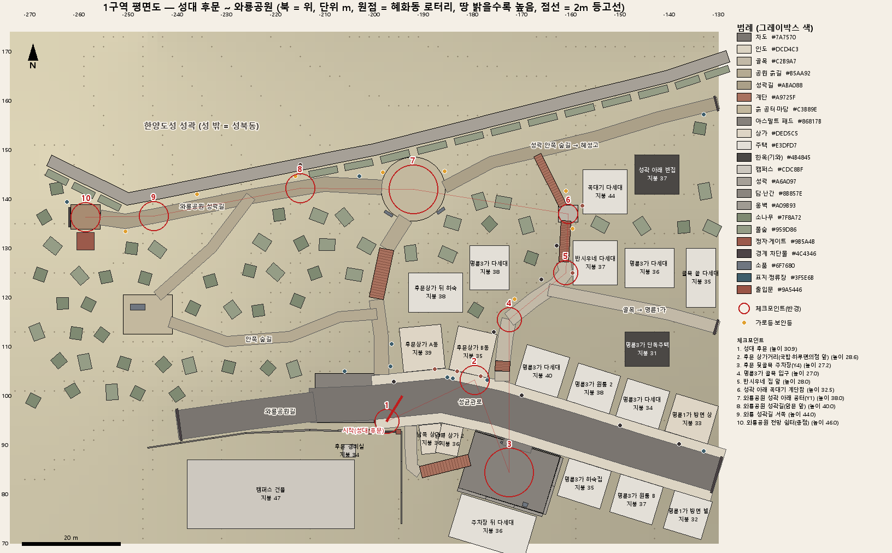

# 06. M1 그레이박스 설계 — 혜화동 1구역(성대 후문 ~ 와룡공원)

> **문서 버전** 0.1 · 2026-10-05
> **목표**(01_기획서 9장 M1): 혜화동 1구역 회색 박스 맵 + 3인칭 이동 → **걸어 다닐 수 있는 동네**
> **데이터**: `unity/HaenginMainEvent/Assets/_Project/Data/zone1.json` (기계용, 이 문서의 표는 모두 이 파일에서 뽑았다)
> **도구**: `tools/zone1_gen.py`(배치 생성) · `tools/zone1_check.py`(JSON 만 읽어 자기 검증, 16장) · `tools/zone1_plan.py`(평면도 그림)
> **근거**: `03_맵_혜화동.md` 셀 A(후문·명륜3가)·셀 B(와룡공원) 존 카드, R1 배달 루트, T1 러닝 루트, 야차 Y1·Y4, 1.3 성곽 라인, 3.1~3.7 축척·좌표·높이 레벨·시야 원칙 + `data/map_zones.json`

---

## 0. 한눈에

| 항목 | 값 |
|---|---|
| 구역 | 성대 후문 앞 성균관로 상가 → 명륜3가 골목(시우네 집) → 성곽 아래 계단 → 와룡공원 공터(Y1) → 와룡공원 성곽길 → 전망 쉼터 |
| 크기 | 게임 144m(동서) × 104m(남북) — 실제 약 576m × 416m를 03_맵 표준 축척(수평 1/4)으로 줄임 |
| 높이 | 걷는 면 22.2m(성균관로 동쪽 끝) ~ 46.0m(전망 쉼터). 시작 30.9 → 끝 46.0 = **+15.1m**(실제 +30m) |
| 걷는 면 | 길 16줄(차도 2·인도 2·골목 5·진입로 1·공원 흙길 4·성곽길·숲길 2) + 계단 5곳 + 평평한 패드 6곳 |
| 블록 | 126개 — 건물 22, 담·난간·옹벽 17조각, 게이트·차단물·소품 13, 정자 1, 소나무 32, 풀숲 41 |
| 성곽 | 143m, 높이 4.5m·두께 2.5m, 오르기·부수기 불가. 북쪽 경계를 겸함 |
| 체크포인트 | 10개(성대 후문 → … → 와룡공원 전망 쉼터), 길 따라 229.7m — 걷기 2분 24초, 달리기 51초 |
| 지름길 | 성대 후문 → 공원 계단 → 공터 50.5m(걷기 32초) |
| M2 전투 후보 | ① 후문 뒷골목 주차장(Y4, 인카운터 1:3) ② 와룡공원 성곽 아래 공터(Y1, 야차 1:1) |
| 자기 검증 | 경사로 최대 16.2°(≤35°), 계단 단 높이 최대 0.18m(≤0.3), 걸을 수 있는 면 **한 덩어리**, 체크포인트 9구간 **끊김 0**, 길 밖 맨땅 35° 넘는 곳 0 |

*평면도: 북쪽이 위. 빨간 원 = 체크포인트(숫자 = 순서), 빨간 막대 = 시작 방향, 땅이 밝을수록 높다. 다시 그리려면 `python tools/zone1_plan.py`.*

---

## 1. 좌표·축척

- **원점 = 혜화동 로터리 중심**(03_맵 3.2와 같은 점). 1구역 가운데는 로터리에서 서북서로 약 230m(게임) 떨어져 있어 좌표가 모두 x −130 ~ −274다. 장면에서 따로 옮기지 않는다 — 나중 구역을 같은 좌표로 이어 붙이기 위해서다.
- **축(Unity 기준)**: +X = 동, +Z = 북, +Y = 위. 단위 m(Unity 1 = 1m).
- **map_zones.json 에서 바꾸는 식**: `X = x × 0.25`, `Y = (y − 30) × 0.5`, `Z = −z × 0.25`
  - 03_맵 3.2의 `gameZ = z × 0.25`와 **Z 부호만 반대**다(map_zones 는 남쪽이 +z, Unity 장면은 북쪽이 +Z).
  - 수평 1/4·수직 1/2라 **경사가 실제의 약 2배**가 된다(03_맵 3.1 의도: 언덕 동네라는 느낌). 건물·계단·사람 크기는 실물 그대로다.
- **yaw**: Unity Y축 회전(도). 0이면 상자 `size[0]`(가로)이 동쪽, `size[2]`(세로)가 북쪽. 양수 = 위에서 볼 때 시계 방향. 성균관로가 동남동으로 비스듬해서 길가 건물은 yaw −6° ~ 17°로 길과 나란히 돌아가 있다.
- 모든 길·계단·패드·체크포인트의 y 는 **그 위를 걷는 면의 높이**다. 블록의 center 는 상자 한가운데, 성곽 점의 y 는 성벽 기초(땅) 높이다.

---

## 2. 구역 범위와 지형

| | 서(x 최소) | 동(x 최대) | 남(z 최소) | 북(z 최대) | 높이(y) |
|---|---:|---:|---:|---:|---|
| 게임(m) | −274 | −130 | 70 | 174 | 땅 22.2 ~ 49.3 |
| 실제 환산 | 로터리 서쪽 1,096m | 로터리 서쪽 520m | 로터리 북쪽 280m | 로터리 북쪽 696m | 해발 74 ~ 129m |

**지형 흐름 — 남쪽이 낮고 북쪽 성곽으로 갈수록 높다**(03_맵 1.1 "북쪽 성곽 능선이 높고 남쪽 대학로로 갈수록 낮다").

| 층 | 높이(y) | 장소 | 느낌 |
|---|---|---|---|
| 아래 | 22 ~ 31 | 성균관로(마을버스길)와 상가, 후문 뒷골목 주차장 | 동쪽(명륜1가)으로 7° 내리막. 차와 사람, 간판 |
| 가운데 | 27 ~ 34 | 명륜3가 골목, 시우네 집, 꼭대기 다세대 | 좁은 골목이 북쪽으로 계단을 타고 오름 |
| 위 | 36 ~ 46 | 와룡공원 공터·숲·성곽길, 전망 쉼터 | 성벽을 오른쪽에 끼고 서쪽 말바위 쪽으로 계속 오름 |

- **체크포인트 높이 단면**: 30.9(후문) → 28.6(상가) → 27.2(주차장) → 27.0(골목 입구) → 28.0(시우네) → 32.5(계단참) → 38.0(공터) → 40.0 → 44.0 → 46.0(전망 쉼터). 골목에서 공터까지 11m를 계단 두 번으로 오르는 게 1구역의 '언덕 체감' 구간이다.
- **높이 격자**(`ground[0]`): 2m 간격 73×53점. 길·계단·패드·성벽 아래 점은 그 면 높이로 고정하고, 나머지는 라플라스(조화) 보간으로 부드럽게 채웠다. 그래서 길 가운데선과 지형의 차이는 평균 0.03m다. 길 밖 맨땅의 가장 가파른 곳은 32.4°(와룡공원길 북쪽 비탈)이고, 35°를 넘는 곳은 없다 — 캐릭터가 어디로 걸어도 미끄러져 갇히지 않는다.
- **평평한 패드 6곳**(`ground[1..]`): 전투·이벤트가 일어나는 곳은 일부러 평평하게 했다.

| 이름 | 모양 | 크기(m) | 중심 (x, y, z) | 바닥 | 비고 |
|---|---|---|---|---|---|
| 명륜3가 종점 회차장 | 사각 | 12 × 10.0 | (-206.0, 31.2, 99.5) | 아스팔트 | 마을버스 1번 기점·회차. 버스 정류장 표지 북쪽 가장자리 |
| 후문 뒷골목 주차장(Y4) | 사각 | 18 × 12.0, yaw 17° | (-172.5, 27.2, 84.4) | 아스팔트 | M2 전투 후보 ① — 인카운터 1:3(황민재 무리, 1부 튜토리얼 보스전). 평평, 북쪽 인도와는 가운데 진입로(폭 6m)로만 이어짐 |
| 성곽 아래 꼭대기 계단참 | 사각 | 4 × 3.4 | (-160.5, 32.5, 137.0) | 돌 | R1 #5. 동쪽 = 꼭대기 다세대 출입문, 북서쪽 = 성곽 아래 좁은 계단 |
| 와룡공원 성곽 아래 공터(Y1) | 원 | 지름 13 | (-192.0, 38.0, 142.0) | 흙 | M2 전투 후보 ② — 야차 1:1(1부 첫눈의 야차, 2부 채강혁 리매치). 흙바닥 원형, 가로등 2·벤치 2. 새벽엔 배드민턴 네트 |
| 와룡공원 전망 쉼터 | 사각 | 6 × 5.0 | (-258.6, 46.0, 136.3) | 나무 데크 | 구역 서쪽 끝. 정자 1, 벤치, 말바위 방향 능선 조망. 서쪽은 '말바위 방면 출입 통제'로 막음 |
| 와룡공원 운동기구 마당 | 사각 | 10 × 8.0 | (-246.0, 42.5, 116.5) | 흙 | map_zones waryong_trail 대표점(37.5906N 126.9906E 환산) 자리. 운동기구·벤치 |

- **경계**: (1) `bounds` 사각형 둘레에 보이지 않는 벽 20m, (2) 북쪽은 성벽, (3) 남쪽은 캠퍼스 담장 2.2m와 건물, (4) 구역 밖으로 이어지는 길 끝 4곳에 낮은 차단물 + 방향 표지(삼청동·명륜1가·혜성고·말바위 방면). 플레이어가 "여기서 더 이어지는구나"를 알게 한다.

---

## 3. 길 목록

폭은 길 전체 폭, 높이는 시작점 → 끝점의 걷는 면 높이. 경사는 꺾인 점 사이 구간 중 가장 가파른 곳.

| 이름 | 종류 | 폭(m) | 길이(m) | 높이 시작→끝 | 최대 경사 | 비고 |
|---|---|---:|---:|---|---:|---|
| 성균관로(후문~명륜1가 방면) | 차도 | 7.0 | 85.4 | 31.5 → 22.2 | 7.3° (13%) | 2차선, 마을버스 1번. 동쪽 끝은 명륜1가 비탈길(-117.5, 21, 82.5)로 이어짐 — M1 경계 |
| 성균관로 북쪽 인도 | 인도 | 2.0 | 74.2 | 31.1 → 22.4 | 7.2° (13%) | 연석 0.15m |
| 성균관로 남쪽 인도 | 인도 | 2.0 | 70.6 | 31.1 → 22.4 | 7.7° (14%) | 연석 0.15m |
| 와룡공원길(삼청동 방면, M1 경계) | 차도 | 6.0 | 28.3 | 31.4 → 35.0 | 7.3° (13%) | 실제로는 말바위·삼청동으로 넘어가는 길. M1 은 x=-240 에서 차단 |
| 상가 뒤 골목 | 골목 | 2.4 | 10.3 | 30.3 → 30.2 | 0.7° (1%) | 후문 게이트 동쪽 기둥과 상가 사이로 들어가 상가 뒤를 돈다 |
| 주차장 진입로 | 진입로 | 6.0 | 2.0 | 27.2 → 27.1 | 1.4° (2%) | 주차장과 인도 높이차 ≤ 0.3m 인 구간 |
| 골목 계단길(상가→명륜3가 골목) | 골목 | 3.0 | 2.0 | 28.0 → 28.0 | 0.0° (0%) | 하루편의점 동쪽 모서리 옆. 계단 4~5단으로 내려감 |
| 명륜3가 골목 입구 | 골목 | 3.0 | 8.6 | 27.0 → 27.0 | 0.0° (0%) |  |
| 명륜3가 골목(시우네 골목) | 골목 | 3.0 | 17.2 | 27.0 → 28.2 | 5.4° (9%) | R1 배달 튜토리얼 동선. 화분·빨래 건조대·고양이 |
| 명륜3가 골목 동쪽(명륜1가 방면) | 골목 | 2.5 | 35.4 | 27.6 → 25.2 | 5.6° (10%) | 03_맵 '주택가 골목' 연결. 동쪽 끝 M1 경계 |
| 성곽 안쪽 숲길(혜성고 방면) | 성곽길·숲길 | 2.5 | 58.4 | 38.0 → 34.1 | 5.2° (9%) | 03_맵 '성곽 안쪽 숲길(학교 담장 옆)'·'성곽 안쪽 오솔길'. 동쪽 끝 M1 경계(혜성고 정문 앞까지 약 60m) |
| 후문 옆 공원길(와룡공원 오르막) | 공원 흙길 | 3.0 | 15.3 | 30.9 → 33.6 | 12.7° (22%) | 마을버스 3번 '후문·와룡공원' 정류장이 옆에 있음 |
| 와룡공원 계단 위 길 | 공원 흙길 | 3.0 | 7.3 | 36.9 → 38.0 | 9.3° (16%) |  |
| 와룡공원 성곽길 | 성곽길·숲길 | 3.0 | 58.0 | 38.0 → 46.0 | 10.6° (19%) | 성벽 안쪽을 따라 걷는 길(성벽 접촉·등반 불가). 2023 정비 안전난간 느낌 |
| 와룡공원 안쪽 숲길(북) | 공원 흙길 | 2.2 | 27.9 | 41.2 → 42.5 | 2.7° (5%) |  |
| 와룡공원 안쪽 숲길(남) | 공원 흙길 | 2.2 | 43.6 | 42.5 → 33.0 | 16.2° (29%) |  |

- 차도는 2차선 7m, 양쪽 인도 2m(연석 0.15m). 골목 2.4~3m, 공원 흙길 2.2~3m, 성곽길 3m·숲길 2.5m.
- 가장 가파른 경사로는 와룡공원 안쪽 숲길(남) 16.2°(29%)로, 03_맵 3.1의 "와룡 쪽은 실제 경사의 2배" 원칙 그대로다. 걷기 불편하면 이 구간만 계단으로 바꾼다.
- **고리 두 개**(막다른 길을 줄임): ① 후문 → 공원 계단 → 공터 → 숲길 → 좁은 계단 → 계단참 → 시우네 → 골목 → 상가 → 후문(작은 고리, 약 150m), ② 공터 → 성곽길 → 안쪽 숲길(북) → 운동기구 마당 → 안쪽 숲길(남) → 공원 계단 아래(큰 고리).

---

## 4. 계단

규칙: **경사 35° 이하는 경사로**, 그보다 가파른 곳과 03_맵에 '계단'으로 적힌 곳은 계단으로 만든다. 단 높이는 0.18m 이하(컨트롤러 stepOffset 0.3m 안), 디딤은 0.33m 이상.

| 이름 | 아래 (x, y, z) | 위 (x, y, z) | 폭(m) | 단 수 | 단 높이(m) | 디딤(m) | 기울기 | 비고 |
|---|---|---|---:|---:|---:|---:|---:|---|
| 상가 뒤 골목 계단 | (-180.5, 27.2, 86.8) | (-190.4, 30.2, 84.4) | 2.4 | 17 | 0.170 | 0.60 | 16.2° |  |
| 골목 계단(내리막) | (-173.8, 27.0, 107.0) | (-173.9, 28.0, 105.0) | 3.0 | 6 | 0.160 | 0.33 | 25.6° | 03_맵 R1 '골목 계단(내리막)' |
| 성곽 아래 꼭대기 계단(시우네 옆) | (-161.4, 28.2, 127.2) | (-160.9, 32.5, 135.6) | 2.0 | 24 | 0.180 | 0.35 | 27.1° |  |
| 성곽 아래 좁은 계단 | (-161.6, 32.5, 138.6) | (-166.8, 36.4, 148.9) | 1.6 | 22 | 0.180 | 0.52 | 18.5° | 03_맵 '성곽 아래 좁은 계단'(명륜3가 골목 ↔ 와룡공원 입구) |
| 와룡공원 계단 | (-199.5, 33.6, 119.8) | (-197.4, 36.9, 129.8) | 3.0 | 19 | 0.170 | 0.54 | 17.9° |  |

- 계단 5곳 모두 기울기 27.1° 이하라, **보이는 단(콜라이더 없음) + 보이지 않는 경사판 콜라이더 1장**으로 만들면 캐릭터가 덜컹거리지 않고 오르내린다(14장).
- 계단은 모두 같은 색(바랜 주칠 `#A9725F`)이다. "붉은 갈색 = 위로 가는 길"이 1구역의 길잡이 규칙이다(9장).

---

## 5. 블록·건물

이름은 모두 가상(실존 가게·학교 이름 없음). 캠퍼스 건물은 대학 이름을 적지 않는다. '보이는 높이'는 비탈 때문에 건물 둘레 땅 높이가 달라서, 높은 쪽 땅에서 잰 높이 ~ 낮은 쪽 땅에서 잰 높이다(상자 아래는 땅속으로 0.5m 묻힘). 층 높이는 3.0m + 지붕 0.6m.

| 이름(가상) | 종류 | 가로×세로(m) | 층 | 보이는 높이 m (높은 쪽 땅~낮은 쪽 땅 기준) | 지붕 y | 중심 (x, z) · yaw | 용도 |
|---|---|---|---:|---|---:|---|---|
| 후문상가 A동 | 상가 | 8.5 × 9.0 | 3 | 7.4 ~ 10.1 | 39.4 | (-190.2, 109.6) · -6° | 1층 '반짝 문구·복사'(가칭) / 2층 번개배달 사무실(남쪽 출입 계단) / 3층 원룸 |
| 후문상가 B동 | 상가 | 8.0 × 9.0 | 2 | 5.5 ~ 8.1 | 35.4 | (-179.8, 108.9) · 12° | 1층 서쪽 성대후문 국밥 / 1층 동쪽 하루편의점 후문점(골목 모서리, 동쪽 면도 유리) / 2층 하숙 |
| 명륜3가 다세대 1(벽돌) | 주택 | 9.0 × 8.5 | 4 | 12.0 ~ 13.2 | 39.7 | (-165.8, 105.0) · 17° | 다세대 4층, 1층 '빨랫줄 세탁'(가칭) |
| 명륜3가 원룸 2 | 주택 | 9.0 × 8.0 | 4 | 11.8 ~ 13.1 | 38.3 | (-155.3, 101.5) · 17° | 원룸 4층 |
| 명륜3가 다세대 3 | 주택 | 9.0 × 8.0 | 3 | 8.5 ~ 10.1 | 34.0 | (-145.3, 98.3) · 17° | 다세대 3층, 1층 '나사 철물'(가칭) |
| 명륜1가 방면 상가주택 | 상가 | 9.0 × 8.0 | 3 | 8.2 ~ 10.0 | 32.9 | (-135.3, 95.3) · 17° | 1층 '고쳐요 PC'(가칭) / 위층 주택 |
| 남쪽 상가 1(제본) | 상가 | 4.5 × 6.0 | 2 | 6.3 ~ 7.6 | 36.4 | (-188.3, 91.2) · -6° | 1층 '넘김 제본'(가칭) / 2층 하숙 |
| 남쪽 상가 2(분식) | 상가 | 4.5 × 6.0 | 2 | 6.3 ~ 7.7 | 35.5 | (-184.6, 91.0) · 12° | 1층 '계단분식'(가칭) / 2층 하숙 |
| 명륜3가 하숙집 A(남쪽) | 주택 | 9.0 × 8.0 | 3 | 8.0 ~ 10.1 | 34.8 | (-157.2, 82.2) · 17° | 하숙 3층 |
| 명륜3가 원룸 B(남쪽) | 주택 | 9.0 × 8.0 | 4 | 11.5 ~ 13.1 | 36.5 | (-146.7, 78.9) · 17° | 원룸 4층 |
| 명륜1가 방면 빌라(남쪽) | 주택 | 8.0 × 8.0 | 3 | 8.6 ~ 9.8 | 32.3 | (-136.2, 75.7) · 17° | 빌라 3층 |
| 반시우네 다세대 | 주택 | 9.0 × 9.0 | 3 | 6.6 ~ 9.4 | 37.0 | (-155.0, 127.0) · 0° | 다세대 2층 = 시우네(실내 씬). 3층 위 옥상(장독·빨랫줄·평상). 출입문 서쪽 면 |
| 꼭대기 다세대(4층) | 주택 | 9.0 × 9.0 | 4 | 10.0 ~ 13.0 | 44.5 | (-153.0, 141.5) · 0° | R1 배달 고객. 엘리베이터 없음(실내 계단 QTE). 출입문 서쪽 = 계단참 |
| 명륜3가 단독주택(기와) | 한옥 | 9.0 × 7.0 | — | 4.2 ~ 5.5 | 30.8 | (-144.5, 109.5) · 0° | 기와지붕 단층 + 다락. 담장 화분 |
| 명륜3가 다세대 4 | 주택 | 10.0 × 8.0 | 3 | 6.7 ~ 9.0 | 36.4 | (-144.0, 126.0) · 0° | 다세대 3층 |
| 골목 끝 다세대 5 | 주택 | 6.0 × 12.0 | 3 | 5.8 ~ 9.0 | 35.1 | (-133.5, 124.0) · 0° | 다세대 3층(구역 동쪽 끝) |
| 성곽 아래 빈집 | 한옥 | 9.0 × 8.0 | — | 2.7 ~ 5.0 | 36.9 | (-142.5, 145.0) · 0° | 빈 한옥(문 잠김). 지붕 너머 성곽 |
| 후문상가 뒤 하숙집 | 주택 | 11.0 × 8.0 | 2 | 3.1 ~ 7.5 | 37.8 | (-187.5, 121.0) · 0° | 하숙 2층, 비탈에 앉음 |
| 명륜3가 다세대 6 | 주택 | 8.0 × 9.0 | 3 | 3.9 ~ 9.0 | 37.7 | (-176.5, 126.0) · 0° | 다세대 3층 |
| 캠퍼스 건물(이름 미표기) | 캠퍼스 | 34.0 × 14.0 | — | 12.1 ~ 16.0 | 47.0 | (-221.0, 80.0) · 0° | 강의동 뒷면. 들어갈 수 없음 |
| 후문 경비실 | 캠퍼스 | 2.6 × 2.6 | — | 2.5 ~ 2.7 | 33.8 | (-205.0, 88.8) · 0° | 게이트 안쪽 경비실 |
| 성대 후문 기둥(서) | 게이트 | 1.0 × 1.0 | — | 3.1 ~ 3.2 | 34.2 | (-201.0, 92.7) · 0° | 후문 게이트 기둥 |
| 성대 후문 기둥(동) | 게이트 | 1.0 × 1.0 | — | 3.0 ~ 3.2 | 33.5 | (-195.0, 92.7) · 0° | 후문 게이트 기둥 |
| 성대 후문 차단 펜스(닫힘) | 차단물 | 5.0 × 0.3 | — | 1.4 ~ 2.0 | 32.5 | (-198.0, 92.7) · 0° | M1 에선 캠퍼스 관통 불가(캠퍼스 언덕길은 이후 마일스톤) |
| 주차장 뒤 다세대 | 주택 | 16.0 × 9.0 | 3 | 7.6 ~ 9.0 | 36.1 | (-175.9, 73.4) · 17° | 주차장 남쪽 담 너머 다세대 3층 |
| 주차장 자판기 | 소품 | 1.0 × 0.8 | — | 1.9 ~ 1.9 | 29.1 | (-169.3, 77.8) · 17° | 밤 야차 조명(자판기 불빛) |
| 주차 차단기 | 소품 | 0.4 × 0.4 | — | 1.1 ~ 1.2 | 28.5 | (-174.1, 90.5) · 17° | 열린 차단기(진입로 서쪽) |
| 와룡공원 공터 벤치(서) | 소품 | 1.8 × 0.6 | — | 0.5 ~ 0.6 | 38.4 | (-197.0, 137.0) · 35° | 공터 가장자리 벤치 |
| 와룡공원 공터 벤치(동) | 소품 | 1.8 × 0.6 | — | 0.5 ~ 0.9 | 38.1 | (-186.4, 137.6) · -35° | 공터 가장자리 벤치 |
| 전망 쉼터 정자 | 정자 | 3.6 × 3.6 | — | 4.4 ~ 5.4 | 50.2 | (-258.6, 131.4) · 0° | 정자(그레이박스는 상자, 쉼터 남쪽에 붙음). 공터·성곽길에서 서쪽 끝 목표로 보임 |
| 운동기구 | 소품 | 3.0 × 1.2 | — | 1.8 ~ 1.8 | 44.3 | (-248.0, 118.0) · 0° | 철봉·허리돌리기 등 묶음 |
| 말바위 방면 출입 통제 | 차단물 | 0.4 × 4.0 | — | 1.2 ~ 1.3 | 47.3 | (-261.9, 136.3) · 0° | M1 서쪽 경계 표시 |
| 성균관로 동쪽 경계 | 차단물 | 0.4 × 7.6 | — | 1.2 ~ 1.4 | 23.6 | (-130.4, 83.9) · 17° | 명륜1가 방면(구역 밖) |
| 와룡공원길 서쪽 경계 | 차단물 | 0.4 × 6.6 | — | 1.2 ~ 1.8 | 36.7 | (-239.6, 94.1) · 172° | 삼청동 방면(구역 밖) |
| 명륜3가 골목 동쪽 경계 | 차단물 | 0.4 × 3.1 | — | 1.2 ~ 1.4 | 26.7 | (-130.4, 113.9) · 16° | 명륜1가 주택가(구역 밖) |
| 성곽 안쪽 숲길 동쪽 경계 | 차단물 | 0.4 × 3.1 | — | 1.2 ~ 1.4 | 35.5 | (-130.4, 159.4) · -14° | 혜성고 방면(구역 밖) |
| 캠퍼스 담장 | 담장 | 길이 합 45 (조각 7) | — | — | — | — | 높이 2.2m, 넘을 수 없는 담 |
| 캠퍼스 담장(동쪽) | 담장 | 길이 합 19 (조각 3) | — | — | — | — | 높이 2.2m, 넘을 수 없는 담 |
| 주차장 난간 | 난간 | 길이 합 12 (조각 2) | — | — | — | — | 높이 1.1m 난간(가운데 진입로 6m 열림) |
| 주차장 옹벽(남) | 옹벽 | 길이 합 18 (조각 3) | — | — | — | — | 주차장 둘레 옹벽(남 2.5m·동 1.5m) |
| 주차장 옹벽(동) | 옹벽 | 길이 합 12 (조각 2) | — | — | — | — | 주차장 둘레 옹벽(남 2.5m·동 1.5m) |

나무·풀숲: 소나무 32그루(2.4×2.4m, 높이 7~10m 상자), 풀숲 41개(높이 0.8~1.3m). 길·계단·패드·건물에서 2.2m 이상 떨어진 자리에만 놓았고, 시선 통로 3곳에는 풀숲만 둔다.

- **실내 씬 출입문**(7장 표의 '출입문'): 하루편의점·번개배달(2층 계단)·성대후문 국밥·반시우네·꼭대기 다세대. M1 에서는 문 앞 표시만 두고 들어가지 않는다.
- 길가 건물은 정면을 인도 바깥선에 붙였다(골목 폭 최소 2.4m 유지). 시우네 다세대는 03_맵 대로 3층(2층이 시우네) + 옥상이다.

---

## 6. 성곽 구간

| 항목 | 값 |
|---|---|
| 이름 | 한양도성 성곽(와룡공원 구간) — 실명 랜드마크 |
| 선 | 21점, 길이 143m. 서쪽 끝 (−266, 147.8) → 와룡 서측 (−250, 140) → 후문 북측 (−200, 150) → 명륜3가 북측 (−140, 165) → 동쪽 끝 (−128, 169). map_zones `wallLine` 3·4·5번 점을 그대로 지나고 8m마다 점을 더 찍었다 |
| 기초 높이 | 34.9(동쪽 끝) ~ 49.3(서쪽 끝, 말바위 쪽 능선) |
| 높이·두께 | 안쪽에서 4.5m, 두께 2.5m. 바깥(북, 성북동)은 땅이 3m 더 낮아 더 높아 보인다 |
| 규칙 | 오르기·부수기 불가(03_맵 3.3, 야차·배달 실격 규칙), 카메라 충돌 대상, 성벽 기슭 2.4m 안쪽에 낮은 풀숲 띠(성벽에 붙어 걷지 않게) |
| 걷는 면과의 거리 | 성곽길 가장자리에서 성벽 안쪽 면까지 최소 1.7m, 공터 가장자리에서 2.1m(검증 5) |
| 암문 | (−215, 147) 성벽에 닫힌 암문 — 03_맵 '성곽 틈 계단'(북정마을 방면). M1 에서는 열리지 않는다 |

- **높이 조정**: map_zones `wallLine` 의 y 는 추정치다. 그대로 쓰면 성벽 기초가 바로 옆 성곽길보다 2~3m 높아져, 길과 성벽 사이가 30° 넘는 비탈이 된다. 그래서 **기초 = 가장 가까운 성곽길·숲길·공터 높이 + 0.8m**로 맞췄다(1.6~2.2m 낮아짐, 13장). 서쪽 끝 10m는 말바위 쪽 능선을 보여 주려고 1m당 0.25m씩 더 올렸다.
- 성벽 너머(성 밖)는 걸어 들어갈 수 없다. 성곽길에서 성벽 위로 성북동 지붕(원경)이 보이게 한다.

---

## 7. 랜드마크

`landmarks` 에는 길잡이·표지·조명·출입문·원경·전투 무대 표시가 함께 들어 있다. 기둥·표지는 길 한가운데를 막지 않게 인도 연석 쪽이나 길 가장자리 밖에 섰다(16장 검증 5).

| 이름 | 종류 | 위치 (x, y, z) | 존 | 역할 |
|---|---|---|---|---|
| 성대 후문 | 관문 | (-198.0, 31.0, 93.4) | `hoomun_street` | 시작 지점. 실명 랜드마크 |
| 명륜3가 종점(마을버스 1번) | 정류장 | (-206.0, 31.2, 104.9) | `hoomun_street` |  |
| 후문시장 앞 정류장(마을버스 1번) | 정류장 | (-185.1, 29.3, 103.7) | `hoomun_street` |  |
| 후문·와룡공원 정류장(마을버스 3번, 확장) | 정류장 | (-196.4, 31.9, 110.5) | `waryong_entrance` |  |
| 하루편의점 간판 | 표지 | (-177.0, 31.2, 103.2) | `haru_conv` | 골목 모서리 돌출 간판(바닥에서 3m 위). 후문에서 동쪽을 보면 첫 번째로 눈에 띄는 밝은 면 — 골목 입구 표시 |
| 와룡공원 안내판 | 표지 | (-196.6, 31.4, 106.0) | `waryong_entrance` |  |
| 한양도성 백악구간 안내판 | 표지 | (-203.0, 38.6, 144.6) | `waryong_trail` |  |
| 혜성고 방면 표지 | 표지 | (-133.0, 34.3, 157.2) | — | 동쪽 경계 너머 = 혜성고 정문 앞(3구역) |
| 명륜1가 방면 표지 | 표지 | (-133.0, 22.8, 88.7) | — |  |
| 말바위 방면(출입 시간 제한) 표지 | 표지 | (-262.4, 46.0, 139.4) | — |  |
| 전봇대 전단지 퀘스트 보드 | 전단 보드 | (-184.0, 29.2, 103.5) | `hoomun_street` | 전봇대에 붙은 전단지(퀘스트 보드) |
| 전봇대 1(성균관로) | 전봇대 | (-196.0, 30.6, 102.9) | — | 전선 = 후지모토식 로우앵글 하늘 |
| 전봇대 2(성균관로) | 전봇대 | (-170.0, 27.4, 100.1) | — | 전선 = 후지모토식 로우앵글 하늘 |
| 전봇대 3(성균관로) | 전봇대 | (-150.0, 24.8, 93.9) | — | 전선 = 후지모토식 로우앵글 하늘 |
| 전봇대 4(성균관로) | 전봇대 | (-138.0, 23.4, 90.2) | — | 전선 = 후지모토식 로우앵글 하늘 |
| 전봇대 1(명륜3가 골목) | 전봇대 | (-175.6, 27.6, 113.0) | — |  |
| 전봇대 2(명륜3가 골목) | 전봇대 | (-166.0, 28.1, 123.6) | — |  |
| 전봇대 3(명륜3가 골목) | 전봇대 | (-162.8, 30.0, 130.5) | — |  |
| 공터 가로등(서) | 가로등 | (-198.2, 38.0, 145.4) | `waryong_entrance` | 야차 링 조명 2개 중 하나 |
| 공터 가로등(동) | 가로등 | (-185.6, 38.0, 145.6) | `waryong_entrance` |  |
| 성곽길 가로등 1 | 가로등 | (-216.0, 40.3, 144.6) | — | 밤에 서쪽 끝까지 점선처럼 이어져 길 안내 |
| 성곽길 가로등 2 | 가로등 | (-236.0, 43.1, 141.0) | — | 밤에 서쪽 끝까지 점선처럼 이어져 길 안내 |
| 성곽길 가로등 3 | 가로등 | (-250.5, 45.0, 133.4) | — | 밤에 서쪽 끝까지 점선처럼 이어져 길 안내 |
| 골목 보안등 1 | 가로등 | (-171.4, 27.6, 119.6) | — | 나트륨 주황 |
| 골목 보안등 2 | 가로등 | (-159.6, 31.7, 134.0) | — | 나트륨 주황 |
| 골목 보안등 3 | 가로등 | (-161.0, 33.4, 141.6) | — | 나트륨 주황 |
| 암문(닫힘, 북정마을 방면) | 암문 | (-215.0, 40.7, 147.0) | `waryong_trail` | 03_맵 '성곽 틈 계단'. M1 은 닫힌 문, 북정마을(성곽 밖)은 이후 마일스톤 |
| 와룡공원 전망 쉼터 | 전망 | (-258.6, 46.0, 136.3) | `waryong_trail` |  |
| 배드민턴 네트(새벽만) | 소품 | (-192.0, 38.0, 142.0) | `waryong_entrance` | 밤엔 걷혀서 공터 = 야차 링 |
| 말바위(원경) | 원경 | (-332.5, 80.0, 180.0) | — | 구역 밖. 전망 쉼터에서 북서쪽 능선 위로 보이는 목표 |
| 북악산 능선(원경) | 원경 | (-420.0, 120.0, 230.0) | — | 스카이박스/빌보드. 북서쪽 수평선 |
| 성북동 지붕들(성곽 너머 원경) | 원경 | (-200.0, 25.0, 230.0) | — | 성곽길에서 성벽 너머로 보이는 저지대 지붕 |
| 남쪽 도심(캠퍼스 너머 원경) | 원경 | (-160.0, 0.0, 0.0) | — | 내리막 = 남쪽 = 대학로 방향 |
| 후문 고양이 '후문이' 자리 | NPC 자리 | (-183.4, 29.4, 115.6) | — | 상가 뒤 하숙집 담 위. 03_맵 동네 고양이(가상) |
| Y4 후문 뒷골목 주차장 | 전투 무대 | (-172.5, 27.2, 84.4) | `hoomun_parking` | M2 전투 후보 ① 인카운터 |
| Y1 와룡공원 성곽 아래 공터 | 전투 무대 | (-192.0, 38.0, 142.0) | `waryong_entrance` | M2 전투 후보 ② 야차 |
| 번개배달 사무실 출입구(2층 계단) | 출입문 | (-187.6, 29.6, 105.4) | `bungae_delivery` |  |
| 성대후문 국밥 출입문 | 출입문 | (-183.1, 29.0, 105.0) | `gukbap` |  |
| 하루편의점 후문점 출입문 | 출입문 | (-178.3, 28.4, 103.9) | `haru_conv` |  |
| 반시우네 출입문 | 출입문 | (-159.6, 28.0, 125.0) | `siu_house` |  |
| 꼭대기 다세대 출입문 | 출입문 | (-157.6, 32.5, 138.6) | `myeongnyun3ga_alley` |  |

---

## 8. 시작 지점과 체크포인트 경로

**시작 지점**: 성대 후문 앞 남쪽 인도 (−197.3, 30.9, 94.7), **yaw 32°**(북북동). 화면 왼쪽에는 공원 계단 위로 공터 가로등과 소나무 숲이, 오른쪽에는 상가거리와 하루편의점 돌출 간판이 들어온다. 등 뒤는 닫힌 캠퍼스 게이트다.

| # | 체크포인트 | 위치 (x, y, z) | 반경(m) | map_zones 존 |
|---:|---|---|---:|---|
| 1 | 성대 후문 | (-197.3, 30.9, 94.7) | 2.5 | `hoomun_street` |
| 2 | 후문 상가거리(국밥·하루편의점 앞) | (-179.5, 28.6, 103.2) | 3.0 | `hoomun_street` |
| 3 | 후문 뒷골목 주차장(Y4) | (-172.5, 27.2, 84.4) | 5.0 | `hoomun_parking` |
| 4 | 명륜3가 골목 입구 | (-172.5, 27.0, 115.5) | 2.5 | `myeongnyun3ga_alley` |
| 5 | 반시우네 집 앞 | (-161.0, 28.0, 125.0) | 2.5 | `siu_house` |
| 6 | 성곽 아래 꼭대기 계단참 | (-160.5, 32.5, 137.0) | 2.0 | `myeongnyun3ga_alley` |
| 7 | 와룡공원 성곽 아래 공터(Y1) | (-192.0, 38.0, 142.0) | 5.0 | `waryong_entrance` |
| 8 | 와룡공원 성곽길(암문 앞) | (-215.0, 40.0, 142.2) | 3.0 | `waryong_trail` |
| 9 | 와룡 성곽길 서쪽 | (-244.8, 44.0, 136.5) | 3.0 | `waryong_trail` |
| 10 | 와룡공원 전망 쉼터(종점) | (-258.6, 46.0, 136.3) | 3.0 | `waryong_trail` |

| # | 플레이어가 하는 일 | 보는 것 |
|---:|---|---|
| 1 | 성대 후문에서 출발. 길을 건넌다 | 상가 간판, 전봇대와 전선, 언덕 위 공원 |
| 2 | 상가 앞 인도. 번개배달(2층)·국밥·하루편의점이 나란히 있다 | 마을버스 '후문시장 앞' 정류장, 전단 보드 |
| 3 | 길 건너 남쪽 주차장으로. 인도 쪽은 난간 가운데 진입로(6m)로 들어가고, 서쪽은 상가 뒤 골목 계단으로 후문과 이어진다 | 자판기, 차단기, 남쪽 옹벽 — M2 인카운터 무대 |
| 4 | 다시 길을 건너 하루편의점 모서리 옆 계단 6단을 내려가 골목으로 | 골목 전봇대, 보안등 |
| 5 | 골목을 따라 북동쪽으로 15m, 시우네 집 앞 | 3층 다세대 출입문, 동쪽으로 갈라지는 골목(명륜1가 방면, 경계) |
| 6 | 시우네 옆 24단 계단(27°)을 올라 계단참 | 여기서 **성곽이 처음 크게 보인다**(검증 6: 성곽 윗선 10/20점). 동쪽은 꼭대기 다세대(R1 배달 고객) |
| 7 | 좁은 계단 22단 → 성곽 안쪽 숲길 → 공터 | 흙바닥 원형 공터, 가로등 2, 벤치 2, 바로 뒤 성벽 — M2 야차 무대 |
| 8 | 성벽을 오른쪽에 끼고 서쪽 성곽길 | 닫힌 암문, 성곽길 가로등 줄 |
| 9 | 성곽길 서쪽(T1 러닝 코스 2번 자리). 남쪽으로 안쪽 숲길이 갈라진다 | 서쪽 끝 정자 |
| 10 | 전망 쉼터(종점) | 정자, 말바위 쪽으로 오르는 능선과 성벽, '출입 통제' 표지 |

- 체크포인트 3(주차장)은 막다른 곳이라 4로 갈 때 길을 다시 건넌다. 튜토리얼에서 "길 건너 골목으로 들어가는 동네 동선"을 한 번 익히게 하려는 배치다.
- 03_맵 R1(번개배달 → 시우네 골목 → 꼭대기 다세대)이 2 → 4 → 5 → 6과 그대로 겹친다. M3 배달 튜토리얼을 이 길 위에 바로 올릴 수 있다.

---

## 9. 시선 유도 — 길을 잃지 않게

**원칙**(03_맵 3.7 그대로): **성곽이 보이면 북쪽, 내리막을 따라가면 남쪽(성균관로·대학로)**. 미니맵 없이 지형으로 방향을 안다.

| 구간 | 길잡이 | 자리 |
|---|---|---|
| 1 → 2 | 하루편의점 돌출 간판(골목 모서리, 바닥에서 3m) · 성균관로 전봇대 4개와 전선 | 간판 (−177.0, 31.2, 103.2), 전봇대는 북쪽 인도 연석 쪽 |
| 2 → 3 | 주차장 자판기 불빛, 난간 사이 진입로 | 자판기 (−169.3, 77.8) |
| 3 → 4 | 하루편의점 간판이 골목 입구를 표시, 골목 계단은 붉은 갈색 | 골목 계단 (−173.9, 28.0, 105.0) |
| 4 → 5 → 6 | 골목 전봇대 3개 · 보안등(나트륨 주황) · 시우네 옆 붉은 갈색 계단 | 골목 보안등 1~3 |
| 6 → 7 | **계단참에서 성곽이 처음 드러난다**. 공터 가로등 2개가 서쪽에서 보인다 | 공터 가로등 (−198.2, 145.4)·(−185.6, 145.6) |
| 7 → 10 | 성벽이 늘 오른쪽(북). 성곽길 가로등 3개가 서쪽 끝까지 점선처럼 이어지고, 끝에 붉은 갈색 정자(성곽길 8번 자리에서 보임) | 성곽길 가로등 1~3, 정자 (−258.6, 131.4) |
| 어디서든 | 후문에서 북쪽으로 공원 계단과 공터 가로등이 보인다(지름길) | 시선 통로 ① |

- **시선 통로 3곳**(키 큰 소나무를 두지 않고 낮은 풀숲만): ① 후문 → 공원 계단 → 성곽, ② 꼭대기 계단참 → 공터, ③ 꼭대기 계단참 → 성곽(북). 그 밖의 와룡공원 숲은 소나무 위주, 마을 쪽 비탈은 풀숲 위주로 둬서 성곽이 지붕 너머로 보이게 했다.
- **확인 결과**(16장 검증 6): 공터 서쪽 가로등은 시작 지점에서 보이고, 하루편의점 간판은 체크포인트 1~6 모두에서 보인다. 다음 체크포인트 표지(3m 기둥)는 9구간 모두 앞 체크포인트에서 보인다. 성균관로·골목(2~5)에서는 건물에 가려 성곽이 거의 안 보이지만, 계단참(6)에서 확 드러나는 '공개 순간'으로 쓴다.
- 구역 밖으로 이어지는 길 끝 4곳에는 차단물과 방향 표지(삼청동·명륜1가·혜성고·말바위 방면)를 둬서 "막힌 곳"이 아니라 "다음에 열릴 곳"으로 읽히게 한다.

---

## 10. 그레이박스 색 규칙

- **종류마다 단색 하나**. 텍스처·그라데이션 없이 URP Lit 단색(스무스니스 0, 스펙큘러 끔) + 그림자만. 장면 안개·하늘은 REFERENCES 2장의 크림 `#E9E0CC`.
- 출처 팔레트(FUJIMOTO_STYLE 6·8장, REFERENCES 2장)에서 **채도를 낮추고 명도를 띄워** 종류끼리 구별되게 했다. 아래 '채도'는 HSV 채도(0~1)다. 그레이박스 색은 출처보다 채도가 낮거나 같다.
- **캐릭터 강조색(시우 주황 밑창 `#E2582C`, 태오 바나나우유 노랑 `#F2CF55`)은 배경에 쓰지 않는다**(FUJIMOTO 8장 2항). 시우 모델을 세웠을 때 캐릭터가 배경에서 떠 보여야 한다.
- **길잡이 색**: 계단·출입문·정자·후문 기둥만 바랜 주칠 계열(채도 0.44~0.55)로, 표지·정류장은 스플릿 톤 청록 계열(0.41)로 둔다. 나머지 넓은 면(땅·길·건물·성곽)은 채도 0.2 이하라 이 두 색이 눈에 먼저 들어온다.
- 녹색은 출처 팔레트에 없어서, 모래 쪽으로 기운 회녹색(채도 0.15~0.17)을 새로 정했다.

| 종류 | 그레이박스 색 | 채도 | 출처 팔레트 | 출처 색 | 출처 채도 |
|---|---|---:|---|---|---:|
| 땅(흙·잔디 기본) | `#C9C1A6` | 0.17 | REFERENCES 2장 땅 모래 베이지 | `#D9C9A8` | 0.23 |
| 차도 | `#7A7570` | 0.08 | REFERENCES 2장 기와 먹회색, 명도만 올림 | `#3A3A3A` | 0.00 |
| 주차장 진입로 | `#86817B` | 0.08 | 기와 먹회색, 명도만 올림 | `#3A3A3A` | 0.00 |
| 인도 | `#DCD4C3` | 0.11 | 하늘·종이 크림 | `#E9E0CC` | 0.12 |
| 골목 | `#C2B9A7` | 0.14 | 땅 모래 베이지(밝게) | `#D9C9A8` | 0.23 |
| 공원 흙길 | `#B5AA92` | 0.19 | 땅 모래 베이지 | `#D9C9A8` | 0.23 |
| 성곽길·숲길 | `#ABA088` | 0.20 | 땅 모래 베이지(어둡게) | `#D9C9A8` | 0.23 |
| 아스팔트 패드(회차장·주차장) | `#86817B` | 0.08 | 기와 먹회색, 명도만 올림 | `#3A3A3A` | 0.00 |
| 흙 공터·마당 | `#C3B89E` | 0.19 | 땅 모래 베이지 | `#D9C9A8` | 0.23 |
| 돌 계단참 | `#BDB6AA` | 0.10 | 먼 산 회갈색(밝게) | `#8F8A80` | 0.10 |
| 전망 데크 | `#A88C72` | 0.32 | 바랜 주칠 목재 | `#9B4A3A` | 0.63 |
| 계단 | `#A9725F` | 0.44 | 바랜 주칠(길잡이 색) | `#9B4A3A` | 0.63 |
| 상가 | `#DED5C5` | 0.11 | 땅 모래 베이지(아주 밝게) | `#D9C9A8` | 0.23 |
| 주택·다세대 | `#E3DFD7` | 0.05 | FUJIMOTO 6장 종이 | `#F4EFE6` | 0.06 |
| 한옥(기와 덩어리) | `#4B4845` | 0.08 | 기와 먹회색 | `#3A3A3A` | 0.00 |
| 캠퍼스 | `#CDC8BF` | 0.07 | 먼 산 회갈색(밝게) | `#8F8A80` | 0.10 |
| 정자 | `#9B5A4B` | 0.52 | 바랜 주칠 | `#9B4A3A` | 0.63 |
| 성곽 | `#A6A097` | 0.09 | 먼 산 회갈색 = 화강암 | `#8F8A80` | 0.10 |
| 담장 | `#8B857E` | 0.09 | 먼 산 회갈색 | `#8F8A80` | 0.10 |
| 난간 | `#8B857E` | 0.09 | 먼 산 회갈색 | `#8F8A80` | 0.10 |
| 옹벽 | `#A09B93` | 0.08 | 벽 아랫부분 회색 돌 | `#8F8A80` | 0.10 |
| 소나무 | `#7F8A72` | 0.17 | 팔레트에 녹색 없음 → 모래 쪽 회녹색 | — | — |
| 풀숲 | `#959D86` | 0.15 | 팔레트에 녹색 없음 → 모래 쪽 회녹색 | — | — |
| 후문 기둥 | `#9B5A4B` | 0.52 | 바랜 주칠 | `#9B4A3A` | 0.63 |
| 경계 차단물 | `#4C4346` | 0.12 | FUJIMOTO 6장 외곽선 ink | `#1A1417` | 0.23 |
| 소품(벤치·자판기·운동기구) | `#6F7680` | 0.13 | FUJIMOTO 6장 교복 재킷 남색(밝게) | `#2B3049` | 0.41 |
| 표지 | `#3F5E6B` | 0.41 | FUJIMOTO 6-4 스플릿 톤 그림자 청록 | `#2F4A5A` | 0.48 |
| 전단 보드 | `#3F5E6B` | 0.41 | 스플릿 톤 청록 | `#2F4A5A` | 0.48 |
| 전봇대 | `#5B5552` | 0.10 | 외곽선 ink(밝게) | `#1A1417` | 0.23 |
| 가로등 | `#5B5552` | 0.10 | 외곽선 ink(밝게) | `#1A1417` | 0.23 |
| 정류장 | `#3F5E6B` | 0.41 | 스플릿 톤 청록 | `#2F4A5A` | 0.48 |
| 출입문 | `#9A5446` | 0.55 | 바랜 주칠 | `#9B4A3A` | 0.63 |
| 암문 | `#5E4A44` | 0.28 | 서까래 끝 붉은 갈색 | `#9B4A3A` | 0.63 |
| 전망 표지 | `#3F5E6B` | 0.41 | 스플릿 톤 청록 | `#2F4A5A` | 0.48 |
| NPC 자리 | `#B5A68A` | 0.24 | 땅 모래 베이지 | `#D9C9A8` | 0.23 |
| 전투 무대 표시(디버그) | `#3B5360` | 0.39 | 스플릿 톤 청록 | `#2F4A5A` | 0.48 |
| 체크포인트(디버그) | `#3B5360` | 0.39 | 스플릿 톤 청록 | `#2F4A5A` | 0.48 |
| 하늘(카메라 배경) | `#E9E0CC` | 0.12 | 하늘·안개 크림(그대로) | `#E9E0CC` | 0.12 |
| 안개 | `#E9E0CC` | 0.12 | 하늘·안개 크림(그대로) | `#E9E0CC` | 0.12 |

---

## 11. 걷는 데 걸리는 시간 목표

- 이동 속도(`meta.speeds`): **걷기 1.6m/s**, **달리기 4.5m/s**(「용과 같이」 달리기 체감), 전력질주 6.0m/s(나중에). 03_맵 3.1은 걷기 1.4m/s 기준이었다.
- 거리는 걸을 수 있는 면만 지나는 최단 경로(계단 포함)로 쟀다(16장 검증 4).

| 구간 | 길 따라 | 걷기 | 달리기 | 목표 |
|---|---:|---:|---:|---|
| 체크포인트 1 → 10 전부 들르기 | 229.7m | 144초(2분 24초) | 51초 | 걷기 2~3분, 달리기 1분 안쪽 |
| 성대 후문 → 전망 쉼터 최단 | 114.5m | 72초 | 25초 | 걷기 1분 남짓 |
| 성대 후문 → 공터(공원 계단 지름길) | 50.5m | 32초 | 11초 | 걷기 30초 — 야차 무대가 '집 근처'로 느껴지게 |
| 시우네 집 → 공터(계단 두 번) | 56.7m | 35초 | 13초 | 계단 오르는 맛이 있는 35초 |
| 자유 탐색(모든 길을 한 번씩, 양쪽 인도 중복 빼고) | 약 440m | 약 4분 35초 | 약 1분 38초 | M1 '걸어 다닐 수 있는 동네' 시연 길이 |

- 03_맵 존 카드의 '이동 시간(분)'(예: 후문 → 와룡 입구 3분)은 **게임 시계**가 흐르는 분이다. 실제 플레이 시간과는 따로 정한다(M3 시간대 시스템).

---

## 12. M2 전투 무대 후보 2곳

M2(01_기획서 9장)는 인카운터 1종 + 야차 1종이다. 1구역 안에 스토리 바이블이 정한 두 싸움 자리가 다 들어 있어서 그대로 고른다. 두 곳 모두 **완전히 평평**하게 만들어 전투 물리·넉백·다운을 단순하게 했다.

| | ① 후문 뒷골목 주차장(Y4) | ② 와룡공원 성곽 아래 공터(Y1) |
|---|---|---|
| 싸움 | 인카운터 1:3 — 황민재 무리, 1부 튜토리얼 보스전(바이블 시우 루트 4) | 야차 1:1 — 1부 '첫눈의 야차', 2부 채강혁 리매치(바이블 시우 루트 7·8) |
| 크기·바닥 | 18 × 12m 아스팔트, y 27.2, 길과 나란히 17° | 지름 13m 흙바닥 원, y 38.0 |
| 둘레 | 북: 인도와 난간 1.1m(가운데 진입로 6m) / 남: 옹벽 2.5m / 동: 옹벽 1.5m / 서: 상가 뒤 골목 계단·상가 뒷벽 | 북: 3.5m 뒤 성벽(4.5m) / 동·서: 성곽길·숲길 입구 / 남: 공원 계단 위 길, 벤치 2 |
| 조명(밤) | 자판기 불빛 + 성균관로 가로등 | 가로등 2개 아래 원형 — 03_맵 Y1 연출 그대로 |
| 동네 기세 액션 후보 | 자판기, 주차 차단기, 난간, 옹벽(벽꽝) | 벤치, 가로등 기둥. **성벽은 쓰지 않는다**(문화재 — 성벽 등반·훼손 실격 규칙) |
| 구경꾼 | 서쪽 인도가 주차장보다 1.3m 높아 난간 너머로 내려다보는 구도 | 원 가장자리(반경 6.5~8m)와 벤치. 배드민턴 네트를 걷은 자리 |
| 카메라 | 북쪽(길 쪽)이 트여 있어 남쪽 옹벽을 배경으로 찍기 좋음 | 남쪽(내리막)에서 성벽을 배경으로. 성벽 쪽은 카메라 충돌로 당김 |
| 데이터 | `landmarks` "Y4 후문 뒷골목 주차장"(kind arena, 반경 6) | `landmarks` "Y1 와룡공원 성곽 아래 공터"(kind arena, 반경 6.5) |

---

## 13. map_zones 와 맞춘 기록

map_zones.json 의 1구역 관련 점을 게임 좌표로 바꾼 값과, zone1 에서 실제로 둔 자리를 비교했다. 존 대표점은 대개 '차도 한가운데'처럼 걸을 수 없는 곳에 찍혀 있어서, 가장 가까운 걷는 면이나 건물 정면으로 옮겼다. 수평 차는 대부분 2~6m(실제 8~24m)로, map_zones 의 좌표 오차(±100m)보다 훨씬 작다.

| 기준점 | map_zones 출처 | 게임 좌표로 바꾼 값 (x, y, z) | zone1 대응 | zone1 좌표 | 수평 차(m) | 높이 차(m) | 이유 |
|---|---|---|---|---|---:|---:|---|
| 성대 후문 게이트 | deliveryRoutes R4 #2 | (-197.5, 31.0, 100.0) | 성대 후문(관문 표지) | (-198.0, 31.0, 93.4) | 6.6 | -0.0 | 남쪽 인도 바깥선 = 캠퍼스 담장 선 |
| 명륜3가 종점 | fastTravel bus1 | (-200.0, 31.0, 97.5) | 명륜3가 종점 정류장 | (-206.0, 31.2, 104.9) | 9.5 | +0.2 | 회차장 북쪽 가장자리 |
| 후문시장 앞 정류장 | fastTravel bus1 | (-186.2, 29.0, 100.0) | 후문시장 앞 정류장 | (-185.1, 29.3, 103.7) | 3.9 | +0.3 | 원래 값이 차도 가운데 → 북쪽 인도 연석 쪽 |
| 후문·와룡공원 정류장 | fastTravel bus3 | (-197.5, 32.5, 110.0) | 후문·와룡공원 정류장 | (-196.4, 31.9, 110.5) | 1.2 | -0.6 | 공원길 옆 |
| 성대 후문 상가거리 | zones | (-185.0, 29.0, 102.5) | 체크포인트 2 | (-179.5, 28.6, 103.2) | 5.5 | -0.4 | 상가 앞 북쪽 인도 |
| 번개배달 사무실 | zones | (-187.5, 29.5, 103.8) | 번개배달 출입구 | (-187.6, 29.6, 105.4) | 1.6 | +0.1 | 건물 정면(인도 바깥선)으로 |
| 성대후문 국밥 | zones | (-181.2, 28.5, 100.0) | 국밥 출입문 | (-183.1, 29.0, 105.0) | 5.3 | +0.5 | 원래 값이 차도 가운데 → 정면으로 |
| 하루편의점 후문점 | zones | (-183.8, 29.0, 101.2) | 하루편의점 출입문 | (-178.3, 28.4, 103.9) | 6.1 | -0.6 | '상가 1층 코너'(03_맵)를 골목 모서리로 해석 |
| 후문 뒷골목 주차장(Y4) | zones/yachaSpots | (-175.0, 27.0, 90.0) | 체크포인트 3(주차장 가운데) | (-172.5, 27.2, 84.4) | 6.2 | +0.2 | 인도와 안 겹치게 남쪽으로, 길과 나란히 17° 돌림 |
| 골목 내리막 입구 | deliveryRoutes R1 #3 | (-172.5, 27.0, 115.0) | 체크포인트 4 | (-172.5, 27.0, 115.5) | 0.5 | +0.0 | 그대로 |
| 반시우의 집 | zones | (-162.5, 28.0, 125.0) | 체크포인트 5(집 앞 골목) | (-161.0, 28.0, 125.0) | 1.5 | +0.0 | 집 출입문 앞 골목 위 |
| 성곽 아래 꼭대기 계단 | deliveryRoutes R1 #5 | (-160.0, 32.5, 136.2) | 체크포인트 6(계단참) | (-160.5, 32.5, 137.0) | 0.9 | +0.0 | 계단참 가운데 |
| 꼭대기 다세대(R1 고객) | deliveryRoutes R1 #6 | (-157.5, 34.5, 142.5) | 꼭대기 다세대 출입문 | (-157.6, 32.5, 138.6) | 3.9 | -2.0 | 출입문을 계단참 높이로(4층 고객 집은 실내 계단) |
| 와룡공원 입구·성곽 아래 공터 | zones | (-190.0, 38.0, 140.0) | 체크포인트 7(공터 가운데) | (-192.0, 38.0, 142.0) | 2.8 | +0.0 | 성벽에서 몇 걸음 떨어지게 |
| 야차 Y1 | yachaSpots | (-192.5, 38.0, 143.8) | 야차 Y1 = 공터 가운데 | (-192.0, 38.0, 142.0) | 1.8 | +0.0 | 공터 원 가운데로 통일 |
| 와룡 성곽길(T1 #2) | trainingRoutes T1 | (-244.8, 44.0, 135.0) | 체크포인트 9 | (-244.8, 44.0, 136.5) | 1.5 | +0.0 | 그대로 |
| 와룡공원 성곽길(대표점) | zones | (-244.8, 42.5, 116.2) | 운동기구 마당 가운데 | (-246.0, 42.5, 116.5) | 1.3 | +0.0 | 공원 안쪽 마당 |
| 성곽: 와룡공원 서측 | wallLine #3 | (-250.0, 47.5, 140.0) | 가장 가까운 성벽 점 | (-250.0, 45.6, 140.0) | 0.0 | -1.9 | 기초 = 성곽길 + 0.8m |
| 성곽: 후문 북측 | wallLine #4 | (-200.0, 41.0, 150.0) | 가장 가까운 성벽 점 | (-200.0, 38.8, 150.0) | 0.0 | -2.2 | 기초 = 공터 + 0.8m |
| 성곽: 명륜3가 북측 | wallLine #5 | (-140.0, 37.0, 165.0) | 가장 가까운 성벽 점 | (-140.0, 35.4, 165.0) | 0.0 | -1.6 | 기초 = 숲길 + 0.8m |

- map_zones.json 자체는 고치지 않았다. 1구역 좌표의 기준은 이제 zone1.json 이고, 03_맵 표를 고칠지는 대표가 정한다(15장).

---

## 14. Unity 장면 생성기에 넘길 것 (zone1.json 읽는 법)

Sandbox 와 같은 '설정 파일 → 에디터 스크립트로 장면 생성' 방식으로 `Zone1.unity` 를 만든다. Unity 는 이번 작업에서 실행하지 않았다.

| JSON | 만드는 법 |
|---|---|
| `ground[kind=heightgrid]` | 정점 73×53 메시 1장. 정점 (origin[0] + i·cell, heights[j][i], origin[1] + j·cell). MeshCollider. 색 `ground` |
| `ground[kind=pad]` | 윗면이 center.y 인 평평한 판(두께 1m, 아래로). rect 는 size = [가로, 세로] + yaw, circle 은 size[0] = 지름. 색 `pad_<surface>` |
| `roads` | 점을 잇는 띠 메시. 가로 단면은 평평, 윗면 y 는 점마다 다르다. **아래로 1m 두께**로 내려 그리면 지형과 틈이 안 생긴다(길·지형 높이차 최대 0.5m). 인도 y 에는 연석 0.15m 가 이미 들어 있다. MeshCollider. 색 = kind |
| `stairs` | 낮은 끝에서 높은 끝으로 steps 개 단(단 높이 riser, 디딤 tread, 폭 width)을 보이게만 쌓고(콜라이더 없음), 두 끝을 잇는 **보이지 않는 경사판 BoxCollider** 1장(최대 27.1°) |
| `blocks` | center·size·yaw 그대로 상자 + BoxCollider. tree 는 줄기만 콜라이더(0.6m), bush 는 콜라이더 없음 |
| `walls` | 이웃한 두 점마다 상자 1개: 길이 = 두 점 거리 + 0.4(겹침), 두께 2.5, 아래 = 두 점 중 낮은 y − 1.5, 위 = 높은 y + 4.5. 콜라이더는 위로 10m 더(넘을 수 없게) |
| `landmarks` | kind 별 단순 도형: pole 원기둥(지름 0.3, height), lamp 원기둥 + 머리 상자(+밤 조명 자리), sign·bus_stop 얇은 판(1.2 × height), door 문짝 판(1 × 2.1, 건물 면에 붙임), wall_gate 성벽 면 판, arena·vista·npc_spot 은 M1 에선 디버그 표시만 |
| `spawn` | 시우 발 위치 pos, Y 회전 yaw |
| `route` | 반경 radius·높이 3m 트리거 원기둥 + 3m 표지 기둥(색 `checkpoint`). 순서대로 켜기 |
| `bounds` | 네 변에 보이지 않는 벽 높이 20m |
| `colors` | 종류별 URP Lit 재질 1개씩(스무스니스 0) |

- **JSON 읽기 주의**: `points: [[x,y,z], …]`, `heights[j][i]` 같은 **배열 속 배열은 Unity JsonUtility 가 못 읽는다**. 프로젝트에 Newtonsoft 패키지가 없으니 `com.unity.nuget.newtonsoft-json`(Unity 공식)을 manifest 에 넣거나, 에디터 어셈블리에 작은 JSON 파서를 둔다.
- 컨트롤러 기준(`meta.controller`): slopeLimit 35°, stepOffset 0.3m. 시우 키 1.74m(SandboxSetup 과 같음).
- 데이터를 고칠 때는 JSON 을 손으로 고치지 말고 `tools/zone1_gen.py` 를 고친 뒤 `python tools/zone1_gen.py && python tools/zone1_check.py` 로 다시 만든다(높이 격자가 길에 맞춰 다시 계산된다). numpy·scipy 필요.
- `Assets/_Project/Data/` 폴더와 zone1.json 의 `.meta` 는 Unity 를 다음에 열 때 생긴다. 그때 함께 커밋한다.

---

## 15. 대표 결정이 필요한 것

1. **1구역 축척**: 지금은 03_맵 표준(수평 1/4·수직 1/2) 그대로라 다른 구역과 좌표가 바로 이어진다. 대신 상가거리(후문 ~ 골목 입구)가 약 25m로 짧다. 상권만 1/3로 늘리면 밀도는 좋아지지만 구역 이음매를 다시 맞춰야 한다.
2. **캠퍼스 이름**: '성대 후문'은 실명 랜드마크로 쓰고 캠퍼스 건물은 이름을 적지 않았다. 이 캠퍼스를 가상 대학(청룡대·백호대 중 하나)으로 부를지, 계속 이름 없이 둘지.
3. **M1 경계를 언제 열지**: 캠퍼스 관통(후문 게이트), 북정마을 암문(성 밖), 말바위 계단(T1 러닝), 혜성고·명륜1가 쪽 길 — 지금은 모두 닫혀 있다.
4. **시우네 옥상**: 03_맵은 옥상을 오픈월드(성곽 뷰)로 둔다. M1 에 바깥 철제 계단과 옥상을 넣을지(지금은 없음).
5. **이동 속도**: 걷기 1.6 / 달리기 4.5 / 전력질주 6.0 m/s 로 확정할지(03_맵은 걷기 1.4 기준).
6. **성벽 높이**: 안쪽에서 4.5m 로 넘을 수 없게 했다. 실제 와룡공원 구간은 안쪽에서 더 낮아 보이는 곳이 많다 — 게임 규칙(오르기 금지)을 위해 높게 둘지.

---

## 16. 자기 검증

`python tools/zone1_check.py --md <파일>` 출력 그대로다. 이 스크립트는 생성기를 쓰지 않고 **zone1.json 만 다시 읽어서** 확인한다. 걸을 수 있는 면끼리는 높이차 0.35m 이하로 맞닿고 담·난간·건물에 막히지 않아야 이어진 것으로 본다. 거리는 그 연결망 위 최단 경로다.

### 검증 1 — 길·계단 경사

| 길 | 종류 | 폭(m) | 길이(m) | 고도차(m) | 최대 경사 | 판정 |
|---|---|---:|---:|---:|---:|---|
| 성균관로(후문~명륜1가 방면) | road | 7.0 | 85.4 | -9.3 | 7.3° (13%) | OK |
| 성균관로 북쪽 인도 | sidewalk | 2.0 | 74.2 | -8.8 | 7.2° (13%) | OK |
| 성균관로 남쪽 인도 | sidewalk | 2.0 | 70.6 | -8.8 | 7.7° (14%) | OK |
| 와룡공원길(삼청동 방면, M1 경계) | road | 6.0 | 28.3 | +3.6 | 7.3° (13%) | OK |
| 상가 뒤 골목 | alley | 2.4 | 10.3 | -0.1 | 0.7° (1%) | OK |
| 주차장 진입로 | driveway | 6.0 | 2.0 | -0.1 | 1.4° (2%) | OK |
| 골목 계단길(상가→명륜3가 골목) | alley | 3.0 | 2.0 | +0.0 | 0.0° (0%) | OK |
| 명륜3가 골목 입구 | alley | 3.0 | 8.6 | +0.0 | 0.0° (0%) | OK |
| 명륜3가 골목(시우네 골목) | alley | 3.0 | 17.2 | +1.2 | 5.4° (9%) | OK |
| 명륜3가 골목 동쪽(명륜1가 방면) | alley | 2.5 | 35.4 | -2.4 | 5.6° (10%) | OK |
| 성곽 안쪽 숲길(혜성고 방면) | trail | 2.5 | 58.4 | -3.9 | 5.2° (9%) | OK |
| 후문 옆 공원길(와룡공원 오르막) | path | 3.0 | 15.3 | +2.7 | 12.7° (22%) | OK |
| 와룡공원 계단 위 길 | path | 3.0 | 7.3 | +1.1 | 9.3° (16%) | OK |
| 와룡공원 성곽길 | trail | 3.0 | 58.0 | +8.0 | 10.6° (19%) | OK |
| 와룡공원 안쪽 숲길(북) | path | 2.2 | 27.9 | +1.3 | 2.7° (5%) | OK |
| 와룡공원 안쪽 숲길(남) | path | 2.2 | 43.6 | -9.5 | 16.2° (29%) | OK |

| 계단 | 폭(m) | 수평(m) | 높이(m) | 단 수 | 단 높이(m) | 디딤(m) | 기울기 | 판정 |
|---|---:|---:|---:|---:|---:|---:|---:|---|
| 상가 뒤 골목 계단 | 2.4 | 10.2 | 2.96 | 17 | 0.174 | 0.60 | 16.2° | OK |
| 골목 계단(내리막) | 3.0 | 2.0 | 0.96 | 6 | 0.160 | 0.33 | 25.6° | OK |
| 성곽 아래 꼭대기 계단(시우네 옆) | 2.0 | 8.4 | 4.30 | 24 | 0.179 | 0.35 | 27.1° | OK |
| 성곽 아래 좁은 계단 | 1.6 | 11.5 | 3.87 | 22 | 0.176 | 0.52 | 18.5° | OK |
| 와룡공원 계단 | 3.0 | 10.2 | 3.30 | 19 | 0.174 | 0.54 | 17.9° | OK |

### 검증 2 — 걸을 수 있는 면 연결

- 면 27개(길 16·계단 5·패드 6), 맞닿은 쌍 34개, 연결 덩어리 **1개**
  - 덩어리(27면): 성균관로(후문~명륜1가 방면), 성균관로 북쪽 인도, 성균관로 남쪽 인도, 와룡공원길(삼청동 방면, M1 경계), 상가 뒤 골목, 주차장 진입로, 골목 계단길(상가→명륜3가 골목), 명륜3가 골목 입구, 명륜3가 골목(시우네 골목), 명륜3가 골목 동쪽(명륜1가 방면), 성곽 안쪽 숲길(혜성고 방면), 후문 옆 공원길(와룡공원 오르막), 와룡공원 계단 위 길, 와룡공원 성곽길, 와룡공원 안쪽 숲길(북), 와룡공원 안쪽 숲길(남), 상가 뒤 골목 계단, 골목 계단(내리막), 성곽 아래 꼭대기 계단(시우네 옆), 성곽 아래 좁은 계단, 와룡공원 계단, 명륜3가 종점 회차장, 후문 뒷골목 주차장(Y4), 성곽 아래 꼭대기 계단참, 와룡공원 성곽 아래 공터(Y1), 와룡공원 전망 쉼터, 와룡공원 운동기구 마당
- 아무 데도 안 이어진 면: 없음
- 참고: 겹치는 자리 중 높이가 0.35~1.5m 달라 이어지지 않은 표본이 있는 쌍 14개(계단 몸통이 위·아래 길과 겹치는 곳, 주차장과 인도 사이 난간 자리 등 — 실제 이음은 계단 끝·진입로에서 됨)

### 검증 3 — 시작 지점·체크포인트가 길 위에 있는지

| # | 체크포인트 | 좌표 (x, y, z) | 반경 | 올라선 면 |
|---:|---|---|---:|---|
| 1 | 1. 성대 후문 | (-197.3, 30.9, 94.7) | 2.5 | 성균관로 남쪽 인도 |
| 2 | 2. 후문 상가거리(국밥·하루편의점 앞) | (-179.5, 28.6, 103.2) | 3.0 | 성균관로 북쪽 인도 |
| 3 | 3. 후문 뒷골목 주차장(Y4) | (-172.5, 27.2, 84.4) | 5.0 | 후문 뒷골목 주차장(Y4) |
| 4 | 4. 명륜3가 골목 입구 | (-172.5, 27.0, 115.5) | 2.5 | 명륜3가 골목 입구, 명륜3가 골목(시우네 골목) |
| 5 | 5. 반시우네 집 앞 | (-161.0, 28.0, 125.0) | 2.5 | 명륜3가 골목(시우네 골목) |
| 6 | 6. 성곽 아래 꼭대기 계단참 | (-160.5, 32.5, 137.0) | 2.0 | 성곽 아래 꼭대기 계단참 |
| 7 | 7. 와룡공원 성곽 아래 공터(Y1) | (-192.0, 38.0, 142.0) | 5.0 | 와룡공원 성곽 아래 공터(Y1) |
| 8 | 8. 와룡공원 성곽길(암문 앞) | (-215.0, 40.0, 142.2) | 3.0 | 와룡공원 성곽길 |
| 9 | 9. 와룡 성곽길 서쪽 | (-244.8, 44.0, 136.5) | 3.0 | 와룡공원 성곽길 |
| 10 | 10. 와룡공원 전망 쉼터(종점) | (-258.6, 46.0, 136.3) | 3.0 | 와룡공원 전망 쉼터 |

- 시작 지점 (-197.3, 30.9, 94.7) yaw 32° → 성균관로 남쪽 인도

### 검증 4 — 체크포인트 구간 계산표

직선 = 두 점 사이 수평 거리. 길 따라 = 걸을 수 있는 면만 지나는 최단 경로(계단 포함). 시간 = 길 따라 거리 ÷ 걷기 1.6m/s · 달리기 4.5m/s.

| 구간 | 직선(m) | 고도차(m) | 평균 경사 | 길 따라(m) | 경사로 최대(계단 제외) | 계단 | 걷기 | 달리기 | 지나는 면 |
|---|---:|---:|---:|---:|---:|---|---:|---:|---|
| 1→2 | 19.7 | -2.3 | 6.6° | 25.1 | 7.7° | — | 16초 | 6초 | 성균관로 남쪽 인도 → 성균관로(후문~명륜1가 방면) → 성균관로 북쪽 인도 |
| 2→3 | 20.1 | -1.4 | 4.1° | 27.8 | 7.3° | — | 17초 | 6초 | 성균관로 북쪽 인도 → 성균관로(후문~명륜1가 방면) → 주차장 진입로 → 후문 뒷골목 주차장(Y4) |
| 3→4 | 31.1 | -0.2 | 0.4° | 35.9 | 7.3° | 골목 계단(내리막) | 22초 | 8초 | 후문 뒷골목 주차장(Y4) → 주차장 진입로 → 성균관로(후문~명륜1가 방면) → 성균관로 북쪽 인도 → 골목 계단길(상가→명륜3가 골목) → 골목 계단(내리막) → 명륜3가 골목 입구 |
| 4→5 | 14.9 | +1.0 | 3.8° | 15.0 | 5.4° | — | 9초 | 3초 | 명륜3가 골목(시우네 골목) |
| 5→6 | 12.0 | +4.5 | 20.5° | 13.7 | 5.1° | 성곽 아래 꼭대기 계단(시우네 옆) | 9초 | 3초 | 명륜3가 골목(시우네 골목) → 성곽 아래 꼭대기 계단(시우네 옆) → 성곽 아래 꼭대기 계단참 |
| 6→7 | 31.9 | +5.5 | 9.8° | 43.0 | 5.2° | 성곽 아래 좁은 계단 | 27초 | 10초 | 성곽 아래 꼭대기 계단참 → 성곽 아래 좁은 계단 → 성곽 안쪽 숲길(혜성고 방면) → 와룡공원 성곽 아래 공터(Y1) |
| 7→8 | 23.0 | +2.0 | 5.0° | 23.3 | 6.9° | — | 15초 | 5초 | 와룡공원 성곽 아래 공터(Y1) → 와룡공원 성곽길 |
| 8→9 | 30.3 | +4.0 | 7.5° | 30.6 | 7.9° | — | 19초 | 7초 | 와룡공원 성곽길 |
| 9→10 | 13.9 | +2.0 | 8.2° | 15.2 | 10.6° | — | 10초 | 3초 | 와룡공원 성곽길 → 와룡공원 전망 쉼터 |
| **합계** |  | +15.1 |  | **229.7** | 오르막 누적 19.9 m |  | **144초 (2.4분)** | **51초** |  |

- 끊긴 구간: 없음
- 성대 후문 → 전망 쉼터 최단(체크포인트 무시): 114.5 m — 걷기 72초, 달리기 25초
- 성대 후문 → 와룡공원 공터 최단(공원 계단): 50.5 m — 걷기 32초, 달리기 11초

### 검증 5 — 지형 격자·건물

- 높이 격자 73×53 (칸 2m), 높이 범위 22.2 ~ 49.3 m
- 길 가운데선 아래 지형과 길 면의 높이차: 평균 0.03 m, 최대 0.52 m (성균관로 남쪽 인도) — 길 리본을 1m 두께로 아래로 내려 그리면 틈이 안 생김
- 길·건물 밖 맨땅(성 안쪽) 경사: 25° 넘는 칸 68개, 30° 넘는 칸 10개, **35° 넘는 칸 0개** — 가장 가파른 곳: 32.4° @ (-213, 105), 31.5° @ (-221, 109), 31.4° @ (-229, 109), 31.2° @ (-231, 109)
- 건물·담·난간이 길/계단/패드 안으로 들어간 곳: 없음
- 성벽 안쪽 면과 가장 가까운 걷는 면: 와룡공원 성곽길 1.7m, 와룡공원 성곽 아래 공터(Y1) 2.1m, 와룡공원 안쪽 숲길(북) 2.1m — 1m 안으로 붙은 면 없음
- 길 한가운데·건물 안에 선 기둥·가로등·표지: 없음
- 길 위에 놓인 나무·풀숲: 0개
- 경계 밖 체크포인트: 없음
- 블록 126개: barrier 6, bush 41, campus 2, fence 10, gate 2, hanok 2, house 13, pavilion 1, prop 5, railing 2, retaining 5, shop 5, tree 32

### 검증 6 — 시선(정보용, 합격 기준 아님)

카메라 높이 = 서 있는 면 + 2.2m. 성곽 윗선 표본 20점 중 가리지 않고 보이는 수, 다음 체크포인트 표지(높이 3m 기둥) 보임 여부. 나무·풀숲 상자도 가림으로 셈.

| # | 체크포인트 | 성곽 윗선 보임 | 다음 체크포인트 표지 | 보이는 길잡이 |
|---:|---|---:|---|---|
| 1 | 1. 성대 후문 | 5/20 | 보임 | 공터 가로등(서), 하루편의점 간판 |
| 2 | 2. 후문 상가거리(국밥·하루편의점 앞) | 0/20 | 보임 | 하루편의점 간판 |
| 3 | 3. 후문 뒷골목 주차장(Y4) | 1/20 | 보임 | 하루편의점 간판 |
| 4 | 4. 명륜3가 골목 입구 | 1/20 | 보임 | 하루편의점 간판 |
| 5 | 5. 반시우네 집 앞 | 4/20 | 보임 | 공터 가로등(동), 하루편의점 간판 |
| 6 | 6. 성곽 아래 꼭대기 계단참 | 10/20 | 보임 | 공터 가로등(서), 공터 가로등(동), 하루편의점 간판 |
| 7 | 7. 와룡공원 성곽 아래 공터(Y1) | 20/20 | 보임 | 공터 가로등(서), 공터 가로등(동) |
| 8 | 8. 와룡공원 성곽길(암문 앞) | 20/20 | 보임 | 공터 가로등(서), 공터 가로등(동), 전망 정자 |
| 9 | 9. 와룡 성곽길 서쪽 | 20/20 | 보임 | 공터 가로등(서), 공터 가로등(동) |
| 10 | 10. 와룡공원 전망 쉼터(종점) | 20/20 | — | 공터 가로등(서), 공터 가로등(동) |

**종합: 통과 — 경사·계단 기준 충족, 걸을 수 있는 면 한 덩어리, 체크포인트 전 구간 길로 이어짐**
