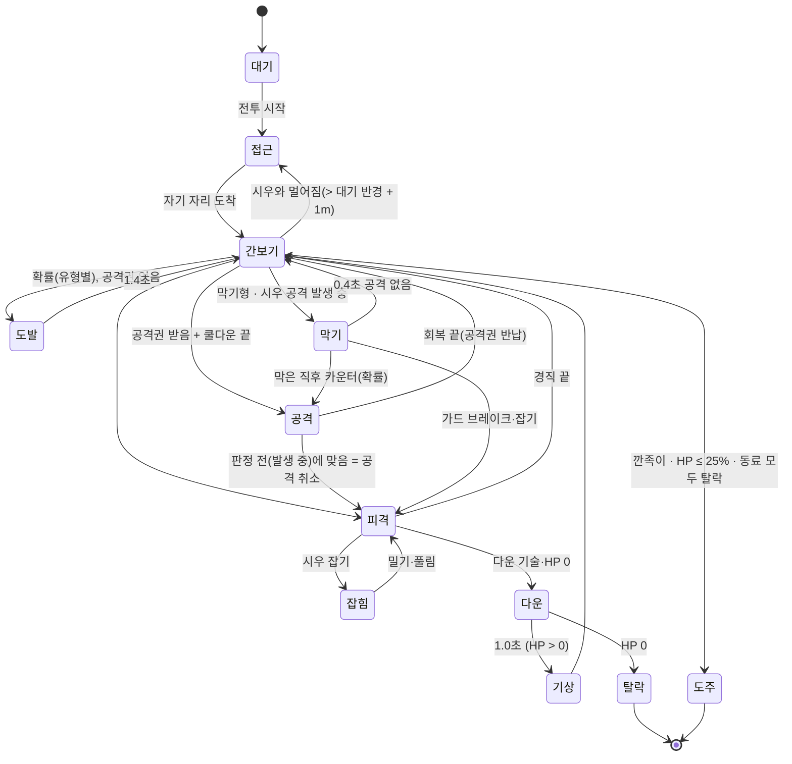

# 08. M2 전투 프로토타입 설계

> 대상: M2 전투 프로토 — 기획서 9장 "락온 전투, 약/강/잡기/회피, 기세 액션 2종, 히트스톱·셰이크 → 인카운터 1종, 야차 1종".
> 기준 문서: `01_기획서.md`(4장 전투), `02_세계관_스토리바이블.md`(시우·야차), `story/시우루트/00_1부_회차구성.md`(6·7화 첫 인카운터, 15화 첫 야차), `07_M1_조작_설계.md`(입력·카메라·이동·레이어·테스트 방식), `06_M1_그레이박스_설계.md`(12장 전투 무대), `anim_library.md`(동작 번호), 3D 시안 `concept/src/01_data.js`·`99_app.js`·`05_fx.js`·`03_rig.js`(타격감 실제 수치).
> 이 문서는 구현자가 이 문서만 보고 만들 수 있게 숫자를 다 적는다. 코드는 쓰지 않았다. 클래스·필드 이름은 제안이고, Cinemachine 3.1.7 의 실제 이름(`CinemachineImpulseDefinition.ImpulseTypes.Uniform`, `CinemachineImpulseListener.ReactionSettings`, `CinemachineGroupFraming`, `CinemachineBrain.IgnoreTimeScale` 등)은 `Library/PackageCache` 소스에서 확인했다. Unity 는 실행하지 않았다.
> 숫자 단위: **프레임(f) = 60fps 기준 1/60초.** 실행은 초 단위로 하고(10-3), 표의 f 는 설계 단위다.

---

## 0. 한눈에

| 항목 | 결정 |
|---|---|
| 결과물 | M1 빌드(혜화동 1구역)에 **뒷골목 주차장 1:3 인카운터**와 **와룡공원 공터 1:1 야차**가 붙은 빌드 + 전투 연습장. 패드·키보드 둘 다 |
| 조작 | □ 약 · △ 강/기세 · ○ 잡기 · × 회피 · R1 막기 · L1 락온(토글) · R2 전투 달리기. 키보드 = 마우스 왼쪽·오른쪽·F·Space·왼쪽 Ctrl·Q |
| 시우 기술 | 약 4타(잽-크로스-훅-크로스) + △ 마무리 4종(앞차기·어퍼·스텝 무릎·큰 훅), 잡기 3갈래(클린치 무릎·하체 밀기·돌려세우기 — **던지지 않는다**), 회피(무적 12f) + '읽었다' 반격 2종, 막기(가드 게이지·크러시), 전진 버팀(공격 중 약타 1번 무시) |
| 기세 액션 2종 | **「벽 러시」**(벽·옹벽·자판기·난간에 몰아붙여 6연타) · **「구경꾼 되받기」**(구경꾼 원으로 밀어내면 구경꾼이 떠밀어 돌려보내고 카운터). 성벽은 쓰지 않는다(문화재 실격 규칙), 쓰러진 상대를 밟는 바닥 기세 액션은 넣지 않는다(톤) |
| 적 | 인카운터 3유형: **깐족이**(돌진형) · **석 달**(막기형) · **냉장고**(덩치형). 야차: **「스크럼」**(15화 '덩치 큰 대학생', 가칭 육중현, 22세 럭비 동아리 포워드) |
| AI | 상태 = 접근·간보기·도발·공격(예고→판정→회복)·막기·피격·잡힘·다운·기상·탈락·도주. **공격권**: 동시에 공격하는 적 최대 1명(어려움 2) |
| 타격감 | 시안 수치 그대로: 히트스톱 약 0.06 / 중 0.095 / 강 0.16 / 기세 0.2초, 트라우마 0.28 / 0.45 / 0.8 / 1.0, 넉백 5 / 10 / 16cm, 번쩍 0.1초, 슬로 30% 0.5~0.75초. 히트스톱·슬로는 `Time.timeScale`(소유자 1개), 흔들림은 Cinemachine Impulse + 2차 노이즈 |
| 카메라 | `CM_Combat`(우선순위 20): 락온 = 시우 등 뒤에서 대상 쪽, 거리 4.2~6.5m 자동, 옆 18°. 다수 = 자유 궤도 5.0m + 위협 중심 자동 정렬. 기세 = `CM_Heat`(30) 상대 중심 근접 |
| 손 | 손가락 뼈 없음 → **M2 = 임시 손가락 뼈로 굽혀 셰이프 키로 굽기**(주먹·잡기 손 L/R 4개, 0크레딧). M3 정식 모델은 손가락 뼈 |
| 동작 | 이미 만드는 16개 + **필수 신규 10개(80크레딧)** + 선택 8개. 동작은 Humanoid 로 시우·적이 같이 쓴다 |
| 테스트 | PlayMode C01~C22: 콤보·판정·데미지, 락온, 회피 무적, 공격권, 다운·기상, 야차 승패, 프레임레이트 독립, 연타만으로 이길 수 있는지 |

---

## 1. 범위와 결과물

### 1-1. M2 에서 하는 것 / 자리만 / 안 하는 것

| 구분 | 내용 |
|---|---|
| **구현** | 탐색 ↔ 전투 전환(로딩 없음), 소프트 조준 + 락온, 약 4타 콤보·△ 마무리 4종, 잡기 3갈래, 회피·'읽었다'·반격, 막기·가드 크러시, 전진 버팀, 기세 게이지·기세 액션 2종, 다운·기상(연타로 빨리 일어나기), 적 4종 AI + 공격권, 인카운터 1(주차장 1:3), 야차 1(공터 1:1, 항복·심판 스톱), 히트스톱·흔들림·줌 펀치·슬로·피격 번쩍·히트 셰이크·피격 젖힘·의성어·먹 이펙트·화면 번쩍·쇼크 컷, 효과음 자리(합성음), 전투 HUD, 시우 주먹 셰이프 키, 전투 연습장, 접근성 '흔들림 줄이기' |
| **자리만** | 결과 카드의 땀·돈·평판 숫자(저장·성장 없음), BGM(첫 타격에 켜지는 자리), 구경꾼(먹색 실루엣 + 코드 들썩임), 심판 형(캡슐 + 이름표), 인카운터 대사(자막 2줄) |
| **안 함** | 스탯·땀 성장 반영(수치 고정), 스타일 전환(깡→복싱→MMA), 사물 들기·무기(자전거·쓰레기통 — 7화 「배달 자전거」는 M3), 「행인 러시」(16화 해금, M3), 그라운드·테이크다운·MMA 규칙, 경찰 사이렌·도주 추격, 밤 조명(낮 그대로), 컷신, 음성, 정식 효과음·BGM, 태오 조작, 악수 연출 |

### 1-2. 대표가 빌드로 해 보게 되는 것

빌드 `C:\클로드\haengin1-builds\M2` (M1 과 같은 Zone1 시작):

1. 성대 후문에서 출발 → 체크포인트 3 **후문 뒷골목 주차장**에 들어서면 자판기 앞 불량배 셋이 시비 → 그 자리에서 1:3. 약 연타만으로도 이기고, 막기형에겐 어퍼·잡기, 덩치형의 껴안기는 회피, 옹벽 앞에서 기세 MAX △ 로 「벽 러시」. 끝나면 결과 카드, 다시 탐색.
2. 계단을 올라 체크포인트 7 **와룡공원 공터**에서 '심판 형'에게 말을 걸면(× / E) 야차 1:1. 상대 「스크럼」의 태클을 피하면 구경꾼이 그를 밀어 돌려보내고, 원 가장자리에서 「구경꾼 되받기」. 상대가 항복하면 승리, 시우가 세 번 다운되면 심판 스톱.
3. 일시정지 메뉴(2차 M1 메뉴에 항목 추가): **계속 / 전투 다시 / 전투 연습장 / 흔들림 줄이기 ◀켬·끔▶ / 카메라 자동 정렬 / 끝내기**. 전투 연습장 = 평지 + 벽 + 구경꾼 원 + 허수아비(맞기만 함)·적 소환, 디버그 키(F2 적 다시, F3 기세 MAX, F4 시우 무적, F7 판정 보기).

**합격(대표 체감 기준)**: 패드로 1:3 을 연타만으로 4분 안에 이긴다(자동 테스트 C22 가 같은 것을 봇으로 확인). 회피·잡기·기세 액션을 쓰면 2분 안쪽. 맞을 때마다 "왜 맞았는지"가 보인다(예고·화살표). 야차는 태클을 두세 번 피해 보면 이기는 법이 보인다.

---

## 2. 조작

### 2-1. 입력 표 (전투 맵 `Combat`)

07 2-1 의 'M2 예약'을 확정한다. 패드는 PS 기호 (Xbox).

| 동작 | 패드 | 키보드·마우스 | 메모 |
|---|---|---|---|
| 이동 | 왼스틱 | W A S D | 락온 중 = 대상 기준(앞 = 대상 쪽), 아니면 화면 기준(07 4-10 의 기준 고정 그대로) |
| 시점 | 오른스틱 | 마우스 | **락온 중엔 대상 전환 전용**(2-3) |
| 약공격 | □ (X) | 마우스 왼쪽 | |
| 강공격 / 기세 액션 | △ (Y) | 마우스 오른쪽 | 기세 MAX + 조건 성립이면 기세 액션(화면에 '△ 기세' 표시), 아니면 강공격. 게이지는 기세 액션에만 쓴다 |
| 잡기 | ○ (B) | F | 잡기 중 방향 + ○ = 돌려세우기 |
| 회피 | × (A) | Space | 방향 없음 = 뒤로 |
| 막기 | R1 (RB) 누르고 있기 | 왼쪽 Ctrl 누르고 있기(또는 마우스 측면 뒤 버튼) | |
| 락온 | L1 (LB) 누름 = 켜기/끄기 | Q 또는 마우스 가운데 | 대상 없으면 M1 처럼 카메라 등 뒤 정렬 |
| 대상 전환 | 락온 중 오른스틱 튕기기 | 락온 중 마우스 휠 위/아래, Tab | |
| 전투 달리기 | R2 (RT) 누르고 있기 | 왼쪽 Shift | 4.5 m/s, 달리는 동안 락온 잠시 풀림(놓으면 다시) |
| 일어나기 빨리 | 다운 중 아무 공격 버튼 연타 | 같음 | 2-4 |
| 일시정지 | Options | Esc | M1 메뉴 + 항목 추가 |
| 디버그 | — | F1~F7 | 개발 빌드만 |

**기획서 4-1 과 달라진 점**: 없음. 기획서의 "□ 연타 최대 4타", "△ 콤보 마무리/단독 강타", "○ 멱살·클린치 → 던지기/무릎/테이크다운" 중 **던지기·테이크다운은 시우 체급에 맞게 '밀기·돌려세우기'로 바꿨다**(3-4). 테이크다운은 MMA 모드(M4 이후).

### 2-2. 입력 에셋

`HInput.inputactions` 에 맵 `Combat` 를 더한다. 07 2-3 방식(에셋 + `InputActionReference`, `PlayerInput` 안 씀) 그대로. **한 번에 한 맵**: 전투 시작 때 `Explore` 끄고 `Combat` 켬, 끝날 때 반대. `Menu` 맵은 지금처럼 일시정지 중에만.

| 액션 | 형식 | 바인딩 | 상호작용 |
|---|---|---|---|
| `Move` | Value / Vector2 | `<Gamepad>/leftStick`, 2DVector(W/S/A/D, 방향키) | Explore 와 같은 설정 |
| `LookPad` / `LookMouse` | Value / Vector2 | `<Gamepad>/rightStick` / `<Mouse>/delta` | 같은 설정 |
| `Light` | Button | `<Gamepad>/buttonWest`, `<Mouse>/leftButton` | Press |
| `Heavy` | Button | `<Gamepad>/buttonNorth`, `<Mouse>/rightButton` | Press |
| `Grab` | Button | `<Gamepad>/buttonEast`, `<Keyboard>/f` | Press |
| `Dodge` | Button | `<Gamepad>/buttonSouth`, `<Keyboard>/space` | Press |
| `Guard` | Button | `<Gamepad>/rightShoulder`, `<Keyboard>/leftCtrl`, `<Mouse>/backButton` | 누르는 동안 `IsPressed()` |
| `LockOn` | Button | `<Gamepad>/leftShoulder`, `<Keyboard>/q`, `<Mouse>/middleButton` | Press |
| `SwitchNext` / `SwitchPrev` | Button | `<Keyboard>/tab` / `<Keyboard>/shift+tab`(합성), `<Mouse>/scroll/y` 양·음 | Press |
| `Run` | Button | `<Gamepad>/rightTrigger`, `<Keyboard>/leftShift` | 누르는 동안 |
| `Pause` / `DebugHud` | Button | Explore 와 같음 | |

- **입력 버퍼**: Light·Heavy·Grab·Dodge 누름은 **0.20초(12f)** 기억했다가 가장 이른 실행 가능 시점에 쓴다. 같은 종류 새 입력이 오면 덮어쓴다. 버퍼 시간은 실제 시간(`unscaledTime`)으로 잰다 — 히트스톱 중 누른 것도 남는다.
  - **구현 메모(2026-10-06, 0~6단계)**: 버퍼 시계 = 실제 시간에서 **히트스톱으로 멈춘 프레임만 뺀 것**(`TimeFx.InputClock`). 그냥 실제 시간이면 C03 '잽 발생 중(3f) □ → 13f 크로스'가 성립하지 않았다 — 잽이 맞으면 히트스톱 4f 가 끼어 연결 창(게임 13f)이 실제로는 17f 뒤라 3f 에 누른 □ 가 14f 째에 만료. 슬로 중에는 실제 시간대로 흐르므로 버퍼가 늘어나지 않는다(실제 시간을 고른 이유는 그대로 지킴). 표의 f(연결 창·타격 시각)는 모두 **게임 프레임**(히트스톱 프레임은 세지 않음 — 3-2 '히트스톱은 경직에 들어가지 않는다').
- 누름 판정은 M1 `GameUi.Edge` 처럼 '지난 프레임 안 눌림 → 지금 눌림'도 본다(테스트 가짜 장치 대응).

### 2-3. 소프트 조준 · 락온 · 대상 전환

**소프트 조준(늘 켜짐)** — "버튼 연타만으로도 이길 수 있게"(기획서 4-1)의 핵심.
- 공격·잡기 시작 때 대상 고르기: 반경 **3.5m**, 기준 방향(스틱을 기울였으면 스틱 방향, 아니면 몸 정면)에서 **±75°** 안의 서 있는 적. 점수 = 거리(m) + 각도(°) × 0.02, 낮은 쪽. 공격 예고 중인 적은 −0.5(먼저 때리게).
- 고른 대상 쪽으로 **3f 동안 최대 45°** 몸을 돌린다(그 이상 차이 나면 45° 만).
- **자석(거리 보정)**: 대상이 기술 사거리보다 멀고 '사거리 + 0.8m' 안이면, 발생 프레임 동안 (거리 − (사거리 − 0.15m))만큼 앞으로 미끄러진다(최대 0.8m, `CharacterController.Move` 라 벽은 못 뚫음).
  - **구현 메모**: 거리는 **발생 동안 매 프레임 다시 잰다**(남은 필요 거리를 남은 발생 시간에 나눔). 시작 때 한 번만 재면 넉백으로 계속 밀려나는 대상을 놓친다 — C02 □□□□△ 에서 크로스(끝) 넉백 0.30m(0.25초 ease-out)가 큰 훅 발생 중에도 이어져 표면 1.15m > 사거리 1.1m 로 헛침. 자석 대상 자격(사거리 + 0.8m 안)은 시작 때 정한다.

**락온(L1 토글)**
- 켤 때 대상: 반경 **10m**, 카메라 정면 ±70°, 시우와 대상 사이에 `Wall` 이 없는 적 중 화면 중앙에 가장 가까운 것. 없으면 M1 처럼 카메라 등 뒤 정렬(0.30초).
- 락온 중: 시우 몸은 늘 대상을 본다(회전 540°/s). 이동 기준 = 시우 → 대상 방향(스틱 오른쪽 = 대상 둘레를 시계 방향으로 돎).
- 대상 전환: 오른스틱을 중립(< 0.3)에서 **0.15초 안에 0.75 넘게** 튕기면 그 화면 방향(좌우 위주, 각도 ±60°)에 있는 가장 가까운 적으로. 마우스 휠·Tab 은 화면 왼→오 순서로 다음/이전.
- 풀림: 대상이 탈락(HP 0)·도주 → **0.4초 뒤 다음 적**(공격 예고 중인 적 우선, 없으면 가장 가까운 적)으로 자동 이동, 적이 없으면 락온 끝. 대상이 12m 넘게 멀어지거나 `Wall` 뒤에 1.0초 넘게 가려지면 풀림. 대상이 다운 중이면 유지(일어나면 계속).
- 전투 달리기(R2) 중엔 락온을 잠깐 내려 두고, 놓으면 같은 대상으로 다시(대상이 탈락했으면 새로 고름).

### 2-4. 이동 수치 (전투 중)

| 상태 | 속도 | 클립 |
|---|---|---|
| 전투 대기 | 0 | 89 Combat_Stance |
| 락온·전투 걸음 앞 | **1.6 m/s** | 21 Walk_Fight_Forward(재생 배율은 M1 5-4 처럼 디딤발 측정으로 맞춤) |
| 뒤 | **1.3 m/s** | 20 Walk_Fight_Back |
| 옆(게걸음) | **1.3 m/s** | 옆 클립이 라이브러리에 없다 → 21(옆 오른쪽·왼쪽 모두)을 **비주얼만 이동 방향 쪽으로 최대 60° 돌려** 재생하고 상체는 `OnAnimatorIK` 의 `SetLookAtWeight(1, body 0.4, head 0.8)` 로 대상을 보게 한다. 어색하면 12장 결정 7  **→ 2026-10-06: 525·526 웅크려 옆걸음(하체) + 상체 전투 자세 층 `SideUpper`(11-3)** |
| 막기 중 이동 | 1.0 m/s | 하체는 위와 같고 상체는 막기 층(10-2) |
| 전투 달리기 | 4.5 m/s | 14 Run_02(M1 그대로) |
| 가속·감속 | 0 → 걷기 0.10초, 정지 18 m/s² | M1 3-2 |

- 공격·잡기·회피·피격 중에는 스틱 이동을 받지 않는다(이동은 기술의 루트 이동 + 자석 + 넉백만).
- `PlayerMotor` 에 더할 것(M1 코드 변경): 몸 방향 덮어쓰기(락온), 외부 이동 더하기(루트 이동·자석·넉백 — 모두 `CharacterController.Move` 경유), 상태별 속도 덮어쓰기. 모터의 중력·접지·턱 처리는 그대로 쓴다.

### 2-5. 탐색 ↔ 전투 전환

| 단계 | 시간 | 무슨 일 |
|---|---|---|
| 시비 | 0 ~ 0.8초 | 탐색 조작 유지. 적 머리 위 자막 2줄. 시우가 멈추면 적이 다가옴 |
| 전투 시작 | 0.8초 | `Explore` 맵 끔 → `Combat` 맵 켬. `CM_Combat` 우선순위 20 → 브레인 블렌드 **0.6초**(EaseInOut). 화면 가장자리 먹 붓 테두리가 0.3초에 들어오고 배너 「시비 붙음!」(인카운터)·이름 카드(야차) 1.2초. 길잡이 HUD·이름표 숨김. 손 셰이프 키 주먹 100(0.08초) |
| 조작 가능 | 1.2초 | 이때부터 공격 입력 받음(전에 누른 것은 버퍼에 남지 않게 비움) |
| 전투 중 | — | BGM 은 **첫 타격(누가 누구를 맞히든)에 시작**(후지모토 8장 9: 긴 정적 → 첫 타격에 폭발). 전까지는 환경음만 |
| 마무리 | 마지막 적 탈락 | 슬로 0.75초 30% + 의성어 「끝!」 대신 큰 붓 글자 **「정리.」**(시우 말투, 2.0초) |
| 결과 | +1.0초 | 결과 카드 2.5초(7-5). 탈락한 적은 일어나 달아남(14 Run_02), 구경꾼 흩어짐 |
| 탐색 복귀 | +2.5초 | `Combat` 끔 → `Explore` 켬. `CM_Combat` 우선순위 0 → 블렌드 **0.8초**. 탐색 카메라 궤도는 시우 등 뒤로 맞춰 둠(`SnapBehind` 를 블렌드 시작 때). 손 셰이프 키 0. 길잡이 HUD 다시 |

- 블렌드는 `CinemachineBlenderSettings` 에셋 하나: `CM_Explore → CM_Combat` 0.6초, `CM_Combat → CM_Explore` 0.8초, `* → CM_Heat` 0.15초(EaseIn), `CM_Heat → CM_Combat` 0.3초. 기본 0.4초는 그대로.
- 이동 기준: 07 4-4 대로 `CamRig.MoveBasis` 가 브레인 출력 카메라 yaw 를 쓴다(락온 중은 2-3 의 대상 기준이 우선).

---

## 3. 시우 기술표

### 3-1. 근거와 원칙

- **체급과 캐릭터**(바이블 2-1): 174cm·61kg, 마른 몸, **빠른 손·끝없는 볼륨·무식한 맷집·절대 뒤로 안 빠지는 전진 압박**. 그래서 ① 약공격이 빠르고 이어지기 쉽다(잽 발생 7f), ② 강공격은 체중이 아니라 '각도'로 넘긴다(어퍼·큰 훅), ③ 잡기는 들어 던지지 않는다 — **태오(88kg 유도)의 메치기와 겹치지 않게** 멱살을 잡고 무릎·밀기·돌려세우기만. 밀기는 아빠 말("사람은 하체로 버티는 거다", 회차구성 부록 B '아빠 밀기')을 그대로 기술로 옮겼다. ④ **전진 버팀**: 공격 중에 들어오는 약타 한 번은 경직 없이 맞고 계속 친다(맷집).
- **시안 수치**(`concept/src/01_data.js attackClips`, `99_app.js resolveHit`): 잽 0.34초·판정 0.11초, 크로스 0.40·0.14, 훅 0.46·0.20, 어퍼 0.50·0.22, 로킥 0.56·0.24, 바디 0.46·0.20 / 위력 잽 1, 크로스·훅·로킥·바디 2, 어퍼 3 / 히트스톱 [0, 0.06, 0.095, 0.16], 트라우마 [0, 0.28, 0.45, 0.8], 넉백 [0, 0.05, 0.10, 0.16]m / 「행인 러시」 = 잽·크로스·잽·크로스·훅·어퍼 1.35배속, 마지막 히트스톱 0.2 + 슬로 0.75초 + 다운. 아래 표의 발생 프레임은 이 '판정 시각'을 60fps 로 바꾼 값이다.
- **위력 단계**(5장 표와 연결): 약(1) / 중(2) / 강(3) / 기세(4). 단계가 히트스톱·흔들림·번쩍·의성어 크기를 정한다.

### 3-2. 공통 규칙

| 규칙 | 값 |
|---|---|
| 연결 창 | 다음 기술 시작 가능 = **판정 끝 + 3f ~ 기술 끝**. 그 전 입력은 버퍼(12f)에 남아 창이 열리는 첫 프레임에 나간다 |
| 콤보 끊김 | 기술 끝 + 0.15초 안에 □/△ 가 없으면 콤보 순번 0 |
| 회피 캔슬 | 공격의 **판정이 끝난 뒤** 회복 중 언제든 × 로 끊을 수 있다(발생 중은 안 됨). 콤보 순번 0 |
| 판정 모양 | 뼈 충돌체가 아니라 **공격자 기준 부채꼴**: 사거리(가슴 중심 → 피격자 캡슐 표면), 반각, 높이 차 ±0.6m. 판정 프레임 동안 매 프레임 검사, 같은 대상은 한 번만(10-3 의 구간 검사) |
| 맞는 수 | 기본 1명(부채꼴 안 가장 가까운). 훅·큰 훅·앞차기는 최대 2명 |
| 피해 | 정수. 시우 기본 HP **200**. 막기 중 피해 20%(올림) |
| 경직 | 피격자가 행동 못 하는 시간. 히트스톱은 경직에 들어가지 않는다(전체가 멈추므로) |
| 넉백 | 피격자를 공격 방향으로 민 총거리. 시안 스프링(속도 = 거리×9/0.9, 감쇠 e^(−10t), 0.5초 뒤 제자리 복귀 없음)을 따른다. 큰 넉백(≥ 0.3m)은 0.25초 ease-out |
| 루트 이동 | 공격 클립의 수평 이동은 살리고(`Bake Into Pose` XZ 끔) `OnAnimatorMove` 에서 `deltaPosition` 을 `CharacterController.Move` 로 옮긴다. 세로·회전은 굽는다. 자석은 따로 더한다. 탐색 클립(대기·걷기·달리기)은 M1 그대로 제자리 |

### 3-3. 타격기

| 입력 | 이름 | 동작 번호 | 발생 / 판정 / 회복 (f) | 전체 | 사거리·반각 | 피해 | 경직 (f) | 넉백 | 위력 | 기세 | 의성어 | 메모 |
|---|---|---|---|---|---|---|---|---|---|---|---|---|
| □ | 잽 | 191 | 7 / 3 / 10 | 0.33초 | 1.1m · 35° | 5 | 20 | 0.05m | 약 | +4 | 퍽! | 연결 13f~ |
| □□ | 크로스 | 192 | 8 / 3 / 13 | 0.40 | 1.2 · 35° | 7 | 22 | 0.10 | 중 | +6 | 빡! | 연결 14f~ |
| □□□ | 훅 | 193 | 12 / 3 / 13 | 0.47 | 1.0 · 60° | 8 | 24 | 0.10(옆) | 중 | +6 | 퍽! | 최대 2명. 연결 18f~ |
| □□□□ | 크로스(끝) | 192 | 8 / 3 / 19 | 0.50 | 1.2 · 35° | 9 | 30 | 0.30 | 중 | +7 | 빡! | □ 더 안 받음, △ 만. 연결 14f~ |
| △ | 앞차기 | 209 | 14 / 4 / 16 | 0.57 | 1.5 · 30° | 12 | 36 | **1.2m** | 중 | +8 | 빡! | 최대 2명. 다수전 거리 벌리기. 가드 −40 |
| □△ | 어퍼컷 | 194 | 13 / 4 / 13 | 0.50 | 0.9 · 40° | 14 | 40 | 0.16 | 강 | +10 | 콰직! | **가드 브레이크**: 막는 적의 가드를 깨고 경직 48f |
| □□△ | 스텝 무릎 | 211 | 12 / 4 / 14 | 0.50 | 0.8 · 40° (+0.4m 들어감) | 12 | 50 '숙임' | 0.10 | 중 | +8 | 퍽! | 숙임 중 ○ 는 반드시 잡힘. 덩치 경직 게이지 −20 |
| □□□△ · □□□□△ | 큰 훅 | **195** (신규) | 16 / 4 / 16 | 0.60 | 1.1 · 60° | 18 | 다운 | 다운(뒤로 1.0m) | 강 | +12 | 콰직! → 착지 쿵! | 최대 2명. 슈퍼아머 무시 |

**연결 검산**(경직 > 다음 타격까지 간격이어야 콤보가 이어진다): 잽 판정 7f → 크로스 판정 13+8 = 21f(간격 14) / 어퍼 13+13 = 26f(간격 19) — 잽 경직 20 ✓. 크로스 8 → 훅·무릎 14+12 = 26(18) — 22 ✓. 훅 12 → 크로스(끝) 18+8 = 26(14) / 큰 훅 18+16 = 34(22) — 24 ✓. 크로스(끝) 8 → 큰 훅 14+16 = 30(22) — 30 ✓(넉백 0.30m 는 자석 0.8m 가 메움).
**약 4타 전체**: 잽 0 → 크로스 13 → 훅 27 → 크로스(끝) 45 → 끝 75f = **1.25초, 29 피해**.

### 3-4. 잡기 (○) — 「멱살」

| 입력 | 이름 | 동작 번호 | 발생 / 판정 / 회복 (f) | 피해 | 결과 | 위력 | 기세 | 메모 |
|---|---|---|---|---|---|---|---|---|
| ○ | 멱살 잡기 | 259 Step_Forward_and_Push 의 **앞부분**(손이 닿는 프레임에서 멈춤) | 8 / 4 / 18(헛잡기) | 0 | 잡힘(최대 2.0초) | — | +5 | 사거리 0.9m · 50°. **가드 무시**. 다운·공격 판정 중인 적은 못 잡음. 덩치형·야차는 경직·숙임 중에만(아니면 '뿌리침': 시우 18f 경직, 0.3m 밀림) |
| 잡기 중 □ | 클린치 무릎 ×3 | 211 (1.4배, 루트 이동 끔) | 9 / 3 / 10 | 6 / 6 / 8 | 잡힘 유지 | 약·약·중 | +4씩 | 3번째 뒤 자동으로 하체 밀기 |
| 잡기 중 △ | **하체 밀기** | ~~259 뒷부분~~ **260 짧은 밀기**(2026-10-06 결정 — 259 뒷부분은 3초짜리 몰아붙이기) | 10 / 4 / 16 | 8 | 1.8m 밀려 비틀(40f) | 중 | +8 | 밀린 경로(0.3초)에 **벽면**이 있으면 '벽꽝': +6 피해, 경직 60f, 위력 강, 의성어 쿵!, 기세 +12. **다른 적**에 부딪히면 둘 다 30f 경직 + 4 피해 |
| 잡기 중 방향 + ○ | **돌려세우기** | 259 앞부분 유지 + 코드 회전 | 0.35초 | 0 | 적의 등이 입력 방향을 보게 시우가 축이 되어 90~180° 돎 | — | +3 | 끝나면 잡기 유지(남은 시간 그대로) → △ 밀기로 벽·구경꾼 쪽에 보내기 |
| (가만히) | 풀림 | — | — | — | 2.0초(깐족이 1.6, 석 달 1.8) 뒤 적이 뿌리침 | — | — | 둘 다 0.3m 떨어짐, 시우 12f 경직 |

- 시우 손: 왼손 멱살 = 왼손 '잡기 손' 셰이프 키 100, 오른손 주먹 100(9장).
- 피해자 자세: 잡힘 = 178 Hit_Reaction 첫 젖힘 프레임 고정 + 피격 젖힘 0.3배, 시우 앞 0.55m 에 붙임(위치는 시우 기준으로 매 프레임 맞춤).

### 3-5. 회피·반격·막기

| 입력 | 이름 | 동작 번호 | 프레임 | 효과 | 기세 | 메모 |
|---|---|---|---|---|---|---|
| × | 회피 스텝 | 156 Stand_Dodge | 전체 24f(0.40초): **무적 2~13f(12f)**, 이동 0~14f 1.6m(ease-out), 회복 10f | 무적 중엔 맞지 않음(잡기 포함) | 0 | 락온 중 = 대상 기준 방향, 아니면 입력 방향, 입력 없음 = 뒤. 몸 방향은 바꾸지 않는다. 공격 캔슬로 15f 부터, 연속 회피 18f 부터. **2번 연속 뒤에는 15f 더 기다림**(구르기 연타 방지) |
| (자동) | **읽었다** (완벽 회피) | — | 적의 판정이 시우 무적 프레임 안에서 시작했고, 그 공격이 회피 안 했으면 맞았을 것(판정 시작 순간 사거리·각도 안 — **구현: '회피를 시작한 자리'로 잼**. 지금 자리로 재면 회피 이동 1.6m 때문에 6f 전 회피도 이미 사거리 밖이라 거의 안 나옴). 읽힌 공격은 남은 판정 동안 시우를 맞히지 못한다 | 0.3초 슬로 **50%** + 화면 가장자리 먹 테두리 + 작은 붓 글자 「읽었다」. **반격 창 0.6초**(실제 시간) | **+15** | 기획서 4-1 "타이밍 맞추면 '읽었다' 판정 → 기세 +" |
| 읽었다 → □ | 카운터 크로스 | 192 (1.3배) | 6 / 3 / 13 | 피해 14, 경직 40, 넉백 0.30, 위력 강, 자석 ~~0.8m~~ **2.4m**(구현 메모: 기본 회피 = 뒤 1.6m 라 0.8m 로는 정면 1m 적에게 표면 2.7m — 헛침. 반격 두 기술 모두 자석·자석 거리 2.4m = 1.6 + 0.8, C07 ③ 으로 확인) | +8 | 빡! |
| 읽었다 → △ | 더킹 어퍼 | 194 | 10 / 4 / 14 | 피해 20, **다운**, 위력 기세(히트스톱 0.2), **슬로 0.5초 30%**, 화면 번쩍 0.4 | +10 | 콰직! |
| R1 누름 | 막기 | 138 Block1: 진입 6f → 막는 프레임에서 고정 유지 → 놓으면 해제 6f(구현: 막기 판정은 누른 프레임부터 — 6f 는 비주얼) | 정면 ±60° 막음 | 피해 20%. **가드 게이지 100**: 약 −15, 중 −25, 강 −40. 0.8초 막지 않으면 30/초 회복. 0 이 되면 **가드 크러시**: 48f 경직, 의성어 빡!, 기세 −5 | 막을 때마다 +2 | 툭(막는 소리). 막기 불가 공격(예고 '!!')은 못 막음 |
| (자동) | 전진 버팀 | — | 시우 공격의 **2타째(크로스) 발생 ~ 판정 끝** 동안 | 적의 **약타 1번**은 경직 없이 맞고(피해는 받음) 공격 계속. 쿨다운 2.0초 | +3 | 맷집·전진 압박(바이블). 중타 이상은 그대로 경직 |

### 3-6. 피격·다운 (시우)

| 받은 것 | 반응 | 경직 | 메모 |
|---|---|---|---|
| 약 | 절차 젖힘만(5-6) | 18f | 이동 멈춤 |
| 중 | 174 Face_Punch_Reaction(1.3배) + 젖힘 | 24f | |
| 강 | 178 Hit_Reaction + 젖힘 0.5배 | 40f | |
| 다운 | ~~187 Knock_Down~~ **366 falling_down**(2026-10-06 2차, 187 은 크게 날아갈 때만 — 11-3)(낙하 0.42초) → 누움 **2.0초**(연타 한 번에 −0.1초, 최소 0.8초) → 344 Stand_Up1(0.85초) | — | 누움·기상 중 무적, 기상 후 0.5초 무적. 적은 다운된 시우를 공격하지 않는다(4-3) |
| HP 0 | 다운 → 일어나지 않음 → 패배 처리(8장) | — | |

기세: 맞음 +3(버팀), 다운당함 −20, 가드 크러시 −5.

### 3-7. 기세 게이지

| 항목 | 값 |
|---|---|
| 범위 | 0~100. **100 = MAX** 일 때만 기세 액션 |
| 시작 값 | 인카운터·야차 시작 때 20(6화 '기세 첫 점화'의 자리). 끝나면 그대로 둠(다음 전투 시작 때 20 으로) |
| 오름 | 표의 '기세' 칸(맞혔을 때만). 도발 중인 적을 1.0초 안 때리고 버티면 +8("도발에 안 넘어가면", 기획서 2장) |
| 내림 | 마지막으로 때리거나 맞은 뒤 **4초** 지나면 −3/초. 다운당함 −20, 가드 크러시 −5 |
| 쓰기 | 기세 액션 = 100 → 0 |
| 화면 | 7장 |

### 3-8. 기세 액션 2종 (환경 「용과 같이」식)

조건이 맞고 게이지 100 일 때 △ → 기세 액션. 시작하면 **다른 적은 모두 멈추고(AI 정지 + 무적)**, 시우·대상도 서로 말고는 무적. 카메라는 `CM_Heat`(6-4). 끝나면 다른 적은 0.5초 뒤 다시 움직인다.

**① 「벽 러시」** — 골목 싸움의 '코너에 가두기'. 볼륨 복서 시우의 전진 압박 그대로.

| 항목 | 값 |
|---|---|
| 조건 | 대상이 시우 앞 **2.0m 안**(±45°), 대상 등 뒤 **1.4m 안에 `HeatSurface(kind = wall)` 면**(옹벽·자판기·상가 뒷벽·주차장 난간), 대상이 서 있음(경직·숙임은 됨, 다운·잡힘 아님). **성벽에는 `HeatSurface` 를 붙이지 않는다**(03_맵 4장: 성벽 훼손 실격) |
| 흐름 | 0.00 시우가 어깨로 밀어붙임(259 뒷부분 0.35초) — 대상 등이 벽에 쿵(위력 중, 벽에 먹 균열 데칼 1.5초) → 0.35 잽·크로스·훅·크로스·훅(191·192·193 1.35배, 0.25~0.35초 간격, 각 피해 5·5·6·5·6, 위력 약, 히트스톱 0.06, 트라우마 0.28) → 1.90 어퍼(194, 피해 20, 위력 기세: 히트스톱 0.2 + 슬로 0.75초 30% + 쇼크 컷 + 화면 번쩍 0.4) → 대상 365 Kneel_on_One_Knee_and_Stand **앞부분**(벽에 기대 한쪽 무릎) → 다운 처리 |
| 합계 | 피해 **47**, 약 3.2초(슬로 포함 실제 시간) |
| 시안 근거 | `doRush`(잽·크로스·잽·크로스·훅·어퍼 1.35배, 마지막만 원래 위력, 히트스톱 0.2, 슬로 0.75) |

**② 「구경꾼 되받기」** — 구경꾼 원이 링 줄 노릇을 하는 「용과 같이」 장면. 야차(원 전체)와 인카운터(구경꾼이 선 북쪽 진입로)에서 다 된다.

| 항목 | 값 |
|---|---|
| 조건 | 대상이 시우 앞 2.0m 안(±45°), 대상 등 뒤 **1.0m 안에 `CrowdRing` 구간**(구경꾼이 선 자리), 대상이 서 있음 |
| 흐름 | 0.00 시우 앞차기(209, 피해 12, 위력 중)로 원 쪽으로 밀어냄 → 0.45 구경꾼 2~3명이 "어어어!" 하며 두 손으로 떠밂(코드: 몸 20° 숙이며 0.2m 전진) → 0.60 대상이 562 Stumble_Walk 로 시우 쪽으로 비틀거리며 돌아옴(1.6m, 0.5초) → 1.05 시우 제자리 크로스 카운터(192, 피해 33, 위력 기세, 히트스톱 0.2 + 슬로 0.75초 + 쇼크 컷 + 화면 번쩍 0.4) → 대상 187 다운(뒤로 1.2m) + 착지 쿵! |
| 합계 | 피해 **45**, 약 2.6초 |

- 기세 액션 중 대상의 HP 가 0 이 되어도 연출은 끝까지 한다.
- 「행인 러시」(조건 없는 기세 액션)는 M3(16화 해금). 넣지 않는 것: **바닥 기세 액션**(쓰러진 상대 밟기 — 17세 주인공·캐주얼 톤에 맞지 않음), 성벽.

---

## 4. 적

### 4-1. 공통

- **몸**: `CharacterController`(높이 = 키, 반지름 0.30 / 덩치 0.38) + `EnemyMotor`(M1 모터의 중력·접지만 가진 가벼운 판). 전투 무대가 평평해서 NavMesh 없이 조향(목표 쪽 + 서로 밀어내기 0.9m)만 한다. 레이어 `Fighter`(10-2).
- **공격 판정·피해·경직·넉백·위력**은 시우와 같은 규칙(3-2). 적 공격은 시우 같은 기술보다 **발생이 2f 이상 느리다**(시우가 끊을 수 있게).
- **예고**: 모든 공격은 발생 전에 몸짓이 보인다. 중·강 공격은 판정 0.2초 전 머리 위 먹 붓 **'!'**(0.3초). **막기 불가 공격**은 0.7~0.6초 전 몸 테두리 흰 번쩍 2번 + **'!!'**. 화면 밖에서 공격하는 적은 발생 +0.2초 + 화면 가장자리 화살표(7-4).
- **피격 반응**: 약 = 절차 젖힘(5-6), 중 = 174(1.3배), 강 = 178, 다운 = 187 → 누움 1.0초 → 344(0.85초), 기상 후 무적 0.3초. **HP 0 = 탈락**: 다운 뒤 일어나지 않고 365 앞부분(무릎·주저앉음)으로 바꿔 전투 끝까지 둔다.
- **슈퍼아머**(덩치·야차): 약타에 경직 없음(젖힘 0.5배만). **경직 게이지**: 약 −6, 중 −12, 강 −30, 스텝 무릎 −20 → 0 이면 60f 경직(이때 잡힘), 3초 뒤 가득 회복.
- **도발**(88 Chest_Pound_Taunt, 1.4초): 간보기 중 확률. 도발 중 맞으면 경직 ×1.5.

### 4-2. AI 상태



| 상태 | 하는 일 |
|---|---|
| 대기 | 시비 전. 자판기 앞에 서 있음(246·243 대기 클립 재사용) |
| 접근 | 자기 자리(아래 '자리')로 걸음(115 Quick_Walk / 깐족이는 14 달리기). 시우 2.0m 안이면 간보기로 |
| 간보기 | 자리에서 옆걸음(1.0 m/s, 21 + 몸 돌림 — 2-4 와 같은 방식)으로 1.5~3.0초마다 자리 고쳐 잡기. 늘 시우를 봄 |
| 공격 | 공격권(4-3)을 받으면 사거리까지 들어가(최대 1.5m, 2.5 m/s) 유형별 기술 하나 또는 연결(원투) |
| 막기 | 막기형만(4-4) |
| 피격 / 잡힘 / 다운 / 기상 | 4-1 |
| 탈락 | 전투 끝까지 무릎 꿇고 있음. 결과 때 일어나 달아남 |
| 도주 | 깐족이만: 무대 가장자리 쪽으로 달아나다 구경꾼에 막혀 되돌아옴(인카운터 안에서는 실제로 못 나감) → 다시 간보기. 결과 집계는 탈락과 같음 |

**자리(간보기 위치)**: 공격권을 가진 적 = 시우에서 **2.0~2.6m**, 나머지 = **3.5~5.0m** 링. 시우 둘레 각도로 **70° 이상** 떨어지게 자리를 나눠 갖고(먼저 온 적 우선), 카메라 정면 ±40° 안 자리를 우선 준다(화면 안에서 기다리게). 다운된 시우 주위 1.5m 안에는 들어오지 않는다.

### 4-3. 공격권 — 동시에 때리는 수 제한

- `AttackDirector`(인카운터마다 1개)가 공격권을 나눠 준다. **동시 공격 최대 1명**(보통) / 2명(어려움, 옵션). '공격 중' = 공격 상태(예고·발생·판정·회복) 전체.
- 권리 요청 조건: 간보기 상태, 개인 쿨다운 끝, 시우가 다운·기상·기세 액션 중이 아님.
- 고르는 순서: 기다린 시간이 긴 적 → 화면 안 적(화면 밖은 기다린 시간 ×0.5 로 계산) → 가까운 적.
- **전체 간격**: 한 적의 공격이 끝난 뒤 다음 적 공격 시작까지 최소 **0.6초**.
- 굶김 방지: 어떤 적도 15초 넘게 권리를 못 받지 않는다(C11 에서 확인).
- 시우가 맞아 경직 중이면 새 권리를 주지 않는다(같은 적의 연결 공격 원투는 예외).

### 4-4. 인카운터 3유형

| | 깐족이 (돌진형) | 석 달 (막기형) | 냉장고 (덩치형) |
|---|---|---|---|
| 설정 | 다른 학교 고3(18). 말이 먼저 나가는 깐족이. 휴대폰을 손목 줄에 걸고 다님 | 고3(18). 동네 복싱 체육관 석 달 다닌 애. 자세는 그럴듯함 | 동네 형(19). 고교 졸업 후 이삿짐 알바. 말없이 껌을 씹음 |
| 키·체중 | 172cm / 57kg | 177cm / 67kg | 184cm / 112kg |
| HP | 70 | 90 | 160 |
| 속도 | 접근 3.6 m/s(달림), 간보기 1.2 | 접근 1.6, 간보기 1.0 | 접근 1.2, 간보기 0.8, 공격 들어갈 때 2.0 |
| 개인 쿨다운 | 1.2초 | 1.5초 | 2.2초 |
| 도발 확률(간보기 2초마다) | 25% | 0 | 10%(껌 풍선, 88 대신 대기 클립 + 코드) |
| 막기 | 없음 | 4-5 | 없음(슈퍼아머, 경직 게이지 30) |
| 다운 | 큰 훅·어퍼(반격)·기세·벽꽝 | 같음 | 큰 훅·기세·경직 게이지 0 + 강타 |
| 가르치는 것 | 약 연타·끊어 치기 | **어퍼(가드 브레이크)·잡기**·옆·뒤에서 치기 | **회피**(막기 불가 껴안기)·스텝 무릎·잡기(경직 중) |
| 이후 | M3 에서 임찬(휴대폰 깐족이)으로 옷만 바꿔 쓰기 좋음 | M3 민재 무리 다른 애/일반 인카운터 | M3 박건우(말없는 덩치, 6화 "목을 감고 바닥에 찍는" 팔)의 바탕 |

**공격표**

| 적 | 기술 | 동작 번호 | 예고 | 발생 / 판정 / 회복 (f) | 사거리 | 피해 | 시우 경직 | 넉백 | 위력 | 막기 |
|---|---|---|---|---|---|---|---|---|---|---|
| 깐족이 | 원투 | 191 → 192 | — | 9/3/12 → 10/3/14 | 1.1 | 6 → 8 | 18 → 24 | 0.05 → 0.10 | 약 → 중 | 됨 |
| | 달려들기 | 510 Standard_Forward_Charge(2.5m, 0.45초) → 192 | '!' 0.5초(몸 낮춤) | 돌진 끝에서 10/3/16 | 돌진 + 1.2 | 12 | 30 | 0.3 | 중 | 됨(가드 −25) |
| 석 달 | 잽 | 191 | — | 9/3/11 | 1.1 | 5 | 18 | 0.05 | 약 | 됨 |
| | 원투 | 191 → 192 | — | 9/3/12 → 10/3/14 | 1.2 | 5 → 8 | 18 → 24 | | 약 → 중 | 됨 |
| | 카운터 훅 | 193 | 짧음('!' 0.2초) | 10/3/14 | 1.0 | 10 | 24 | 0.10 | 중 | 됨 |
| 냉장고 | 큰 휘두르기 | ~~193 (0.7배)~~ **128 양손 내려찍기**(2026-10-06 2차, 태오 리그) | '!' 0.6초(팔을 크게 뒤로) | 22/4/20 | 1.2 | 16 | 40 | 0.3 | 강 | 됨(가드 −40) |
| | 앞차기 | 206 Spartan_Kick | '!' 0.5초 | 20/4/18 | 1.5 | 14 | 36 | 1.5m(막아도 1.0m) | 중 | 됨 |
| | 껴안기 | 259 앞부분 → 성공 시 259 뒷부분 밀어 넘어뜨리기 | **'!!' 0.7초** + 흰 번쩍 2번 | 24/6/30(헛방) | 1.2 | 18 | **다운** | 1.5m | 강 | **불가** |

### 4-5. 막기형 막기 규칙

- 시우 공격의 발생이 시작될 때 석 달이 그 공격 사거리 + 0.5m 안, 시우를 ±70° 안에서 보고 있으면 막기 확률: 약 1·2타 **50%**, 3·4타 **90%**, △ 앞차기·큰 훅 **40%**, 어퍼·잡기는 막지 못함(어퍼 = 가드 브레이크 48f, 잡기 = 가드 무시).
- 막는 중 피해 0, 석 달 가드 게이지 60(약 −15, 중 −25) → 0 이면 48f 경직.
- 막은 직후 0.25초 안에 **60%** 로 카운터 훅.
- 첫 막기 때 HUD 한 줄 도움말 「막는 상대엔 □→△ 어퍼, 또는 ○ 잡기」(한 번만).

### 4-6. 야차 상대 — 「스크럼」

**고른 인물: 15화 「성곽 아래 원」의 '첫 상대 덩치 큰 대학생'.**
- M2 의 야차 1종은 **이기고 질 수 있는 시험**이어야 한다. 채강혁(22화)은 '패배 확정 이벤트 전투'라 승패 판정 시험에 맞지 않고, 1부 최종보스라 전용 기술·컷신이 필요해 M3 이후가 맞다.
- 15화의 핵심 그림 — "61킬로, 원 안에서 제일 가벼운 시우는 배당이 제일 높다", "맞으면서 앞으로 간다. 뒤로는 한 발도 안 뺀다. 이긴다" — 가 그대로 M2 의 손맛 시험(체급 차이, 전진 버팀, 태클 피하고 되받기)이 된다.
- 스토리 바이블에 이름이 없어 **가칭**을 붙였다(12장 결정 2).

| 항목 | 내용 |
|---|---|
| 이름 카드 | 「와룡공원 야차 첫판 — **'스크럼' 육중현**」(가칭) |
| 설정 | 22세, 후문 쪽 캠퍼스(이름 미정 — 06 15장 결정 2) 럭비 동아리 포워드 2학년. 야차엔 '몸 풀러' 나온다. 사람 좋은 형인데 붙으면 진지해진다. 이기면 "한 판 더?", 지면 시원하게 인정 |
| 키·체중 | 188cm / 102kg (냉장고와 달리 뱃살 없는 운동선수 통짜, 굵은 허벅지·목) |
| HP | **260** |
| 슈퍼아머 | 경직 게이지 40(페이즈 2: 50) |
| 속도 | 간보기 1.0, 들어갈 때 2.4 m/s, 태클 5.5 m/s |
| 쿨다운 | 1.8초 → 페이즈 2(HP ≤ 50%) 1.3초 |

| 기술 | 동작 번호 | 예고 | 발생 / 판정 / 회복 (f) | 사거리 | 피해 | 결과 | 막기 |
|---|---|---|---|---|---|---|---|
| 밀기 | 260 Push_Forward_and_Stop | — | 12/4/16 | 1.2 | 6 | 넉백 1.2m(막아도 0.8m) | 됨 |
| 휘두르기 | 193 (0.75배) | '!' 0.5초 | 20/4/18 | 1.2 | 15 | 경직 40 | 됨(가드 −40) |
| **태클** | **512 Male_Head_Down_Charge** | **'!!' 0.6초**(몸 낮추고 발 구름 2번) + 흰 번쩍 | 돌진 4.0m(0.73초) 중 판정 계속 | 몸 앞 0.8 | 22 | **시우 다운** | **불가** |
| 도발 | 88 Chest_Pound_Taunt | — | 1.4초 | — | — | 페이즈 1 만, 20% | — |

- **태클 헛방**: 회피로 피하면 4.0m 끝까지 가서 **562 Stumble_Walk 비틀 1.2초**(등 노출, 이때 맞으면 경직 ×1.5). 원 가장자리에 닿으면 구경꾼이 떠밀어 시우 쪽으로 돌려보냄(되받기와 같은 연출, 피해 없음) — 플레이어가 「구경꾼 되받기」의 원리를 먼저 보게 하는 장치.
- **페이즈 2**(HP ≤ 50%): 도발 없음, 태클 확률 25% → 40%, 태클 헛방 후 비틀 1.2 → 0.9초, 밀기 → 휘두르기 연결.
- 기술 고르기(공격권은 1:1 이라 늘 있음): 거리 > 3m 태클 50% / 접근 50%, 거리 ≤ 1.5m 밀기 40% · 휘두르기 40% · 물러나기 20%.
- **항복**: HP 0 → 다운 → 365 앞부분(한쪽 무릎) 유지 + 자막 "됐다, 됐어! 졌다!" → 심판 형 "끝!"(8-2).

### 4-7. 외형 설명 (힉스필드 설정화용)

공통: 후지모토풍 A(컬러 셀) — `concept/FUJIMOTO_STYLE.md` 9장 규칙(작가명·작품명 금지, 담배·술·상표·글자 금지). **주황(#E2582C)은 시우 전용 강조색이라 적에겐 쓰지 않는다** — 적마다 채도 낮은 자기 색 하나. 1:3 에서 실루엣으로 구분되게 체형을 뚜렷이 다르게(마름 / 보통 / 둥근 거구). 실존 인물과 닮지 않게, 담배 없음(소품은 휴대폰·껌·수건).

| | 깐족이 | 석 달 | 냉장고 | 스크럼 |
|---|---|---|---|---|
| 실루엣 | 마르고 구부정, 목 앞으로 | 어깨 올린 복싱 자세, 단단한 보통 체격 | 둥글고 큰 덩어리, 뱃살, 짧은 목 | 사각 통짜, 굵은 목·허벅지, 둥근 어깨 |
| 머리 | 앞머리 내린 짧은 머리, 끝에 염색 빠진 갈색(#7A5A3C) | 아주 짧은 버즈컷, 왼쪽 눈썹에 면도 선 한 줄 | 까까머리에 가까운 짧은 머리, 둥근 얼굴 | 짧은 스포츠 머리 + 흰 헤어밴드, 양 귀를 가로지르는 흰 테이프 한 줄(럭비) |
| 얼굴 | 가는 눈, 한쪽 입꼬리 올린 비웃음 | 굳은 표정, 턱 당김 | 작은 눈, 무표정, 껌 | 넓은 얼굴, 짙은 눈썹, 평소 진지 / 웃으면 사람 좋은 큰 웃음 |
| 옷 | 머스터드 바람막이(#B8963E) 지퍼 반쯤, 흰 교복 셔츠(넥타이 없음), 검정 슬림 교복 바지, 흰 운동화 검정 밑창, 손목에 검은 휴대폰 줄 | 검정 반팔 기능성 티(#24262B), 회색 교복 바지(#4A4E57), 손에 감은 탁한 빨간 핸드랩(#9E3B36), 검은 운동화 | 꽉 끼는 회색 반팔 티(#8E8F93), 남색 작업 바지(#2E3447) 무릎에 흙 얼룩, 목에 흰 수건, 흰 면장갑 한 짝 뒷주머니, 검은 작업화 | 진녹색 칼라 반팔 럭비풍 상의(#2F5A45, 가슴에 흰 가로줄 두 개, 번호·글자 없음), 남색 반바지(#2A2F45) + 검은 긴 타이츠, 흰 양말, 회색 러닝화 |
| 자기 색 | 머스터드 | 탁한 빨강 | 회색·남색(무채) | 진녹색 |

**영어 프롬프트 초안** (GPT Image 2.5, 2:3, 참조 이미지 없음, 한 장 먼저 뽑아 확인). 공통 꼬리말 `STYLE_COLOR` 와 `AVOID` 는 FUJIMOTO_STYLE 부록 B 원문을 그대로 붙인다(아래엔 약속어로 적음) — **AVOID 끝 문장은 "Original characters, not resembling any existing anime or manga character or any real person." 으로 늘려 쓴다.**

```text
[kkanjok_color] Full-body front-view color character illustration of an original character, standing with a cocky slouch, chin pushed forward, weight on one hip, one hand half in his windbreaker pocket and the other hand dangling a black phone on a wrist strap, a sneering half-smile with one mouth corner raised. The character is an 18-year-old Korean high-school boy (third-year student), 172 cm and 57 kg, about 7.3 heads tall with realistic proportions: a skinny, slightly hunched frame, narrow shoulders, thin neck pushed forward, thin wrists, not muscular. Light warm skin. Narrow face with thin, slightly upturned eyes, thin eyebrows, a small sharp chin. Short black hair with a heavy fringe falling over the forehead, the ends faded to a washed-out light brown from old hair dye. Outfit: an unzipped-halfway mustard-yellow windbreaker over a white school dress shirt with no necktie, the shirt untucked; black slim-fit school trousers; white low-top sneakers with black soles. Plain unbranded clothing. Colors: light warm skin with mauve shadows, black hair with faded brown ends (#7A5A3C), a desaturated mustard windbreaker (#B8963E) as his only accent color, white shirt with cool blue-grey shadows, black trousers. No orange anywhere. Plain warm off-white paper background (#F4EFE6) with a soft grounding shadow under the feet, whole body visible from hair to soles. {STYLE_COLOR} {AVOID}
```

```text
[seokdal_color] Full-body front-view color character illustration of an original character, standing in an amateur boxing guard that looks practiced but stiff: fists raised near the chin, elbows tucked, shoulders hunched up, chin down, glaring forward. The character is an 18-year-old Korean high-school boy (third-year student) who has trained at a neighborhood boxing gym for three months, 177 cm and 67 kg, about 7.4 heads tall with realistic proportions: an average, solid build with defined but modest arm muscles, not bulky. Light tan skin. A square-ish face with a firm jaw, small dark eyes under straight eyebrows, one thin shaved slit line through his left eyebrow, a tight-lipped serious mouth. Very short black buzz-cut hair. Outfit: a plain black short-sleeve athletic T-shirt, grey school trousers, black sneakers, and dull red cloth hand wraps wound around both hands and wrists. Plain unbranded clothing. Colors: light tan skin with mauve-brown shadows, black hair, a black T-shirt (#24262B), grey trousers (#4A4E57), dull brick-red hand wraps (#9E3B36) as his only accent color. No orange anywhere. Plain warm off-white paper background (#F4EFE6) with a soft grounding shadow under the feet, whole body visible from hair to soles. {STYLE_COLOR} {AVOID}
```

```text
[naengjanggo_color] Full-body front-view color character illustration of an original character, standing heavy and still with his arms hanging slightly away from his body, feet planted wide, expressionless, chewing gum. The character is a 19-year-old Korean young man who works part-time for a moving company, 184 cm and 112 kg, about 7.2 heads tall with realistic proportions: a big, round, heavy body with a soft belly, thick arms, broad sloping shoulders, a short thick neck, big hands; strong but not a bodybuilder, no visible abs. Light skin with ruddy cheeks. A big round face, small eyes, a round nose, a small closed mouth. Black hair clipped almost to the scalp. Outfit: a plain grey short-sleeve T-shirt that is a little tight on him, navy work trousers with faded dirt marks on the knees, black work boots, a white towel hanging around his neck, and one white cotton work glove sticking out of his back pocket. Plain unbranded clothing. Colors: light skin with mauve shadows and ruddy cheeks, black hair, a heather-grey T-shirt (#8E8F93), navy work trousers (#2E3447), a white towel, black boots; muted greys and navy only, no strong accent color. No orange anywhere. Plain warm off-white paper background (#F4EFE6) with a soft grounding shadow under the feet, whole body visible from hair to soles. {STYLE_COLOR} {AVOID}
```

```text
[scrum_color] Full-body front-view color character illustration of an original character, standing square to the viewer with his hands loosely on his hips, a calm serious look that could break into a big friendly grin. The character is a 22-year-old Korean university student who plays as a forward on his university's rugby club, 188 cm and 102 kg, about 7.4 heads tall with realistic proportions: a thick, compact athlete's body with a thick neck as wide as his jaw, rounded heavy shoulders, a thick chest and waist, very thick thighs and calves; strong and solid, not a bodybuilder, no visible abs, no exaggerated V-shape. Warm light-tan skin. A wide square face, thick dark eyebrows, small calm eyes, a broad nose, an easy closed mouth. Short black sporty hair under a plain white elastic headband, and one strip of white athletic tape wrapped around his head across both ears like a rugby player's ear tape. Outfit: a dark forest-green short-sleeve rugby-style jersey with a white collar and two plain horizontal white stripes across the chest (no numbers, no letters, no logos), navy athletic shorts over black full-length compression tights, white socks, grey running shoes. Plain unbranded clothing. Colors: warm light-tan skin with mauve-brown shadows, black hair, a muted forest-green jersey (#2F5A45) as his only accent color, white stripes and collar, navy shorts (#2A2F45), black tights, grey shoes (#9A9CA0). No orange anywhere. Plain warm off-white paper background (#F4EFE6) with a soft grounding shadow under the feet, whole body visible from hair to soles. {STYLE_COLOR} {AVOID}
```

**3D 용 A포즈 4방향**(색 그림 채택 뒤, 참조 = 그 색 그림): 위 본문의 첫 문장(자세)을 아래로 바꾸고 나머지는 그대로. `concept/art/fujimoto/README.md` 「3D 변환 시험」의 교훈(팔이 몸에 붙으면 리깅 실패)을 넣었다.

```text
Four-view A-pose character turnaround of the same original character in full color, front view, left side view, back view and right side view side by side at identical scale on one shared ground line: standing straight, arms held away from the body at about 45 degrees so the hands are clearly separated from the hips and thighs, fingers relaxed and slightly spread, feet a little wider than shoulder-width apart, neutral expression, whole body visible from hair to soles in every view. (이어서 [이름]_color 의 'The character is …' 부터 끝까지)
```

- 크레딧(README 단가): 색 그림 2.75 + A포즈 4방향 4.25 + Tripo 멀티뷰 9 + 리깅 5 ≈ **21 / 명**, 4명 ≈ 84. 리깅을 손가락 뼈 있는 무료 도구로 하면 −5(9장).

### 4-8. 적이 쓰는 동작

동작은 Humanoid 근육 공간으로 리타깃되므로 **시우용으로 뽑은 클립을 적이 그대로 쓴다.** 새로 뽑는 것만 적는다.

| 쓰임 | 번호 | 쓰는 적 |
|---|---|---|
| 재사용(시우 것) | 89, 21, 20, 191, 192, 193, 138, 174, 178, 187, 344, 14 Run_02, 115 Quick_Walk, 246·243 대기 | 전원 |
| **신규 필수** | **88** Chest_Pound_Taunt(도발) · **510** Standard_Forward_Charge(달려들기) · **206** Spartan_Kick(앞차기) · **512** Male_Head_Down_Charge(태클) · **260** Push_Forward_and_Stop(밀기) · **365** Kneel_on_One_Knee_and_Stand(탈락·항복·벽 주저앉기 — 앞부분/뒷부분 나눠 씀) · **562** Stumble_Walk(되받기·태클 헛방 비틀) | 깐족이·냉장고·스크럼·전원 |
| 선택 | 190 Knock_Down_1(앞으로 쓰러지기 변형 — 방향 미리보기 확인), 179 Hit_Reaction_1(피격 변형), 306 Cheer_with_One_Hand_Up · 298 Cheer_with_Both_Hands_Up(구경꾼 환호, 실루엣이 정식 모델이 되면) | |

- **덩치 체형 클립(88·206·512·260)은 태오 모델(183cm·88kg)로 뽑는다** — 마른 시우 몸에서 뽑은 동작을 거구에 옮기면 팔이 배를 뚫기 쉽다. 시우 클립을 덩치가 쓸 때 팔이 몸통을 뚫으면 그 아바타의 Humanoid 근육 범위(`Arm Down-Up`)를 줄이고, 그래도 안 되면 그 클립만 덩치 모델로 다시 뽑는다(8크레딧).
  - **2026-10-06 실측(11-4)**: 근육 범위 줄이기는 효과가 없거나(`Down-Up`) 거꾸로였다(`Front-Back`). 대신 재생 뒤 **위팔을 몸 바깥으로 12° 벌린다**(`FighterAnim.ArmSpread` — 냉장고·스크럼). 닿는 순간 냉장고 2.2 → 1.3%, 스크럼 15.1 → 11.8%, 가장 깊음 7.1 → 4.3cm · 8.3 → 4.6cm.
- `anim_library.md` 에 없는 번호(259·260·510·512·562·365·31·306·298·93)는 Meshy 문서(2026-10-06 조회)에서 가져왔다. **뽑기 전 이름을 다시 확인하고, 미리보기 한 장으로 방향·길이를 본 뒤** 돌린다.

---

## 5. 타격감 규칙

### 5-1. 수치표 (시안 → Unity)

| 요소 | 약 | 중 | 강 | 기세(마무리) | 근거 |
|---|---|---|---|---|---|
| 히트스톱 | **0.060초** | **0.095** | **0.160** | **0.200** | 기획서 4-2, `resolveHit`, `doRush` |
| 트라우마 더함 | 0.28 | 0.45 | 0.80 | 1.00 | `app.cam.add` |
| 줌 펀치 | — | 1 | 1 | 1 | `power ≥ 2 → punch = 1` |
| 피격자 번쩍 | 0.1초 | 0.1초 | 0.1초 | 0.1초 | `flash() → flashT .1`, 이미시브 0.5 |
| 히트 셰이크(피격자 떨림) | 히트스톱 동안 매 프레임 가로 ±1.5cm·앞뒤 ±1.0cm 무작위 | 같음 | 같음 | 같음 | `jitter` |
| 피격 젖힘 무게 | 0.85 | 1.15 | 1.45(클립과 섞을 땐 ×0.5) | 1.45 | `hitFlinch(.55 + power × .3)` |
| 넉백 | 0.05m | 0.10 | 0.16 + (다운이면 뒤로 1.0) | 기술별 | `knock([0,.05,.1,.16])` |
| 화면 번쩍 | — | — | 흰색 0.32, 0.16초 | 0.40 | 시안은 중타도 번쩍 — **연타 중 눈 피로 때문에 강 이상만**으로 줄임 |
| 쇼크 컷(흑백 반전 2f) | — | — | — | 기세 마무리 · 전투 첫 타격 | FUJIMOTO 8장 9 |
| 슬로모션 | — | — | 더킹 어퍼 0.5초 | 0.75초, **30% 속도** | `app.slow`, `dt × .3` |
| 의성어 | 퍽! | 빡! | 콰직! | 콰직! / 착지 쿵! | 시안 |
| 먹 이펙트 | 5-4 표 power 1 | power 2 | power 3 | power 3 + 바닥 고리(다운) | `inkHit`, `inkSlam` |
| 기세(시우가 때렸을 때) | 기술표 | | | | |
| 접근성 '흔들림 줄이기' | 트라우마 ×0.3, 화면 번쩍·쇼크 컷·슬로 끔(히트스톱은 둠) | | | | `REDUCED` |

### 5-2. 시간 — 히트스톱과 슬로모션

- **`TimeFx` 하나만 `Time.timeScale` 을 쓴다.** 값 = 일시정지면 0, 아니면 히트스톱 중 0, 아니면 슬로 중 그 배율(0.3 / '읽었다' 0.5), 아니면 1. M1 `GameUi` 의 일시정지도 `TimeFx.SetPaused` 를 부르게 바꾼다(M1 코드 변경).
- 히트스톱·슬로 남은 시간은 **실제 시간(`unscaledDeltaTime`)으로 줄인다.** 히트스톱 중 새 히트스톱이 오면 더 긴 쪽(합치지 않음). 슬로 중 히트스톱이 오면 히트스톱이 먼저, 끝나면 남은 슬로.
- 히트스톱 중 멈추는 것: 애니메이터(일반 갱신), 모터, AI, 판정 타이머. **안 멈추는 것**: 카메라(`CinemachineBrain.IgnoreTimeScale = true` — **구현: 전투 중에만 `CinemachineCore.UniformDeltaTimeOverride = 실제 프레임 시간`**. 고정 프레임 테스트(`captureDeltaTime`)에서도 결정적이고 탐색(M1) 카메라는 그대로), 흔들림(`CinemachineImpulseManager.Instance.IgnoreTimeScale = true`), 입력 버퍼, 히트 셰이크, 이펙트(실제 시간 × 0.15 — 시안 `fx.update(rdt × .15)`), 소리.
- 슬로 중 이펙트는 실제 시간 × 0.45(시안), 카메라는 실제 시간.
- 피격 젖힘은 **게임 시간**으로 줄어든다(히트스톱 동안 젖힌 채 멈춤 — 시안 "decays in real-ish time so hitstop keeps it").
- 전투가 끝나거나 장면이 바뀌면 `TimeFx.Reset()`(timeScale 1). 테스트 C20 이 '멈춘 채 남는 timeScale' 을 잡는다.

### 5-3. 카메라 흔들림 — Cinemachine Impulse

시안 흔들림: 트라우마 t(누적, 최대 1, 실제 시간으로 1.8/초 감소), 세기 s = t². 카메라 위치 가로 ±0.14·s m, 세로 ±0.10·s m, 보는 점 가로 ±0.05·s m, 기울기(roll) ±0.05·s rad(2.9°). 진동 = sin(61·k·t)·0.6 + sin(37·k·t + 1.3)·0.4 (k: 가로 1, 세로 1.3, 기울기 0.9, 보는 점 0.7) → **약 9.7 Hz + 5.9 Hz**.

Unity 구성:

| 오브젝트 | 설정 |
|---|---|
| `ImpactFx` 의 `CinemachineImpulseSource` | `ImpulseDefinition.ImpulseType = Uniform`, `ImpulseShape = Bump`, `ImpulseDuration` 아래 표, `ImpulseChannel 1`. 쏘는 값(`GenerateImpulseWithVelocity`) = 방향 × 크기: 방향 = (가로 0.8, 세로 0.6, 0) — 리스너가 `UseCameraSpace` 라 카메라 기준으로 읽힌다, 크기 = 아래 '세기' |
| `CM_Combat`·`CM_Heat`·`CM_Explore` 의 `CinemachineImpulseListener` | `ChannelMask 1`, **`Gain 0.02`**, `UseCameraSpace true`, `ApplyAfter = Noise`(기본), `SignalCombinationMode Additive`. `ReactionSettings.m_SecondaryNoise = NS_HitShake`, `AmplitudeGain 1`, `FrequencyGain 1`, `Duration 0.25`. 소스 확인: 2차 반응은 **`Gain` 을 곱하기 전** 충격 크기로 세기를 정하고, `Gain` 은 1차 충격(화면이 툭 밀림)에만 곱해진다 → 세기 1 에서 1차 2cm, 흔들림 본체는 2차 노이즈가 시안 진폭 그대로 |
| `NS_HitShake`(NoiseSettings 에셋) | 위치 X: (9.7 Hz, 0.084 m) + (5.9 Hz, 0.056 m) · 위치 Y: (12.6 Hz, 0.060) + (7.7 Hz, 0.040) · 회전 Z(roll): (8.7 Hz, 1.72°) + (5.3 Hz, 1.15°) · 회전 Y(보는 점 대신): (6.8 Hz, 0.43°) + (4.1 Hz, 0.29°). = 시안 진폭 × 0.6 / 0.4 를 세기 1 기준으로 |

- **누적 재현**: Cinemachine 2차 반응은 새 충격과 지금 크기 중 **큰 쪽**만 쓴다(소스 `m_CurrentAmount = Max(...)`) — 시안처럼 연타가 쌓여 커지지 않는다. 그래서 `ImpactFx` 가 시안 트라우마를 직접 들고(더하기·실제 시간 1.8/초 감소), 충격을 쏠 때 크기 = **그 순간의 트라우마²**로 보낸다. 잽-크로스-훅이 이어지면 0.28 → 0.73 → 1.0 으로 커져 시안과 같은 '쌓이는' 맛이 난다.

| 단계 | 트라우마 더함 | 단독일 때 세기(t²) | `ImpulseDuration`(= 트라우마 ÷ 1.8) | 흔들림 최대(가로 위치 / 기울기) |
|---|---|---|---|---|
| 약 | 0.28 | 0.08 | 0.16초 | 1.1cm / 0.2° |
| 중 | 0.45 | 0.20 | 0.25 | 2.8cm / 0.6° |
| 강 | 0.80 | 0.64 | 0.44 | 9.0cm / 1.8° |
| 기세 | 1.00 | 1.00 | 0.56 | 14cm / 2.9° |
| 다운 착지 | 0.50 | 0.25 | 0.28 | 3.5cm / 0.7° |

- 세기 0.032 미만은 2차 반응이 무시된다(소스: `sqrMag < 0.001`) — 약타 단독 0.08 은 넘는다. 실측(C10)에서 시안 곡선과 최대 진폭 ±20%, 지속 ±0.05초 안이 아니면 `Duration`·`AmplitudeGain` 만 고친다. 그래도 안 맞으면 시안 식을 그대로 옮긴 `CinemachineExtension`(`TraumaShake`, Noise 단계)로 바꾼다.
- **구현 메모(2026-10-06)**: Impulse + 2차 노이즈를 건너뛰고 **대안인 `TraumaShake` 확장을 바로 썼다**. ① 2차 반응이 '큰 쪽만' 쓰여 어차피 트라우마 누적을 우리 코드(`Shake`)가 들고 있어야 했고 ② 1차 충격(Gain 0.02 의 툭 밀림)은 시안에 없는 움직임이며 ③ Perlin 노이즈 대신 시안의 사인 합(9.7 + 5.9 Hz)을 그대로 쓰면 테스트가 결정적이다. C10 실측: 약·중·강·기세 최대 진폭이 시안 식과 같고, 지속 0.15/0.23/0.43/0.55초(시안 0.16/0.25/0.44/0.56). 확장은 `CM_Explore`(탐색엔 충격이 없어 0)·`CM_Combat`·이후 `CM_Heat` 에 모두 붙인다.
- 탐색 중 흔들림 0(07 4-7 원칙 1)은 그대로 — 탐색엔 충격이 없다.

### 5-4. 줌 펀치·기세 카메라 당김

- 줌 펀치(중 이상): 카메라 거리 × (1 − 0.10·p), p = 1 에서 실제 시간 e^(−5t) 로 감소(시안 `punch`). ~~`CombatCamRig` 가 궤도 반지름에 곱한다~~ **구현: `TraumaShake` 확장이 보는 점 쪽으로 거리 × 0.10·p 당김**(같은 결과, 어느 카메라든 — 3단계는 CM_Combat 전에 만들어서).
- 기세·다운 집중(시안 `focus`): 보는 점을 대상 가슴 쪽으로 w × 60% 옮기고 거리 × (1 − 0.22·w), w 는 1 에서 e^(−1.6t). `CM_Heat` 와 큰 다운에 쓴다.

### 5-5. 이펙트·의성어·화면

**먹 이펙트**(A 스타일 `fx:'ink'` — 시안 `05_fx.js inkHit`, p = 위력 1~3, 크기 단위 m, 수명 초):

| 조각 | 개수 | 크기(시작 → 끝) | 수명 | 기타 |
|---|---|---|---|---|
| 포인트 색 튀김(주황 #E8572A) | 1 | 0.2 → 0.5 + 0.14p | 0.16 | 맨 앞, 무작위 회전 |
| 먹 붓 획(#1A1417) | 1 | 0.3 → 0.42 + 0.14p, 가로 2배 | 0.2 + 0.03p | 맞는 방향으로 기울임 ±0.35 rad |
| 집중선 | p ≥ 2 일 때 1 | 0.9 → 1.5 + 0.35p | 0.17 | 불투명 0.9 |
| 흰 섬광 별 | 1 | 0.12 → 0.36 + 0.15p | 0.13 | 먹 테 |
| 흰 조각 | 4 + 3p | 0.13~0.19 → 0.03 | 0.2~0.3 | 속도 2.6 + 0.8p m/s |
| 먹 방울 | 2 + 2p | 0.04~0.09 → 0.02 | 0.35~0.55 | 중력 −6 |
| 다운 착지(`inkSlam`) | 바닥 붓 고리 1(0.4 → 3.0, 0.5초) + 집중선 + 만화 먼지 9 + 방울 8 | | | |

- 텍스처는 시안 페이지의 `inkFxTex` 가 캔버스로 그린 것을 **그대로 PNG 로 뽑아** 쓴다(작은 도구 `concept/tools/export_fx.cjs`: Playwright 로 페이지를 열어 `canvas.toDataURL` 저장 — CLAUDE.md 의 헤드리스·`--mute-audio` 방식). 빌보드는 풀링한 쿼드, `ImpactFx` 가 실제 시간 × (히트스톱 0.15 / 슬로 0.45 / 1)로 갱신.
- **의성어**: 글꼴 Black Han Sans(OFL, TMP SDF 에셋 `KR_Impact_SDF` 새로 — 12장 결정 8 → **구현: 글자 7개라 시안과 같은 그림으로 구움, 11-3 다르게 한 것 2**), 흰 글자 + 먹 외곽(#14151D) + 주황 그림자(#E8572A) — 시안 A 그대로. 맞은 점 위 0.32m, 가로 ±0.1m 무작위, 기울임 ±8°, 크기 0.2 → 0.55 + 0.12p(가로 2배), 수명 0.55초(튀어나오듯 커졌다 0.7 지점부터 흐려짐), 위로 0.35 m/s. **0.12초 안에 두 번 나오면 뒤엣것은 생략**(연타 때 글자 더미 방지). 막기 '툭'(작게, 회색), 가드 크러시 '빡!'.
- **피격 번쩍**: UTS 재질 `_Emissive_Color` 를 `MaterialPropertyBlock` 으로 흰색 × 0.5, 0.1초(실제 시간).
- **화면 번쩍**: 전체 화면 UGUI 흰 판 불투명 0.32(기세 0.40) → 0, 0.16초 ease-out.
- **쇼크 컷**: URP `Full Screen Pass Renderer Feature` + 색 반전 셰이더 그래프, 2f 동안 켬. 전투 첫 타격과 기세 마무리에만.

### 5-6. 피격 젖힘 (절차)

시안 `FLINCH` 표(라디안)를 Humanoid 뼈(Spine·Chest·Neck·Head·팔)의 **캐릭터 기준 회전**으로 `LateUpdate` 에서 더한다. 무게 = 5-1 표, 게임 시간 e^(−9t) 로 감소, 각 뼈 최대 60°.

| 종류 | 머리 | 목 | 가슴 | 척추 | 기타 |
|---|---|---|---|---|---|
| 정면(잽·크로스) | 뒤로 28.6° · 옆 0 | 뒤로 11.5° | 뒤로 14.3° | 뒤로 5.7° | |
| 훅 | 뒤로 8.6° · 돌림 43° · 기울 14.3° | 돌림 11.5° | 돌림 18.3° · 기울 −4.6° | | 맞은 방향 반대로 |
| 어퍼 | 뒤로 51.6° | 뒤로 20.1° | 뒤로 24.1° | 뒤로 8.6° | |
| 몸통(무릎·바디) | 앞으로 14.3° | | 앞으로 31.5° | 앞으로 17.2° | 위팔 앞으로 23° 양쪽, 엉덩이 0.1×다리 길이 내림 |

### 5-7. 효과음 자리 (합성음 — 시안 `Sound` 를 WAV 로)

기획서 4-2 "저음 '쿵' + 고음 '탁' 2겹". 시안 레시피를 오프라인으로 굽는 작은 스크립트(`tools/sfx_gen.py`, numpy)로 `Audio/SFX/*.wav` 를 만든다. k = 0.45 + 0.2p.

| 소리 | 레시피 | 언제 |
|---|---|---|
| `hit_p1~3` | 사인 170 → 42 Hz(길이 0.16 + 0.04p, 크기 0.9k) + 띠 잡음 1900 Hz Q0.9 0.06초 0.7k('탁') + 저역 잡음 400 Hz Q0.7 0.12초 0.5k('쿵') | 맞을 때 |
| `whoosh` | 띠 잡음 700 → 2600 Hz Q1.2 0.14초 0.18 | 휘두름 시각: 잽 0.03 · 크로스 0.05 · 훅 0.10 · 어퍼 0.14 · 킥 0.12 · 무릎 0.08초 |
| `slam` | 사인 95 → 28 Hz 0.55초 1.1 + 저역 380 Hz 0.4초 0.8 + 띠 2400 Hz 0.08초 0.5 | 다운 착지·벽꽝 |
| `heat` | 톱니 220 → 880 Hz 0.35초 0.12 + 띠 1200 → 5000 Hz 0.3초 0.12 | 기세 MAX·기세 액션 시작 |
| `block` | 띠 900 Hz 0.05초 + 사인 300 → 200 Hz 0.06초 | 막기 |
| `dodge` | whoosh × 0.6 | 회피 |

- 덩치·야차가 **맞을 때** 저음 사인 크기 ×1.3·음높이 ×0.85(체급 클수록 저음, 기획서).
- 구경꾼 웅성임·"어어어!"·심판 형 목소리는 자리만(무음 + 자막).

---

## 6. 전투 카메라

### 6-1. 구성

```
Main Camera     CinemachineBrain(IgnoreTimeScale true, 블렌더 설정 2-5)
CM_Explore      M1 그대로(우선순위 10) + ImpulseListener
CM_Combat       우선순위 0 ↔ 20
                ├ CinemachineOrbitalFollow (Sphere)     추적 대상 = CombatPivot
                ├ CinemachineRotationComposer           보는 대상 = CombatPivot
                ├ CinemachineGroupFraming               (다수전만 켬, 6-3)
                ├ CinemachineDeoccluder                 M1 과 같은 설정(07 4-3)
                ├ CinemachineImpulseListener
                └ CombatCamRig (우리)                   yaw·반지름·옆 바꾸기·줌 펀치
CM_Heat         우선순위 0 ↔ 30 (기세 액션 동안)
CombatPivot     우리가 매 프레임 옮기는 빈 오브젝트
```

### 6-2. 락온 구도

| 값 | 숫자 | 설명 |
|---|---|---|
| `CombatPivot` | 시우 CamTarget(1.40m) → 대상 가슴(1.25m) 쪽으로 **35%**, **그리고 0.25m 내림**(구현 메모: 내리지 않으면 6m 락온에서 시우 발이 뷰포트 y 0.09 — C17① 0.1 밖. 내린 뒤 1.5/3/6m 모두 발 0.15~0.18, 머리 ≤ 0.70) | 둘 다 화면에 |
| 궤도 yaw | (대상 → 시우 방향의 yaw) **+ 옆 18°**(기본 오른쪽 어깨 = 시우가 화면 왼쪽) | 「용과 같이」 락온: 시우 등 뒤에서 상대를 봄 |
| 피치 | 10° | |
| 반지름 | clamp(3.6 + 0.6 × 거리, **4.2, 6.5**) m | 1m 붙으면 4.2, 5m 떨어지면 6.5 |
| FOV | 45° | 탐색과 같음 |
| yaw 따라가기 | 최대 **150°/s**, 각가속도 400°/s², 0.25초 지연 | 상대가 빙빙 돌아도 카메라는 조용히 |
| 구도 | `ScreenPosition (0, 0)`, `Damping (0.10, 0.20)`, 데드존 끔 | |
| 위치 감쇠 | (0.15, 0.40, 0.25) | M1 과 같음 |

### 6-3. 다수 적(락온 안 함) 구도

| 값 | 숫자 |
|---|---|
| 조작 | M1 처럼 자유 궤도(마우스·오른스틱), 반지름 **5.0m**, 기본 피치 **14°**(조금 위에서 — 셋이 다 보이게), FOV **47°** |
| 자동 정렬 | 손댄 뒤 1.5초 지나면 **위협 중심**(공격권 가진 적 무게 2, 나머지 1, 다운·탈락 0 의 평균) 쪽으로 최대 40°/s(07 4-8 방식) |
| `CinemachineGroupFraming` | 대상 그룹 = 시우(무게 1.5, 반경 0.5) + 7m 안의 서 있는 적(무게 1, 반경 0.5). `FramingMode HorizontalAndVertical`, `FramingSize 0.75`, `SizeAdjustment DollyOnly`, `DollyRange (−1.0, 2.5)`(반지름 4.0~7.5m), `Damping 2` |
| 화면 밖 공격 | 공격권 가진 적이 화면 밖이면 HUD 가장자리 화살표(7-4) + 발생 +0.2초(4-1). 카메라를 강제로 돌리지는 않는다 |

### 6-4. 기세 액션 카메라 `CM_Heat`

- 대상 가슴을 중심으로 반지름 **2.6m**, FOV **40°**, 피치 6°, yaw = 시우→대상 선의 **옆(90°)** 중 벽·구경꾼에 덜 막힌 쪽. 연출 동안 8°/s 로 천천히 돎. 마지막 타격에 줌 펀치 + 집중(5-4) + 슬로.
- 들어갈 때 0.15초, 나올 때 0.3초 블렌드. 기세 액션은 짧아서(2.6~3.2초) 카메라가 벽에 막히면 Deoccluder 가 당기고, 0.5m 보다 가까워지면 반대쪽 옆으로 컷.

### 6-5. 벽 가림

- Deoccluder 는 M1 수치 그대로(벽 안 들어감, 즉시 당김, 0.5초 복귀, 레이어 Default·Ground·Wall·CamBlock). 구경꾼·적·난간·가로등은 카메라가 통과(레이어 10-2).
- **옆 바꾸기**: 락온 중 Deoccluder 당김 때문에 카메라–CombatPivot 거리가 원래의 **65% 미만으로 0.4초 넘게** 유지되거나, 시우–대상 선이 카메라에서 가려지면 옆 18° ↔ −18° 로 0.5초에 넘긴다(다시 넘기기까지 1.5초 잠금).
  - **구현(11-4)**: 무조건 넘기면 벽을 등졌을 때 양쪽 다 막혀 왕복했다 → 옆 각 후보 18°·40°·65°·90° 중 '열린'(당김 없음 + 대상 안 가림) 가장 작은 각을 옆마다 찾아 **지금 옆 우선**(반대 옆이 40° 넘게 작은 각으로 열릴 때만 넘김), 어느 쪽도 안 열리면 그대로, **넘어갈 길이 벽에 막혔으면 돌지 않고 컷**. 당김 판단에 '따라갈 목표 자리(지연 전)가 이미 막혔는지'를 더함. 넓힌 뒤 더 작은 각이 2초 열려 있으면 줄임.
- **빈 쪽 고르기**(다수전): 0.25초마다 지금 yaw 와 ±20°·±40° 다섯 자리를 구체 검사(반지름 0.10)해서 '막히지 않은 거리 − 각도 차 × 0.02' 가 가장 좋은 쪽으로 최대 60°/s. 주차장 남쪽 옹벽(2.5m)에 등지고 싸울 때 카메라가 옹벽에 끼지 않고 길 쪽(북쪽)으로 돈다.
- 주차장 북쪽이 트여 있어(06 12장) 카메라는 대개 길 쪽에서 옹벽을 배경으로 찍힌다. 공터는 남쪽(내리막)에서 성벽을 배경으로.

---

## 7. HUD

UGUI 캔버스(정렬 30, 길잡이 HUD 10·M1 메뉴 20 위), 기준 1920×1080, 글꼴 `Fonts/KR_Bold_SDF`(NotoSansKR-Bold, 이미 있음) — 의성어만 `KR_Impact_SDF`(구현: 의성어는 그림 — 11-3). 색: 먹 #1A1417, 종이 #F4EFE6, 시우 주황 #E2582C(기세 게이지에만). **전투 중엔 길잡이 HUD·이름표·목표 화살표를 숨긴다** — 주황이 '목표 색'(06·07)과 '기세 색'으로 겹치지 않게.

### 7-1. 시우 (왼쪽 위, 여백 48px)

| 요소 | 모양 |
|---|---|
| 이름 | 「반시우」 28px 흰 글자 먹 외곽 |
| 체력 | 420×18 바: 먹 바탕(테두리 3px) 위 종이색 채움. 깎이면 깎인 만큼 흰색으로 0.4초 남았다가 줄어듦(최근 피해). 30% 아래면 채움이 0.8초 주기로 옅게 깜빡 |
| 기세 | 체력 아래 420×10 바, 주황 채움. **100 이 되면** 바 위로 먹 붓 획이 일렁이고 「기세」 글자(20px) + 소리 `heat`. 기세 액션 조건이 맞으면 대상 옆에 「△ 기세」(패드) / 「우클릭 기세」(키보드) 판(7-3) |
| 가드 | 막는 중에만 시우 발밑 반원 게이지(반지름 0.6m, 월드 공간 데칼), 30% 아래 붉은 기 없이 흰색 깜빡 |

### 7-2. 적

| 요소 | 모양 |
|---|---|
| 락온 대상 | 머리 위 0.35m(화면 공간 고정 크기): 이름 24px(예: 「깐족이」) + 160×8 체력 바(먹 바탕·흰 채움) |
| 다른 적 | 맞은 뒤 2초만 같은 바(이름 없이, 0.3초에 흐려짐) |
| 야차 상대 | 화면 위 가운데 600×14 큰 바 + 이름(「'스크럼' 육중현」) + 다운 표시 점 3개 |
| 등장 카드 | 야차 시작 때 이름 카드 2.0초: 위 작은 줄 「와룡공원 야차 첫판」, 큰 줄 「'스크럼' 육중현」(시안 `nameCard` 와 같은 2단, 1.9초 → 2.0초) |

### 7-3. 락온·예고 표시

- **락온**: 대상 발밑 먹 붓 원 데칼(지름 1.0m, 먹 60%, 천천히 5°/s 돎) + 머리 위 작은 역삼각형(흰 + 먹 테, 바 위). 소프트 조준 대상(락온 안 했을 때 다음 공격이 갈 적)은 발밑 원만 30%.
- **공격 예고**: 적 머리 위 먹 붓 '!'(0.3초, 튀어나오듯). 막기 불가는 '!!' + 몸 테두리 흰 번쩍 2번.
- **기세 액션 판**: 조건이 맞는 동안 대상 옆에 「△ 기세」 종이색 판 + 먹 테두리(0.15초에 나타남).

### 7-4. 화면 밖 화살표

M1 `RouteHud` 의 가장자리 화살표 코드를 재사용하되 색을 **먹(#1A1417) + 흰 테두리**로(주황은 목표 전용). 공격권을 가진 적이 화면 밖일 때만, 예고가 시작되면 0.2초 간격으로 2번 커졌다 작아짐.

### 7-5. 그 밖

- **조작 안내**(M1 왼쪽 아래 한 줄을 전투 내용으로): 「□ 약 · △ 강 · ○ 잡기 · × 회피 · R1 막기 · L1 락온」/ 키보드면 「좌클릭 약 · 우클릭 강 · F 잡기 · Space 회피 · Ctrl 막기 · Q 락온」. 마지막 입력 장치 따라 바뀜.
- **도움말 한 줄**(처음 한 번씩): 첫 막기형 막기(4-5), 첫 '!!'「피해!(×)」, 첫 기세 MAX「벽이나 구경꾼 앞에서 △」.
- **결과 카드**(오른쪽 아래, 2.5초): 「정리 완료 — 땀 +30 · 평판 +1」(인카운터) / 「야차 승 — 판돈 +50,000원 · 땀 +60 · 평판 +3」. 숫자는 자리(저장 안 함). 인카운터 돈은 12장 결정 9.
- **패배 화면**: 화면이 먹으로 번지며 「…일어나.」(6화 대사) + 「다시 / 그만」(패드 × / ○, 키보드 Enter / Esc).
- 접근성: 일시정지 메뉴 '흔들림 줄이기'(5-1). `PlayerPrefs` 키 `haengin.fx.reduced`.

---

## 8. 무대 흐름

### 8-1. 인카운터 — 후문 뒷골목 주차장 1:3

무대: 06 12장 ①, `zone1.json` 패드 「후문 뒷골목 주차장(Y4)」 18×12m, y 27.2, yaw = PARK_YAW(길과 나란히 17°). 아래 좌표는 **주차장 로컬**(x = 동쪽 길 방향, z = 북쪽 길 쪽, 원점 = 주차장 가운데 = 체크포인트 3).

| 것 | 자리 / 값 |
|---|---|
| 적 대기 | 자판기(로컬 +5.0, −5.3) 앞: 깐족이 (+3.6, −3.4), 석 달 (+5.2, −3.0), 냉장고 (+6.4, −4.2) — 자판기 불빛 아래 셋 |
| 시작 트리거 | 주차장 사각형 안쪽 1m 들어왔을 때 + 적과 거리 ≤ 9m. 북쪽 진입로·서쪽 계단 어느 쪽으로 와도 |
| 시비 | 깐족이 "어? 야, 거기. 너 지금 우리 보고 웃었냐?" → 냉장고(말없이 껌 풍선) → 0.8초에 전투 시작(2-5) |
| 경계 | 진입로(북쪽 6m)와 서쪽 계단 입구에 보이지 않는 `PlayerOnly` 벽을 전투 동안만 켬. 북쪽 진입로엔 구경꾼 3명, 북쪽 난간 위 인도에 3명(`CrowdRing` 구간 = 진입로 6m 만) |
| `HeatSurface(wall)` | 남쪽 옹벽(2.5m), 동쪽 옹벽(1.5m), 자판기, 북쪽 난간(1.1m, 진입로 빼고), 서쪽 상가 뒷벽 |
| 쓰지 않는 것 | 주차 차단기(M3 동네 기세 액션 후보), 쓰레기통·자전거(M3) |
| 끝 | 셋 다 탈락(깐족이 도주 포함) → 2-5 마무리·결과 |
| 패배 | 시우 HP 0 → 7-5 패배 화면. '다시' = 적·구경꾼·시우를 시작 자리로(시우는 북쪽 진입로 바깥 인도, 트리거 2m 앞), HP·기세 초기화 |
| 다시 하기 | 이긴 뒤 같은 인카운터는 일시정지 메뉴 '전투 다시' 로만(M2) |
| 시간 | 기대 플레이 1.5~4분 |
| 데이터 | `EncounterDef` 에셋: 무대 이름(zone1 landmark "Y4 후문 뒷골목 주차장"), 적 목록·대기 자리, 구경꾼 수·자리, 경계 벽, 대사 2줄, 결과 숫자 |

### 8-2. 야차 — 와룡공원 성곽 아래 공터 1:1

무대: 06 12장 ②, 패드 「와룡공원 성곽 아래 공터(Y1)」 지름 13m 흙바닥 원, 중심 (−192.0, 38.0, 142.0). 가로등 2개(중심에서 약 7.1~7.3m)·벤치 2개(약 7.1m)는 모두 원 밖 구경꾼 자리에 있다.

| 단계 | 내용 |
|---|---|
| 입회인 | '심판 형'(가칭, 캡슐 + 이름표 → 구현은 태오 모델 짙은 회색, 11-4) — 원 남쪽 가장자리 (−192.0, 38.0, 135.0). `Interactable`(07 6장: × / E) 「야차 — 들어가기」 |
| 확인 | 대화 판: 심판 형 "판돈 오만. 룰 알지? 무기 없고, 항복하면 끝. 원 밖으로 밀리면 다시 가운데." → 「들어간다 / 다음에」 |
| 입장 | 암전·로딩 없이, 조작 막힌 채 약 6초: 구경꾼 **12명**이 3초에 걸쳐 원 둘레(반경 6.8~7.6m)에 걸어와 섬 → 시우 남쪽 (0, −3.5), 스크럼 북쪽 (0, +3.5)(공터 중심 기준) 서로 마주 봄 → 이름 카드 2.0초 → 심판 형 "시작!" → 조작 |
| 링 경계 | 원 반경 **6.0m** 부터 바깥으로 3 m/s 로 안쪽 밀어냄(구경꾼이 떠미는 연출: 가장 가까운 구경꾼이 몸 숙이며 0.2m 전진), **6.8m** 에 보이지 않는 원통 벽(`PlayerOnly`, 적도 막힘). 기세 액션 ② 「구경꾼 되받기」의 `CrowdRing` = 원 전체 |
| 라운드 | 없음(바이블) |
| 승리 | 스크럼 HP 0 → 항복(4-6) → 심판 형 "끝! 그만!" → 슬로 0.75초 없이(항복은 조용히) → 결과 카드 |
| 패배 | ① 시우 HP 0 → 다운 → 심판 스톱 ② **시우 다운 3회** → 심판 스톱("그만, 거기까지.") ③ 일시정지 메뉴 '항복'(야차 중에만 보임) → 결과 「야차 패 — 판돈 −50,000원(자리)」 |
| 기세 | 원 안에 벽이 없어 「벽 러시」는 안 나온다(성벽은 원 밖 3.5m + `HeatSurface` 없음). 「구경꾼 되받기」만 |
| 끝 | 구경꾼 흩어짐, 스크럼 "한 판 더?"(자막) → 탐색 복귀(2-5). 악수 연출은 M3 |
| 시간 | 기대 1.5~3분 |
| 데이터 | `YachaDef` 에셋: 무대(zone1 landmark "Y1 와룡공원 성곽 아래 공터"), 상대, 판돈, 링 반경 6.0/6.8, 다운 한도 3, 구경꾼 12 |

---

## 9. 손 — 주먹 만들기

### 9-1. 지금 상태 (실측 2026-10-06, `siwoo_idle246.glb` 를 Blender 5.2 로 열어 봄)

- 뼈 24개(손은 `LeftHand`·`RightHand` 손목 뼈까지), 메시 1개 정점 45,728·면 77,514, 셰이프 키 없음.
- 손 정점(가장 큰 가중치가 손 뼈인 것): 왼손 1,017 · 오른손 1,106. **손가락 다섯 개가 따로 모델링돼 있다**(바인드 포즈는 A포즈, 손가락은 곧게 조금 벌어짐, 마디에 테이프 텍스처). 그래서 손가락을 굽히는 방법이 다 가능하다.

### 9-2. 후보 비교

| 방법 | 어떻게 | 모양 | 작업량 | 위험 | 비용 | 이후 |
|---|---|---|---|---|---|---|
| A. 셰이프 키 직접 조각 | Blender 에서 손 정점을 주먹 모양으로 조각 → 셰이프 키 → Unity 블렌드셰이프 | 중(손 조각 실력에 달림) | 손 하나 2~3시간 수작업 | 손가락 사이 면이 뭉개짐 | 0 | 정해진 모양만 |
| **A′. 임시 손가락 뼈로 굽혀 셰이프 키로 굽기** | 손가락마다 임시 뼈 3마디를 넣고 손 정점만 자동 가중치 → 주먹·잡기 자세로 굽힘 → 아마추어 모디파이어 '셰이프 키로 적용' → 임시 뼈 지움 | 중상(관절 따라 굽어 자연스러움, 테이프 텍스처가 주먹 마디에 그대로) | 스크립트 반나절 + 캐릭터당 30분(겹친 정점 손질) | 엄지가 손바닥을 뚫는 곳 몇 개 손질 | 0 | 정해진 모양만, 하지만 임시 뼈를 남기면 곧 D |
| B. 주먹 메시 교체 | 주먹 메시를 따로 만들어 손 뼈에 붙이고, 편 손 정점을 숨겼다 켰다 | 하~중(손목 이음매, 툭 바뀜, 외곽선·색 맞추기) | 짧음 | 이음매가 화면에 보임 | 0~크레딧(3D 생성 시) | 막다른 길 |
| C. 손가락 뼈 있는 리깅으로 다시(Mixamo 자동 리깅 / AccuRIG / Blender Rigify) | 모델을 손가락 포함 리깅으로 다시, Humanoid 손가락 근육으로 손 모양 | 상(어떤 손 모양이든) | 다시 리깅 + `CharSetup` 바인드 포즈·발바닥 측정 다시 + T24·T25 다시 | 몸 가중치가 바뀌어 지금 동작 느낌이 달라질 수 있음. 외부 계정(Adobe·Reallusion)·약관 확인 | 0 | M3 정식 모델에 맞음 |
| D. 지금 뼈 24개 + 손가락 뼈만 Blender 로 추가 | 몸 리깅·가중치는 그대로, 손 정점에만 손가락 뼈 가중치 → Humanoid 아바타에 손가락 매핑 → 애니메이터 '손' 층(아바타 마스크 손가락만)에 주먹·잡기 자세 클립 | 상 | 반나절~1일(가중치 손질) | 낮음(몸은 안 바뀜). FBX 뼈 이름·순서 확인 | 0 | 바나나우유 쥐기·피스 사인 등 FUJIMOTO 7-1 손 자세 세트까지 |

### 9-3. M2 권장: A′ (다음 단계가 자연스럽게 D)

- 이유: M2 에 필요한 손은 **편 손(탐색) · 주먹(전투) · 잡기 손(멱살)** 셋뿐이고, 몸 리깅을 건드리지 않아 M1 에서 맞춘 걷기 발바닥·리타깃(07 5-4·5-5)이 그대로다. 0크레딧. 만든 임시 뼈를 지우지 않고 두면 그대로 D 의 재료가 된다.
- 만들 것: `tools/hand_keys.py`(Blender 헤드리스) — ① GLB 열기 ② 손 정점을 손가락 다섯 묶음으로 나눔(손 뼈 가중치 정점 중 손목에서 먼 연결 덩어리) ③ 묶음마다 주축(PCA)을 따라 3마디 임시 뼈 ④ 손 정점만 자동 가중치 ⑤ 자세 2개로 굽혀 셰이프 키 **4개**: `Fist_L`, `Fist_R`(손가락 마디 85°·90°·70°, 엄지는 검지·중지 둘째 마디 위로), `Grip_L`, `Grip_R`(옷깃을 쥔 손: 마디 55°·60°·40°, 엄지 마주 봄) ⑥ 임시 뼈 지움(따로 `.blend` 로 보관) → `glb2fbx.py` 에 '셰이프 키 유지' 옵션을 더해 `Siwoo.fbx` 다시. Unity 모델 가져오기: Blend Shapes 켬, 블렌드셰이프 법선 '가져오기'.
- 런타임 `HandShape`: 상태별 무게(0.08초 보간). 탐색 0 / 전투 대기·이동·공격·막기 `Fist` 100 / 잡기 중 `Grip_L` 100·`Fist_R` 100 / 피격·다운 `Fist` 40 / 승리 동작 `Fist` 100.
- 확인: Sandbox 손 확대 스크린샷(정면·옆) + C14(블렌드셰이프 무게가 상태 따라 바뀌는지).
- 적: 정식 모델이 나오면 같은 스크립트를 돌린다. 리깅을 무료 도구(C)로 하면 손가락 뼈가 처음부터 있으니 D 방식으로 간다(12장 결정 6).

---

## 10. 구조 · 데이터 · 자동 테스트

### 10-1. 폴더·클래스 (경로 짧게 — 프로젝트 경로 53자 규칙)

`Assets/_Project/Scripts/Combat/` (어셈블리 `Haengin.Game` 그대로)

| 클래스 | 하는 일 |
|---|---|
| `MoveDef` (ScriptableObject) | 기술 하나: 이름, 애니메이터 상태 이름, 발생·판정·회복(f), 연결 창, 사거리·반각·높이, 최대 대상 수, 피해, 경직, 넉백, 위력, 가드 피해, 기세, 의성어, 플래그(가드 브레이크·다운·막기 불가·루트 이동·자석 거리) — **기본값 = 이 문서 표** |
| `CombatTuning` (ScriptableObject) | 5-1 표·버퍼·소프트 조준·락온·기세 게이지·가드 게이지 수치 |
| `EnemyDef` (ScriptableObject) | 4-4·4-6 표(HP·속도·쿨다운·도발·막기·슈퍼아머·기술 목록·고르는 확률) |
| `Fighter` | 공통: HP, 팀, 상태, 피격 처리(경직·넉백·다운·무적), 젖힘 |
| `PlayerCombat` | 입력 버퍼 → 기술 실행, 콤보 순번, 잡기·회피·막기·버팀, 기세 액션 조건 |
| `EnemyBrain` | 4-2 상태 기계 |
| `AttackDirector` | 4-3 공격권 |
| `HitResolver` | 부채꼴 판정·구간 검사(10-3)·결과 계산(순수 함수 — 테스트하기 쉽게) |
| `LockOn` | 2-3 |
| `HeatGauge` · `HeatActionDef` · `HeatActionPlayer` | 3-7·3-8. 연출은 Unity Timeline 이 아니라 **코드 타임라인**(시각, 시우 클립, 대상 클립, 타격 이벤트 목록) — 테스트로 돌리기 쉽게 |
| `TimeFx` | 5-2 timeScale 단독 소유 |
| `ImpactFx` | 히트스톱·트라우마/임펄스·줌 펀치·번쩍·셰이크·이펙트·의성어·소리를 한 번에 |
| `CombatCamRig` | 6장 |
| `Encounter` · `YachaMatch` · `EncounterDef` · `YachaDef` · `CrowdRing` · `HeatSurface` | 8장 |
| `CombatHud` | 7장 |
| `HandShape` | 9-3 |
| `Dev/InputScript` | 정해진 입력 순서를 프레임 단위로 넣는 재생기(테스트·녹화 공용) |

M1 코드 변경: `PlayerMotor`(몸 방향 덮어쓰기·외부 이동·속도 덮어쓰기), `PInput`(맵 전환, 전투 땐 `PlayerCombat` 이 읽음), `CamRig.MoveBasis`(전투 카메라·락온 기준), `GameUi`(일시정지 → `TimeFx`, 메뉴 항목 추가), `RouteHud`·`NameTags`(전투 중 숨김), `LocoAnim`(전투 블렌드 트리 쪽 `Blend` 계산 추가).

### 10-2. 애니메이터 · 레이어

**`Siwoo.controller` 확장**
- 기본 층: `Move`(M1 탐색 블렌드 트리) · `Combat`(2D 자유 블렌드: 89 대기 / 21 앞 / 20 뒤, 옆은 2-4) · 기술·피격·회피 상태들(상태 하나 = 클립 하나, 이름 = `MoveDef.State`). **전이는 그리지 않고 코드가 `CrossFadeInFixedTime(상태, 0.05초)`** 로 넣는다(결정적·테스트 쉬움). 재생 배율 = 10-4 의 측정값.
- 상체 막기 층: 아바타 마스크(상체·팔), 138 막는 프레임 고정 포즈, 무게 0 ↔ 1 을 6f.
- 루트 이동: 기술 상태에서만 `OnAnimatorMove` 로 XZ 를 모터에 넘김(3-2). → **9단계 구현은 클립 수평 이동을 버리고 전부 코드로**(11-2 다르게 한 것 3).
- 적 컨트롤러 `Enemy.controller` 하나를 4종이 같이 씀(Override Controller 로 유형별 클립만 바꿈). → 9단계: Override 는 대기 클립만(11-2 다르게 한 것 7).

**레이어 추가**(07 3-5 표 뒤에)

| 번호 | 이름 | 무엇 | 플레이어 | 카메라 |
|---|---|---|---|---|
| 12 | `Fighter` | 적 `CharacterController` | 막힘 | **무시** |
| 13 | `Crowd` | 구경꾼 실루엣 | 통과(링 벽이 막음) | **무시** |

- 링·진입로 경계 벽은 기존 `PlayerOnly`(카메라 무시) — 적의 레이어 `Fighter` 도 `PlayerOnly` 와 충돌하게 둔다.
- `HeatSurface`·`CrowdRing` 은 레이어가 아니라 컴포넌트(기존 Wall 충돌체에 붙임).

### 10-3. 프레임레이트 독립 — 규칙

- 기술 진행은 **초**로 잰다(`MoveDef` 의 f ÷ 60). 판정은 "이번 프레임 구간 [t0, t1) 이 판정 구간과 겹치면" 검사 — 30fps·20fps 로 떨어져도 판정 프레임을 건너뛰지 않는다. 한 프레임에 판정 시작과 끝을 다 지나면 그 프레임에 한 번 검사.
- 무적·경직·쿨다운·버퍼도 같은 구간 방식. 히트스톱·슬로·버퍼·연출 대기는 실제 시간, 나머지는 게임 시간.
- 가장 긴 한 프레임 = 1/20초(그보다 길면 쪼개지 않고 1/20 로 자름 — 시안 `Math.min(..., 1/20)` 과 같음).

### 10-4. 클립 측정 (`CombatClipProbe`, 에디터)

M1 `CharSetup` 의 걸음 측정처럼, 공격 클립을 시우 아바타에 편집 모드로 재생해 **타격 시각** = 치는 손(발·무릎)이 가슴에서 정면으로 가장 멀리 나간 프레임을 잰다. 재생 배율 = 클립 타격 시각 ÷ (발생 f ÷ 60). 배율이 0.7~1.6 밖이면 로그 경고(표의 발생 f 를 고칠지 대표·구현자가 판단). → 9단계 구현: 거의 모든 클립이 1.6 을 넘어(준비 동작이 김) **1.6 에서 자르고 앞부분을 건너뛰어** 맞춤, 표의 발생 f 는 그대로(11-2 다르게 한 것 1). 회복 끝은 손이 가드 높이로 돌아온 프레임 → 그 뒤는 대기로 0.08초 섞음. 결과는 `CombatClips.json` 과 로그, 옆 고정 카메라 띠 사진(M1 `m1_game_9_walk_strip` 방식)으로 남긴다.

### 10-5. 자동 테스트 (PlayMode)

07 9-1 방식 그대로: `Time.captureDeltaTime = 1/60`, 캡슐 리그 + 코드 시험장(`CombatLab` — 평지 20×20, 벽 1면, 구경꾼 원 반경 6.0), 입력은 `InputScript` 또는 `PlayerCombat` 에 직접 넣기. 적은 `EnemyDef` 로 캡슐 적을 만들고, 필요한 테스트만 실제 프리팹. 장면이 필요한 것만 `Zone1.unity`. **AI·구경꾼·흔들림 난수는 `CombatTuning.seed` 로 시드를 고정**(테스트마다 같은 결과).

| # | 이름 | 내용 | 합격 |
|---|---|---|---|
| C01 | `Combo_Light4_Damage` | 허수아비 1m 앞, □ 를 매 5f 누르기 | 4번 맞음, 피해 합 29, 타격 시각 7·21·39·53f(±1f — 판정 첫 프레임), 4타 뒤 □ 무시 |
| C02 | `Combo_Finishers` | □△ · □□△ · □□□△ · □□□□△ · △ | 각각 어퍼 14·무릎 12·큰 훅 18(다운)·큰 훅 18·앞차기 12 + 넉백 1.2m ± 0.05 |
| C03 | `Combo_Window_Reset` | □ 뒤 0.5초 쉬고 □ / 버퍼: 잽 발생 중(3f) □ | 다시 잽(순번 0) / 13f 에 크로스 시작 |
| C04 | `LockOn_Pick_Switch_Lose` | 적 3명(정면·오른쪽 40°·왼쪽 뒤) | 정면 고름, 오른쪽 튕김 → 오른쪽, 대상 탈락 → 0.4초 뒤 남은 가까운 적, 12m 떨어지면 풀림, 벽 뒤 1.0초 → 풀림 |
| C05 | `SoftAim_Magnet` | 대상이 30° 옆·1.8m(잽 사거리 1.1) | 3f 안에 대상 쪽 ±5°, 미끄러짐 ≤ 0.8m, 맞음 |
| C06 | `Dodge_IFrames` | 적 잽(판정 9~11f)을 시우 회피 시작 시각 −20f ~ +5f 로 한 프레임씩(회피 이동 끔) | 맞지 않은 경우 = 판정이 무적 2~13f 와 겹친 경우와 정확히 같음 |
| C07 | `Dodge_Read_Counter` | 판정 시작 6f 전에 회피 → □ / 판정 14f 전 회피 | '읽었다' 1번, 기세 +15, 슬로 0.3초 50%(실제 시간 ±1f), 카운터 피해 14 / '읽었다' 없음 |
| C08 | `Grab_Branches` | 잡기 → □×3 / 잡기 → △(뒤 1.0m 에 벽) / 방향 + ○ / 덩치형 잡기 | 무릎 6·6·8 후 자동 밀기 / 벽꽝 피해 8 + 6, 경직 60f / 적 방향 입력대로 ±10° / 뿌리침(시우 경직 18f) |
| C09 | `Guard_Crush` | 막는 시우에게 적 약타 7번(0.5초 간격 — 회복 시작 0.8초 전) | 피해 = 20%, 7번째(100 − 15×7 < 0)에 크러시 48f, 기세 −5 |
| C10 | `Impact_Feel_Numbers` | 약·중·강·기세 타격 1번씩 | 히트스톱(실제 시간) 0.060 / 0.095 / 0.160 / 0.200 ± 1f, timeScale 은 그동안 0 이었다가 1, 카메라 흔들림 최대 진폭이 시안 식(5-3) ±20%, 지속 ±0.05초, 피격자 번쩍 0.1초, 넉백 5 / 10 / 16cm ± 1cm |
| C11 | `Director_MaxAttackers` | 1:3, 시우는 60초 막기만 | 어느 프레임에도 '공격 중' 적 ≤ 1(어려움 설정 ≤ 2), 서로 다른 적 공격 시작 간격 ≥ 0.6초, 세 적 모두 15초 안에 한 번씩 공격 |
| C12 | `Enemy_Types` | 석 달에게 □ 연타 / □△ · 냉장고에게 □ 3번 / □□△ 2번 · 깐족이 HP 25% + 동료 탈락 | 3타째 이후 막음 90% 근처(100번 중 80~98) / 어퍼 가드 브레이크 / 냉장고 경직 없음 → 경직 게이지 0 에서 60f 경직 / 도주 상태 |
| C13 | `Down_GetUp` | 큰 훅으로 적 다운 / 시우 다운 + 연타 | 다운 → 누움 1.0초 → 기상 0.85초 → 간보기, 그동안 무적 / 시우 누움 2.0초 → 연타 10번이면 1.0초, 다운된 시우에게 공격권 0 |
| C14 | `HandShape_States` | 실제 Player 프리팹: 탐색 → 전투 → 잡기 → 끝 | `Fist_R` 0 → 100 → 100, `Grip_L` 0 → 0 → 100 → 0(각 0.08초 ± 1f) |
| C15 | `Heat_Actions` | 기세 100 + 대상 등 뒤 1.2m 벽 / 등 뒤 0.8m 구경꾼 / 둘 다 없음 | 「벽 러시」 피해 47, 다른 적 멈춤·무적, 게이지 0 / 「구경꾼 되받기」 피해 45 / 강공격(게이지 그대로 100) |
| C16 | `Hud_Binds` | 락온·피해·기세 MAX | 대상 이름·바 표시, 바 값 = HP 비율 ± 0.01, 기세 MAX 판, 한글 글꼴 `KR_Bold_SDF` 사용, 길잡이 HUD 숨김 |
| C17 | `Camera_Framing_Wall` | ① 락온 거리 1.5·3·6m ② `CombatLab` 벽을 등지고 락온 30초(적이 둘레를 돎) ③ 1:3 다수전 | ① 시우·대상 둘 다 뷰포트 x 0.1~0.9, y 0.1~0.95 ② 모든 프레임 07 T09 검사(카메라 벽 안 0, 가림 0), ~~옆 바꾸기 ≤ 4번~~ → 옆 바꾸기 ≤ 대상이 좌우로 건너간 횟수 · 같은 쪽 왕복 0 · 카메라가 시우 머리 1m 안 ≤ 10%(11-4) ③ 공격권 가진 적이 화면 밖이면 화살표 켜짐 |
| C18 | `Encounter_Flow_Y4` | `Zone1.unity`: 시작 트리거 → 봇으로 승리 → 복귀 / 일부러 패배 → 다시 | 맵 Explore → Combat → Explore, `CM_Combat` 우선순위 20 → 0, 결과 카드 1번, 탈락 3 / 다시 하면 적 3명·HP 200·기세 20 |
| C19 | `Yacha_WinLose` | `Zone1.unity` 공터: 스크럼 HP 를 0 으로 / 시우 다운 3회 / 메뉴 항복 / 시우를 바깥으로 밀기 | 항복 → 승 / 심판 스톱 → 패 / 패 / 시우 거리 ≤ 6.8m(모든 프레임) |
| C20 | `FrameRate_Independence` | C01·C06·C11 의 짧은 판을 captureDeltaTime 1/20 · 1/30 · 1/60 · 1/144 로 | 맞은 횟수·피해 같음, 타격 시각 차 ≤ 그 프레임 길이, 히트스톱 길이 ± 1프레임, 끝난 뒤 `Time.timeScale == 1` |
| C21 | `Input_Smoke_Combat` | `InputTestFixture`: 패드 □□□□, △, ○, ×, R1, L1 / 키보드 좌클릭·우클릭·F·Space·Ctrl·Q | 실제 `HInput` → `PInput` → `PlayerCombat` 까지 각 기술 시작 |
| C22 | `Bot_MashOnly_Wins` | 1:3 인카운터를 '연타 봇'으로: 가장 가까운 적 쪽으로 걸으며 □□□□ 반복, 회피·막기·잡기 안 씀 | **승리, 걸린 시간 ≤ 240초, 남은 HP ≥ 20%** (기획서 4-1 "연타만으로도 이길 수 있고"). 로그에 시간·남은 HP. 실패하면 적 수치를 고친다(봇이 아니라) |

배치 실행: 07 9-3 명령 그대로(`-testFilter Haengin.Tests.CombatTests` 등). 결과 기록 칸은 구현 후 채운다 → 0~6단계 결과는 11-1.

---

## 11. 구현 순서와 확인 방법

작게 나눠 한 단계씩 끝내고 확인한 뒤 다음으로. 각 단계 끝에 테스트 + 스크린샷/짧은 녹화(`InputScript` 재생 → 프레임 PNG → mp4, 헤드리스·무음).

| 단계 | 할 것 | 확인 |
|---|---|---|
| 0 | `Combat` 입력 맵, 레이어 12·13, `CombatLab` 시험장(평지·벽·구경꾼 원·허수아비), `TimeFx`, `MoveDef`·`CombatTuning` 에셋 | C21 일부, M1 테스트 27개 그대로 통과 |
| 1 | `Fighter`·`HitResolver`·`PlayerCombat` 잽 하나(클립 없이 캡슐) | C01 의 1타 판, C20 의 잽 판 |
| 2 | 약 4타 + △ 마무리 4종 + 버퍼·연결 창 + 소프트 조준·자석 | C01·C02·C03·C05 |
| 3 | 타격감 1차: 히트스톱·트라우마/임펄스·줌 펀치·번쩍·셰이크·넉백·젖힘 | C10, **시안 페이지와 같은 기술을 나란히 녹화해 대표·구현자가 눈으로 비교** |
| 4 | 락온·대상 전환 + `CM_Combat` + 탐색↔전투 전환 | C04·C17①, 전환 녹화 |
| 5 | 회피(무적·읽었다·반격) + 막기(가드 게이지·크러시) + 전진 버팀 | C06·C07·C09 |
| 6 | 잡기 3갈래 + 벽꽝 + `HeatSurface` | C08 |
| 7 | 적 깐족이 + `EnemyBrain` + `AttackDirector` + 다운·기상 | C11(깐족이 3명으로)·C13 |
| 8 | 석 달·냉장고 + 슈퍼아머·경직 게이지·막기·예고 | C12, C11(3유형) |
| 9 | 클립 연결: `CombatClipProbe` → 시우 애니메이터 전투 층 → 적 컨트롤러(임시 몸 — 12장 결정 5). 주먹 셰이프 키 | C14, 띠 사진, 손 확대 |
| 10 | 기세 게이지 + 기세 액션 2종 + `CM_Heat` | C15, 녹화 |
| 11 | 이펙트·의성어·화면 번쩍·쇼크 컷·효과음 자리 | 스크린샷: 약·중·강·기세 각 1장(히트스톱 첫 프레임 — 시안 `__freezeOnHit` 와 같은 방식) |
| 12 | HUD | C16, 스크린샷 |
| 13 | 인카운터 Y4 를 Zone1 에 | C18·C22·C17② |
| 14 | 야차 Y1 + 스크럼 | C19 |
| 15 | 적 정식 모델(설정화 → 4방향 → Tripo → 리깅) + 신규 클립 + 덩치 근육 범위(→ 위팔 벌림, 11-4) | 다시 C11~C19, 적 4명 정면·옆 스크린샷 |
| 16 | M2 빌드(`EditorBuildSettings` 에 Zone1, 07 11장 9), 접근성, 전체 테스트 | M1 27 + M2 22 전부 통과, 빌드 실행 확인 줄, 패드로 직접 1:3·야차 한 판씩 녹화 |

- 크레딧이 필요한 단계는 9(시우 신규 3개)와 15(적)뿐이다. 그 전까지는 이미 있는 동작 + 임시 몸으로 진행한다.

### 11-1. 0~6단계 구현 결과 (2026-10-06)

**만든 것**(`Assets/_Project/Scripts/Combat/`, 어셈블리 `Haengin.Game`): `CombatTypes`(위력·버튼·결과) · `MoveDef`·`MoveLib`(이 문서 표 기본값) · `MoveSet`(에셋 `Settings/SiwooMoves.asset` 하나에 기술 14개를 하위 에셋으로) · `CombatTuning`(`Settings/CombatTuning.asset`) · `TimeFx`(+`Shake`) · `HitResolver` · `Fighter`(+`AttackRun`·`IBody`·`PlayerBody`) · `FighterBody`(4-1 의 `EnemyMotor`) · `HitReact`(젖힘·번쩍·셰이크·다운 임시 눕힘·**클립 전 임시 공격 자세**) · `ImpactFx` · `TraumaShake` · `HeatGauge` · `PlayerCombat` · `LockOn` · `CombatCamRig` · `CombatMode`(탐색↔전투) · `HeatSurface`·`CrowdRing`(표시·조건 검사만) · `CombatFactory`(장면 생성·테스트 공용 조립) · `CombatLab`(시험장 배치) / `Dev/InputScript`·`Dev/CombatDebug`(F2 적 다시 · F3 기세 MAX · F4 시우 무적 · F7 판정 부채꼴 보기). 에디터 `Editor/Game/CombatSetup`(레이어 12·13 이름, 충돌 행렬 Player×Crowd·Fighter×Crowd·Fighter×CamBlock 끔, 에셋, 프리팹에 전투 부품, `Scenes/CombatLab.unity`). 입력 `HInput.inputactions` 에 `Combat` 맵(2-2 표 그대로, Shift+Tab 은 OneModifier). 블렌드 `Settings/CombatBlends.asset`(2-5).

**M1 코드 변경**: `PlayerMotor`(걷기 속도 덮어쓰기·몸 방향 고정 `SetMoveInput(…, walkSpeed, keepFacing)` · `AddDisplacement`·`Halt`·`SetYaw`·`LastSideHit`·`OwnSpeed`) · `PInput`(`SetCombatMap`, 전투 중 `PlayerCombat` 으로) · `GameState`(일시정지 → `TimeFx`) · `Layers`(12·13, 땅 검사 `Solid` 에서 Fighter·Crowd 뺌) · `RigFactory`(CM_Explore 에 `TraumaShake`) · `LocoAnim`(걷기 동작 속도 = `OwnSpeed`: 자석·넉백·회피로 밀린 것은 걸음으로 안 침 — 탐색에선 같은 값) · `M1Setup`(프리팹에 전투 부품, `BuildCore`). M1 테스트 27개 그대로 통과.

**테스트**(PlayMode, 그래픽 켜고 전체 42/42 = M1 27 + C 14 + 녹화 1, 로그 `c_18_all_gfx`):

| # | 결과 |
|---|---|
| C01 | 4번 · 29 · 타격 7.0/21.0/39.0/53.0f(게임 프레임), 4타 뒤 □ 무시 |
| C02 | 어퍼 14 · 스텝 무릎 12 · 큰 훅 18 다운 · 큰 훅 18 다운 · 앞차기 12 + 넉백 1.200m |
| C03 | 0.5초 쉬고 □ = 잽(순번 1) · 잽 3f □ → 13f 크로스 |
| C04 | 정면 고름 · 오른쪽 튕김 → 오른쪽 · 탈락 0.42초 뒤 정면 · 13m 풀림 · 벽 뒤 1.03초 풀림 |
| C05 | 3f 안 오차 0.0° · 미끄러짐 0.55m · 맞음 |
| C06 | −20~+5f 26판 중 안 맞음 = −13~−2f(판정 첫 프레임이 무적 2~13f 안) — 어긋남 0 |
| C07 | 읽었다 1 · 기세 +15 · 슬로 50% 18f(0.300초) · 카운터 14 / 14f 전 회피 = 읽었다 0 / **(더함) 뒤 회피 1.6m 이동 켬 → 읽었다 → 더킹 어퍼 20** |
| C08 | 무릎 6·6·8 → 자동 밀기 8 / 벽꽝 8 + 6 · 경직 59f / 돌려세우기 오차 0.0° / 덩치 뿌리침 · 시우 경직 18f |
| C09 | 막음 ×6 → 크러시(7번째) · 피해 1×7 · 경직 48f · 기세 20 → 27(+2×6 −5) |
| C09b(더함) | 전진 버팀: 크로스 발생 중 적 잽 → 버팀(피해 5, 크로스 계속 맞힘) / 2초 안 두 번째 → 경직 |
| C10 | 히트스톱 0.067/0.100/0.167/0.200(±1f) · 흔들림 최대 = 시안 식 · 지속 0.15/0.23/0.43/0.55초 · 번쩍 0.117(7f) · 넉백 5.0/10.0/16.0cm |
| C17① | 1.5/3/6m: 시우 발·머리 y 0.15~0.67, 대상 0.31~0.70, x 0.37~0.61 |
| C20 | 20·30·60·144fps: 4번 · 29 · 타격 시각 차 ≤ 1프레임 · 첫 히트스톱 0.100/0.067/0.067/0.063 · 끝난 뒤 timeScale 1 · 회피 0.10초 전 피함 / 0.30초 전 맞음 / 0.05초 뒤 맞음 |
| C21 | 패드 □□□□ → 잽·크로스·훅·크로스(끝) · △ 앞차기 · ○ 잡기 · × 회피 · R1 막기 · L1 락온/풀림 / 키보드 좌클릭·우클릭·F·Space·왼쪽 Ctrl·Q 같음 |

**눈 확인**(그래픽 배치, `-c2shots <폴더>` 를 줄 때만 도는 `ZCombatShots`): 시안 페이지(헤드리스 `__freezeOnHit`)와 같은 화각(34° · 4.5m · 옆)으로 잽·크로스·훅·어퍼 맞은 순간 나란히(`c3_compare_*.png`), Unity 1/60초 연속 띠(`c3_strip_*.png`)·mp4, 게임 카메라(락온) 같은 순간, 전환(전투 → 탐색 0.8초 → 전투 0.6초 → 락온 돌기), 읽었다 슬로·반격, 가드 크러시, 잡기 → 벽꽝. 비교 메모: ① 시안의 고정 사진은 젖힘이 아직 안 들어간 순간(시안은 다음 프레임에 더함)이라 Unity 쪽이 더 젖혀 보인다 — 실제 히트스톱 동안의 모습은 같은 숫자 ② 먹 이펙트·의성어·화면 번쩍은 11단계라 아직 없음 ③ 시우 공격 자세는 클립 전 임시(`HitReact.Strike`)이고, 사거리 1.1m(표면)라 시우 팔이 허수아비에 닿아 보이지 않는다 — 9단계 `CombatClipProbe` 로 클립 타격 거리와 표 사거리를 맞출 것 ④ 강(어퍼) 젖힘은 뼈마다 최대 60° 라도 척추·가슴·목·머리가 쌓여 몸이 크게 꺾인다(시안과 같은 숫자) — 클립과 섞을 때 ×0.5(5-1) 적용 필요.

**7단계 이후로 넘기는 것**: 적은 `CombatFactory.AddFighter` + `FighterBody` 로 만들고 `Fighter.StartAttack(move, 시우)`(예고 중 `Telegraphing = true` → 소프트 조준 우선·위협 중심 무게 2) · 슈퍼아머 = `Fighter.Armor`(약타 = Armored; **경직 게이지·도발 ×1.5·숙임 잡기의 덩치 쪽은 8단계**) · 적 기술 표(4-4·4-6)는 `MoveLib.EnemyJab/EnemyCross` 처럼 `EnemyDef` 로 · 잡기 풀림 시간 유형별(1.6/1.8초)은 아직 2.0 고정 · `AttackDirector`·`EnemyBrain`·`EncounterDef` 미구현 · Zone1 에는 아직 CM_Combat·CombatMode 가 없다(연습장에만 — 13단계 인카운터가 붙임) · 다수전 `CinemachineGroupFraming` 과 6-5 '빈 쪽 고르기'(다섯 자리 구 검사)는 미구현(옆 바꾸기는 구현) · 화면 밖 화살표·HUD·의성어·이펙트·효과음 없음(`PlayerCombat.Notice` 가 '읽었다'·'가드 크러시'·'뿌리침'을 DebugHud 알림으로만) · 일시정지 메뉴 항목(전투 다시·연습장·흔들림 줄이기)은 아직 · `HitReact.Strike`(임시 자세)와 다운 눕힘은 9단계 클립으로 바꿀 것(`MoveDef.State`·`ClipId` 준비됨).

### 11-2. 7·8·9단계 구현 결과 (2026-10-06)

**만든 것**
- **7단계**(적 AI·공격권·다운): `EnemyDef`(4-4 표 — `EnemyLib.Kkanjok/Seokdal/Naengjanggo`, 에셋 `Settings/Enemy_<유형>.asset`, 기술은 하위 에셋) · `EnemyBrain`(4-2 상태: 대기·접근·간보기·도발·공격 들어가기·공격·막기·피격·다운·탈락·도주) · `AttackDirector`(4-3 공격권 + 시우 둘레 자리 고리: 권리 가진 적 2.3m, 나머지 4.2m, 서로 70° 이상, 카메라 쪽 40° 로 당김) · `TelegraphMark`(머리 위 '!'·'!!', 판정 0.3초 전부터) · `MoveLib` 적 기술 9개(4-4 공격표 숫자). `Fighter`: 음수 시작 시각(예고·준비 시간 = `MoveDef.Lead`), 달려들기 돌진 구간(`ChargeDist/ChargeTime`), 이어지는 기술(`Followup` — 원투 2타), 유형별 가드 최대·막기 비율·잡기 풀림 시간·도발 중 경직 ×1.5, `Fighter.AttackStarted` 이벤트(석 달 막기 판단용).
- **8단계**(유형 차이): 석 달 막기(4-5 확률 굴림, 막는 중 다음 타가 오면 막기 연장) · 막은 뒤 0.25초 안 60% 카운터 훅(공격권 간격 무시, 동시 한도는 지킴) · 첫 막기 알림 「막는 상대엔 □→△ 어퍼, 또는 ○ 잡기」 · 냉장고 슈퍼아머(경직 게이지 30: 약 −6 · 중 −12 · 강 −30, 기술별 `StaggerGauge` 가 있으면 그 값 — 스텝 무릎 20) → 0 이면 깨짐 경직 60f + 숙임, 깨진 동안 강타 = 다운, 3초 안 맞으면 다시 30 · 깐족이 도주(HP 25% 이하 + 동료가 모두 탈락).
- **9단계**(클립·손): 적 정식 모델 4명 `Art/Characters/Enemy/{Kkanjok,Seokdal,Naengjanggo,Scrum}.fbx`(리깅 GLB → `tools/glb2fbx.py` 손 셰이프 키 포함, 텍스처는 GLB 에서 뽑음) Humanoid + 툰 재질 + 프리팹 `Prefabs/Enemy_<이름>.prefab`(대기만 자기 Idle 로 바꾼 `Anim/Enemy_<이름>.overrideController`) · 전투 클립 26개 `Art/Clips/*.fbx` · 에디터 `ClipSetup`(10-4 의 `CombatClipProbe`) · `ClipTable`(측정표) · `FighterAnim`(코드가 상태를 넣는 재생기) · `HandShape` · `HitReact.UseClips`(클립을 쓰면 임시 공격 자세·다운 눕힘을 끔) · `CombatDebug` F5(깐족이·석 달·냉장고 1:3 소환 — AI + 공격권) · F6(지움). 연습장 허수아비 = 석 달 모델. `CombatSetup.Build` 가 캐릭터 → 클립 → Player 프리팹 → 적 프리팹 → 연습장 순으로 다시 만든다(약 2분 40초).

**`ClipSetup` 이 하는 일**: ① 클립 FBX 를 통째로 Humanoid 로 들여와 시우 아바타에 편집 모드로 120점 재생(손·발·무릎·가슴·골반 위치, 곡선은 `Logs/ClipProbe/<클립>.csv` — 커밋 안 됨) ② 타격 시각(치는 끝이 가슴에서 정면으로 가장 멀리 나간 때, 앞 80% 안)·뻗은 거리(골반 기준) ③ 나눔: 259 → 잡기(손 닿을 때까지)/밀기, 187 → 쓰러짐(바닥 닿음까지)/누움(끝 0.3초 반복), 344 → 일어서는 부분만(골반 높이 20%~95%: 4.50~5.81초), 365 → 앞 0.3초(무릎 꿇음 반복), 88 → 가장 바쁜 1.4초, 138 → 두 손이 가장 높은 한 프레임(막기 고정 자세) ④ 나눈 조각마다 발바닥 높이 맞춤 ⑤ `Anim/ClipTable.asset` + `Anim/CombatClips.json` ⑥ `Siwoo.controller` 에 전투 상태(전투 대기·이동 2D 블렌드 + 기술·피격·다운·도발 등 25개) + 상체 막기 층(`Anim/UpperBody.mask`, 무게 6f), `Anim/Enemy.controller`(4명 공용). 상태 전이는 그리지 않고 `FighterAnim` 이 `CrossFadeInFixedTime(상태, 0.05초)`(누움·탈락·일어서기는 0.15초).

**측정**(시우 아바타, 클립 초): 잽 타격 0.515 · 뻗음 0.73m(왼손) / 크로스 0.633 · 0.69 / 훅 0.292 · 0.57 / 어퍼 0.663 · 0.48 / 큰 훅 0.795 · 0.57 / 앞차기(209) 0.653 · 0.78(오른발) / 스파르타 킥(206) 0.693 · 0.79 / 무릎 0.938 · 0.45(오른무릎) / 밀기(260) 1.950 · 0.48 / 잡기 손 닿음 0.592 · 0.43 / 밀기(259 뒤) 3.511 · 0.45 / 쓰러짐 바닥 0.992 / 일어서기 1.50초 조각 / 회피 가장 먼 때 0.585. 전투 걷기 클립 디딤발 속도 앞 0.63 · 뒤 0.64 m/s → 재생 ×2.54(1.6 m/s) · ×2.04(1.3 m/s).

**테스트**(PlayMode, 그래픽 켜고 전체 51/51 = M1 27 + C 22 + 녹화 2, 로그 `e_15_gfx`):

| # | 결과 |
|---|---|
| C11(깐족이 3명) | 60초 막기만: 동시 공격 최대 1 · 공격 시작 31번 · 서로 다른 적 시작 간격 최소 1.90초 · 셋 다 10~11번, 가장 오래 기다림 8.1초(한도 15) · 시우 다운 0 |
| C11(3유형) | 동시 최대 1 · 29번 · 최소 간격 1.58초 · 깐족이·석 달 10번, 냉장고 9번 · 가장 오래 기다림 8.2초 · 다운 1(껴안기는 막기 불가) |
| C11(어려움 2명) | 동시 최대 2(한도 2) · 46번 · 가장 오래 기다림 7.0초 · 다운 3 |
| C12 | 석 달 막기 굴림 100번: 3·4타 89 · 1·2타 49 · 어퍼 0 / 실제 □□□ 20판 중 3타째 막음 9(앞 타가 맞으면 경직이라 못 막음) / 막는 석 달 □△: 잽 막힘 → 어퍼 가드 브레이크 48f / 냉장고 □ 따로 3번: 버팀 ×3 · 경직 없음 · 게이지 12 → 3초 뒤 30 / □□△: 잽·크로스 버팀 → 스텝 무릎에서 깨짐 60f / 깐족이 HP 17/70: 동료 있으면 간보기 → 동료 탈락 뒤 도주, 결과 집계는 탈락 |
| C13 | 적: 쓰러짐 0.43초 · 누움 1.00초 · 기상 0.85초 → 간보기, 다운 중 무적·누운 동안 잽 0 / 시우: 누움 연타 10번 1.00초 · 연타 없이 2.00초 · 다운 중 새 공격권 0 |
| C14 | 실제 Player 프리팹: 탐색 `Fist_R` 0 · `Grip_L` 0 → 전투 `Fist_R` 100 까지 5f → ○ 누르면 `Grip_L` 100 까지 6f(`Fist_R` 100 유지, 실제로 잡힘) → 전투 끝 둘 다 0 까지 5f(목표 0.08초 = 4.8f ± 1f) |
| C14b(더함) | 시우 클립: □×4 = Jab·Cross·Hook·Cross 상태, **판정 첫 프레임의 클립 시각 = 측정 타격 시각(4타 모두 어긋남 0.0f)**, 배율 ×1.60 / 잡기 → 무릎 → 잡기 / 다운: 쓰러짐 → 누움 → 일어서기 → 전투 대기 |
| C14c(더함) | 깐족이 프리팹: Humanoid · 손 셰이프 키 · 전투 중 주먹 100 / 원투 = 잽 → 크로스 / 다운 = 쓰러짐 → 누움 → 일어서기 → 전투 대기 |
| 그 밖 | C01~C10 · C09b · C17① · C20 · C21 = 11-1 과 같은 숫자 · M1 27개(T24·T25 는 손 셰이프 키를 넣어 다시 뽑은 `Siwoo.fbx` 로) |

**눈 확인**(`-c9shots <폴더>` 를 줄 때만 도는 `ZClipShots`): 기술 띠 16장(시우 □·□□·□□□·□□□□·△·□△·□□△·□□□△·○□△, 적 기술 6개, 다운·기상 — 옆 카메라 1/60초, 판정 첫 프레임 빨간 테), 손 확대(시우 탐색·주먹·잡기 손, 적 4명 편 손·주먹·쥐기), 시우 + 적 4명 줄 세움(정면·비스듬), F5 1:3 실전 30초(게임 카메라, 시우는 단순 봇: 가까운 적 락온·위협이 오면 막기·막기 불가면 옆 회피·붙으면 □ 4번에 △ 1번) mp4.
- 1:3 30초(봇): 동시 공격 최대 1 · 석 달 25초 전에 탈락 · 냉장고 다운 2번(HP 160 → 66) · 깐족이는 도발·간보기가 많음(HP 58) · 시우 막기 263프레임·HP 58 잃음.

**문서와 다르게 한 것(이유)**
1. **재생 배율(10-4)**: 클립들은 준비 동작이 길어 타격 시각이 0.29~0.94초인데 표의 발생은 0.10~0.27초라, 배율로만 맞추면 ×2.8~6.3(하체 밀기 ×21)이 된다. → 배율은 **1.6 에서 자르고 남는 만큼 클립 앞부분을 건너뛰고 시작**(`FighterAnim.MaxRate`). 판정 첫 프레임에 클립이 정확히 타격 시각에 온다(C14b). 표의 발생 f 는 바꾸지 않았다(타격감·테스트 기준). 1.6 아래인 것: 훅·석 달 카운터 훅 ×1.46, 냉장고 앞차기 ×1.39, 껴안기 ×0.85, **큰 휘두르기 ×0.49**(0.6초 예고 동안 훅 클립을 반속도로 — 느린 휘두르기로는 괜찮아 보이나 덩치용 큰 휘두르기 클립이 없어서).
2. 배율을 정할 때 '예고 + 발생' 대신 **FighterAnim 이 기술을 처음 본 순간부터 판정 첫 프레임까지 남은 시간**을 쓴다(이어진 기술은 링크에서 넘어온 시간만큼 이미 지나 있음 — 이걸 안 빼면 훅이 6f 일찍 뻗었다). 그리고 `CrossFadeInFixedTime` 의 시작 위치는 '배율이 곱해진 상태 시간'으로 해석돼(측정: ×1.6 에서 0.33초를 주면 클립 0.53초부터) 클립 초 ÷ 배율로 넘긴다. 멈춘 자세(잡고 있기·잡힘)는 배율 0 대신 0.001.
3. **루트 이동(10-2)**: 클립의 수평 이동은 뽑아서 버린다(`Animator.applyRootMotion` 끔). 수평 이동은 전부 코드(자석·넉백·회피·돌진)가 해서 판정·테스트가 결정적. 높이·회전은 자세에 굽는다(쓰러짐·일어서기 높이 그대로).
4. **클립 FBX**: 시우 메시를 다 넣지 않고 뼈마다 1cm 삼각형 대리 메시만(`glb2fbx.py` 셋째 인자 `p`) — 동작만 쓰니 파일 220~590KB, 바인드 포즈는 그대로.
5. **손(9-3 A′)**: 임시 뼈 + 자동 가중치 대신 `tools/hand_keys.py` 가 마디 회전을 직접 계산(관절 앞뒤 1cm 섞음). 네 손가락은 손가락별로 나누지 않고 벙어리장갑처럼 손 넓이 방향 관절선 3개로 같이 굽힌다 — 손가락별로 나누면 따로 모델링된 손가락 조각·테이프 이음매가 찢어져 가시가 생겼다. 엄지 모으기는 왼손 엄지가 바깥으로 돌아 끔(엄지는 접히기만). 적 4명에도 같은 스크립트.
6. **`HandShape` 는 LateUpdate**: 모델 FBX 의 대기 클립에 셰이프 키 곡선이 들어 있어 애니메이터가 매 프레임 0 으로 덮어썼다(적 대기 상태에서 주먹이 안 쥐어짐).
7. **적 컨트롤러**: `Enemy.controller` 하나 + 적마다 Override 는 **대기 클립만**(깐족이 대기를 덩치에 리타깃하면 팔이 등 뒤로 감). 전투 클립은 4명 모두 시우 리그 클립(덩치 4개는 태오 리그) 그대로.
8. **공격권 세부**: 기다린 시간 = 마지막 공격이 끝난(또는 활성된) 때부터, 화면 밖 적은 가중치 0.5, 단 15초 × 0.66 넘게 기다리면 화면 안 취급(굶김 방지). 공격 들어가기는 1.5m 또는 1.2초까지 걷고 그 자리에서 친다.
9. **슈퍼아머 해석(4-4 '경직 게이지 30')**: 약타 하나하나는 '버팀'(피해는 들어감, 경직 없음) — 테스트 C12 는 '□ 따로 3번 = 버팀 ×3' 과 '□□△ = 스텝 무릎에서 깨짐' 둘로 확인.
10. **냉장고 도발**: 88 가슴 치기 대신 전투 대기 그대로(4-4 '껌 풍선' — 풍선은 11단계 이펙트).
11. 일어서기(344)는 누움 1.9초 → 앉아 버팀 2.5초 → 일어섬 1.6초로 긴 클립이라 일어서는 1.5초만 0.85초에 ×1.76 으로 쓴다(누움 → 앉은 자세로 0.15초 섞음).

**남은 문제**
1. **주먹이 안 닿아 보인다**: 클립 뻗은 거리(골반에서 0.43~0.79m)가 표 사거리(표면 0.8~1.5m)보다 짧아 맞는 순간 주먹과 상대 사이가 0.3~0.5m 빈다(띠 사진·`hit_*.png`). 고치는 길: ① 자석이 멈추는 거리를 클립 뻗음에 맞춰 줄이기(C05 미끄러짐 숫자가 바뀜) ② 판정 사거리를 줄이기(맞히기 어려워짐) ③ 맞은 쪽 젖힘·넉백으로 거리감을 덮기 — 10단계 전에 정할 것.
2. 하체 밀기(259 뒷부분)는 3초 동안 천천히 몸을 낮춰 밀고 나가는 동작이라 앞 3.24초를 건너뛰고 마지막만 보인다(낮게 미는 자세는 그럴듯함). 짧은 밀기 260(태오)로 바꿀지.
3. 쓰러짐(187)은 뒤로 붕 떠서 공중제비처럼 넘어간다(골반이 1.5m 까지 뜸) — 큰 훅 다운에는 과장. 190 Knock_Down_1 이 나으면 선택 동작 주문.
4. 냉장고 큰 휘두르기는 훅 클립 반속도(덩치용 휘두르기 클립 없음), 껴안기 성공 뒤 '259 뒷부분 밀어 넘어뜨리기' 연출은 아직(시우는 다운만).
5. 옆걸음 클립이 없어 전투 이동 옆 방향은 앞걸음을 몸만 돌려 씀(12장 결정 7 그대로). 전투 걷기 클립이 느려 ×2.0~2.5 로 빨리 돌려야 발이 안 미끄러짐.
6. 손: 시우 주먹은 손가락이 말려 들어가지만 **엄지가 검지·중지를 감싸지 않고** 옆에 붙어 있다. **적 덩치 둘(냉장고·스크럼)은 손가락이 끝마디만 굽어 갈퀴처럼 보인다**(손이 크고 손가락이 벌어진 모델이라 관절선 위치가 안 맞음 — 모델별로 `JOINTS`·각도를 따로 줄 것), 석 달 손 테이프는 주먹 쥐면 늘어난다(`c9_hands.png`). 대기 클립의 셰이프 키 곡선은 FBX 에서 빼는 게 깔끔(지금은 LateUpdate 로 덮음).
7. 덩치(냉장고·스크럼)가 시우 리그 전투 클립을 쓸 때 팔이 몸통에 묻히는지는 1:3 녹화에서만 봤다 — 근육 범위(4-8)는 아직 안 줄임.

**10단계 이후로 넘기는 것**: 기세 액션·`CM_Heat`(10), 이펙트·의성어·효과음(11 — 도발 껌 풍선, 예고 '!' 는 지금 TMP 글자), HUD(12), 인카운터 Y4 를 Zone1 에(13), 야차·스크럼 AI(14 — 모델·프리팹은 준비됨), 클립 타격 거리와 사거리 맞추기(남은 문제 1).

### 11-3. 결정 3건 · 2차 클립 · 10·11·12단계 구현 결과 (2026-10-06)

**결정 반영**
1. **주먹이 안 닿아 보이는 문제 → 닿는 거리 자석**(아캄·용과 같이 방식). 판정 사거리(0.8~1.5m)는 그대로 두고, 발생 동안 자석이 공격자를 **그 클립이 실제로 닿는 거리**(측정 뻗음 − 0.04m, 표면 기준)까지 붙인다. 사거리 안에 있어도 붙는다. 그만큼 미끄러지는 게 **1.2m**(반격처럼 자석이 더 큰 기술은 그 값 2.4m)를 넘으면 예전 자석(사거리 − 0.15m, 최대 0.8m) — 판정만 하고 젖힘·밀림으로 가린다. 조정값 `CombatTuning.ContactMax 1.2 · ContactSink 0.04`, 몸마다 `Fighter.ReachOf`(FighterAnim 이 클립표 × 키 비율로 넣음). 클립이 없는 캡슐 몸(대부분의 C 테스트)은 예전 자석 그대로라 **C05 숫자는 바뀌지 않았다**(미끄러짐 0.55m) — 대신 실제 프리팹으로 **C05b** 를 더했다.
   - 뻗은 거리는 이제 **루트(= Fighter 위치) 기준**으로 잰다(9단계는 골반 기준이라 몸이 뒤에 있는 클립에서 5cm 쯤 길게 나왔다): 잽 0.68 · 크로스 0.62 · 훅 0.57 · 어퍼 0.50 · 큰 훅 0.52 · 앞차기(209) 0.72 · 스파르타 킥(206) 0.86 · 무릎 0.40 · 짧은 밀기 0.41 · 잡기 0.45 · 내려찍기 0.62m.
2. **하체 밀기 = 260 짧은 밀기**(`ClipTable.StateFor`: 259 의 밀기 → `PushFwd`). 259 는 잡기(손 닿음까지)만 쓴다. 벽 러시 어깨 밀기도 260.
3. **2차 클립**(c541edd): 보통 다운 = **366 falling_down**(바닥 닿음 0.88초 → 0.42초에 ×2.1), 187 은 크게 날아가는 다운(구경꾼 되받기 마무리)만 `FallBig/LieBig` · 냉장고 큰 휘두르기 = **128 양손 내려찍기**(타격 1.34초, ×1.6 + 앞 0.38초 건너뜀, 넉백 정면·젖힘 머리 — 훅 0.7배를 대신) · 전투 이동 옆 = **525/526 웅크려 옆걸음**(좌우 이름 그대로 맞음 — Blender 로 골반 이동 방향 확인, 하체만, 상체는 새 층 `SideUpper`(상체 마스크, 89 전투 자세)가 |CX| 만큼 덮음, 막는 중엔 막기 층 우선, 옆 1.3 m/s 에 왼 ×1.25 · 오른 ×1.48). 이미 있는 적 정의 에셋은 '클립 연결' 값만 표대로 고친다(`CombatSetup.SyncClips` — 피해·프레임 같은 손으로 고친 값은 그대로).
4. **덩치 손**: `tools/hand_keys.py` 에 모델별 값(`PROFILES` — 냉장고·스크럼). 원인은 손가락이 벌어진 넓은 손이라 엄지 쪽을 반대로 잡은 것(진짜 엄지는 안 굽고, 새끼·손날이 엄지 각도로만 접힘) + 손끝 윤곽이 비스듬한 약지 끝을 새끼 칸으로 넣은 것. 엄지 쪽 = 손 넓이로 가장 멀리 뻗은 쪽, 손바닥 쪽은 좌우 해부학으로, 손끝은 손가락별로. 주먹 네 손가락 85°·100°·80°, 엄지 맞은편 돌리기 75°. 기본값 경로(시우·깐족이·석 달)는 비트 단위로 같다. `Naengjanggo.fbx`·`Scrum.fbx` 만 다시 만듦(정점·뼈·UV 같음).

**만든 것**
- **10단계** `HeatAction`(조건 · 코드 타임라인 · 다른 적 멈춤·무적 · 끝나고 0.5초 뒤 다시) · `HeatMoves`(기세 액션 기술 9개, 고정 대상·막기/슈퍼아머 무시·기세 0) · `HeatCam`(CM_Heat — 몸·조준 부품 없이 위치를 놓음 + TraumaShake). `Fighter`: `Shielded`(무적) · `KeepStanding`(HP 0 이어도 연출 끝까지 서 있음) · `ScriptAnim`(되받기 비틀걸음 562) · `DownPose`(Kneel = 365 앞부분, Big = 187). `EnemyBrain.Freeze` · `CombatMode.AnyChanged`.
  - 「벽 러시」: 0.00 어깨 밀기(260, 0.35초에 쿵 — 대상은 0.10~0.35 에 벽까지 밀려나고 벽에 먹 균열 1.5초) → 0.40·0.67·0.97·1.24·1.54 시작 잽·크로스·훅·크로스·훅(약, 발생 3f — 판정 0.45·0.72·1.02·1.29·1.59, 주먹이 닿는 자리로 붙음) → 1.75 시작 어퍼(발생 9f, 판정 1.90, 위력 기세, 슬로 0.75초 30%) → 벽에 기대 한쪽 무릎(다운). 게임 시간 2.61초.
  - 「구경꾼 되받기」: 0.00 앞차기(중 12, 발생 8f) → 0.13~0.45 구경꾼 쪽으로 → 0.45 가까운 구경꾼 3명이 20° 숙이며 0.2m 떠밂(0.45초) → 0.60~1.05 비틀걸음으로 돌아옴 → 0.95 시작 크로스 카운터(발생 6f, 판정 1.05, 기세 33, 뒤로 1.2m 크게 날아감). 게임 시간 1.96초.
- **11단계** `CombatFx`(시안 inkHit·inkSlam·word 그대로 — 빌보드 풀 256, 그리는 카메라마다 그 카메라를 봄, 실제 시간 × 히트스톱 0.15 / 슬로 0.45) · `FxKit`(Settings/FxKit.asset) · 셰이더 `Haengin/FxSprite`(빛 없음·알파·양면, 깊이 검사 보통/맨 위)·`Haengin/ShockCut`(흑백 반전) + **URP Full Screen Pass Renderer Feature**(PC·Mobile 렌더러, 켜고 끄기는 전역 `_HaenginShock` — 실행 중 에셋을 바꾸지 않음) · 그림 생성 `tools/ink_fx_gen.py`(시안 캔버스 코드를 옮김, mulberry32(2024) 같은 순서라 모양이 시안과 같다) · 효과음 생성 `tools/sfx_gen.py`(시안 Sound 레시피 → WAV 9개) · `Fonts/BlackHanSans-Regular.ttf` + `OFL-BlackHanSans.txt`(이 PC 의 다른 작업 폴더에 있던 같은 파일을 복사 — 내려받지 않음).
  - 맞음: 포인트 색 튀김 · 먹 붓 획 · 집중선(중 이상) · 흰 섬광 별 · 흰 조각 4+3p · 먹 방울 2+2p + 의성어(기술표 칸) + hit_p1~4(덩치는 크기 ×1.3·음높이 ×0.85). 막힘 '툭' + block. 가드 크러시 '빡!'. 강 화면 번쩍 0.32 · 기세 0.40(0.16초). 쇼크 컷 2프레임 = 전투 첫 타격(시우) · 기세 마무리. 다운 착지 = 바닥 붓 고리 + 집중선 + 만화 먼지 9 + 방울 8 + '쿵!' + slam. 휘두름 = 판정 0.09초 전 whoosh. 회피 dodge · 기세 MAX·기세 액션 heat · '읽었다' 화면 가장자리 먹 테두리 0.6초 + 「읽었다」 글자. 배치 모드에선 소리 끔(AudioListener 0, 재생 횟수만 셈).
- **12단계** `CombatHud`(7-1 체력·최근 피해·30% 깜빡·기세·MAX 붓 획 + 「기세」·발밑 반원 가드 / 7-2 락온 대상 이름·바, 다른 적 맞은 뒤 2초 바 / 7-3 락온 발밑 먹 원 1.0m 5°/s · 역삼각형 · 소프트 조준 원 30% · 「△ 기세」/「우클릭 기세」 판 0.15초 / 7-4 화면 밖 화살표(공격권 가진 적, 예고 때 2번 커짐) / 7-5 조작 안내 줄을 전투 조작으로(`GameUi.HintOverride`, 마지막 입력 장치), 처음 '!!' 「피해!(×)」·처음 기세 MAX 「벽이나 구경꾼 앞에서 △」). 플레이어 프리팹 밑 `CombatUi`(CombatFx + CombatHud).

**테스트**(PlayMode, 그래픽 켜고 전체 **56/56** = M1 27 + C 26 + 녹화 3, 로그 `f_14_gfx`)

| # | 결과 |
|---|---|
| C05b(더함) | 실제 프리팹: 잽 표면 1.30·0.90m → 판정 첫 프레임 0.64m(= 뻗음 0.68 − 0.04), 주먹 ↔ 몸 표면 −0.04m(닿음) / 앞차기 1.78m → 0.68m · 발 −0.04m / 앞차기 2.03m(1.35m 미끄러져야 함) → 예전 자석 1.35m · 발 0.64m 떨어짐 |
| C10b(더함) | 잽 이펙트 1 · '퍽!' · 소리 2(whoosh + hit_p1) · 전투 첫 타격 쇼크 컷 1 / 어퍼 화면 번쩍 1 · 쇼크 컷 0 · '콰직!' / 막힘 '툭' · block / 다운 착지 1 · '쿵!' |
| C15 | 벽 1.2m: 벽 러시 피해 **47**(0·5·5·6·5·6·20) · 기세 0 · 다른 적 움직임 0.00m · 무적·멈춤 · CM_Heat 30 / 구경꾼 0.8m: 되받기 **45**(12·33) · 기세 0 / 둘 다 없음: 앞차기 12, 기세 100 그대로 |
| C16 | 전투 시작 → HUD 보임 · 길잡이 HUD 숨김 · 글꼴 KR_Bold_SDF · 조작 안내 전투 조작 / 락온 → 이름 「석 달」 · 바 0.667(HP 60/90) / 시우 HP 50 → 바 0.25 / 기세 100 → MAX 표시, 벽·구경꾼 없으면 판 없음, 대상 뒤 1.0m 벽 → 「우클릭 기세」 판 / 전투 끝 → 숨김 · 길잡이 다시 · 안내 탐색으로 |
| 그 밖 | C01~C14c · C17① · C20 · C21 · M1 27 = 앞과 같은 숫자 |

**눈 확인**(`-c10shots <폴더>` → `ZHeatShots`, `-c9shots` 에 옆걸음 띠 더함): 벽 러시·되받기 게임 카메라 녹화(CM_Heat, 2프레임마다)와 띠, 약·중·강 맞은 순간(옆 카메라)·기세 마무리(게임 카메라), HUD(기세 MAX·락온·기세 판·다른 적), 화면 밖 화살표, 옆걸음 띠, 내려찍기·쓰러짐(366) 띠, 덩치 손 확대.

**문서와 다르게 한 것(이유)**
1. 닿는 거리 자석은 위 결정 1. 클립 없는 몸은 예전 자석(테스트 숫자 그대로).
2. **의성어는 TMP 글꼴 에셋(`KR_Impact_SDF`) 대신 그림으로 굽는다**: 글자가 퍽!·빡!·콰직!·쿵!·툭·읽었다·기세 일곱 개뿐이고, 시안 `wordTexture` 와 같은 그림(512×256, Black Han Sans 140px, 주황 그림자 + 먹 테 26px + 흰 글자, −0.08 rad)이 바로 나온다. 다른 글자가 필요해지면 그때 TMP 에셋을 만든다(글꼴 파일은 넣어 둠).
3. 쇼크 컷은 셰이더 그래프 대신 손으로 쓴 HLSL(`Blit.hlsl`) — 에디터 없이 배치로 만들 수 있게. 색 반전이 아니라 **밝기 반전 + 대비 1.6배**(FUJIMOTO 8장 9 '흑백 반전').
4. 되받기 비틀걸음 거리는 문서의 1.6m 가 아니라 **크로스가 닿는 자리까지**(연습장 실측 1.02m) — 고정 1.6m 면 대상이 시우를 지나치거나 못 미쳤다.
5. 벽 러시 쿵은 피해 0 의 '기술'(위력 중)로 넣어 히트스톱·흔들림·효과음·'쿵!' 이 보통 타격과 같은 길로 나간다.
6. 기세 게이지는 마지막 타격 뒤 4초가 지나면 −3/초라, 100 에서 4초를 기다리면 MAX 가 풀린다(3-7 그대로) — 녹화 스크립트는 `Heat.Add(100)`(때린 것처럼 내림 시계 다시)로 맞춤.
7. HUD 의 결과 카드·패배 화면·야차 큰 바·등장 카드는 13·14단계(인카운터·야차)와 함께. 일시정지 메뉴의 '흔들림 줄이기'는 16단계(접근성) — 효과 쪽은 `CombatTuning.Reduced` 로 이미 꺼짐(번쩍·쇼크 컷·슬로 끔, 흔들림 ×0.3).
8. 테스트에서 실제 프리팹을 쓸 때 `PInput` 을 지운다: `CombatMode` 가 찾아 맵을 바꾸면 실제 HInput 에셋이 켜져 뒤따르는 InputTests 의 가짜 장치 입력이 막혔다(T16·T20·T23 이 한 번 실패).

**남은 문제**
1. 기세 액션 중 구경꾼 떠밂은 연습장 실루엣(캡슐)이 20° 숙이는 정도라 잘 안 보인다(정식 구경꾼이 생기면 302·306 등 동작으로).
2. 벽 러시 앞 3연타 사이에 의성어가 겹친다('쿵!' 위에 '퍽!') — 시안도 겹치지만, 거슬리면 0.12초 생략을 0.2초로.
3. 내려찍기(128)의 '타격 시각'(손이 가슴에서 가장 멀리 나간 때)은 손이 아직 머리 높이라 맞는 순간이 조금 일러 보인다. 다운(366)은 바닥 닿음 0.88초를 0.42초에 맞춰 ×2.1 로 빠르다.
4. 덩치 손: 손등 쪽 손가락 사이 뾰족한 주름, 스크럼은 원래 벌어진 손가락이라 주먹이 넓다. 깐족이 양손·석 달 왼손도 엄지 쪽을 반대로 잡고 있다(덜 티 남 — 같은 프로필을 붙이면 고칠 수 있음).
5. 화면 밖 화살표는 공격권을 가진 적의 가슴이 뷰포트 밖일 때만(공격권의 '화면 안' 판정은 가장자리 여유가 있어, 그걸 쓰면 반쯤 보이는 적에도 화살표가 떠서 따로 잼).

### 11-4. 13·14·15·16단계 구현 결과 (2026-10-06)

**같이 고친 것**(10~12단계 확인 때 받은 목록)
1. **의성어 겹침**: 새 의성어가 나오면 바로 앞 의성어를 지운다(`CombatFx` — 지운 수 `WordsCut`). 벽 러시 3연타·쿵 위에 퍽! 이 겹치지 않는다.
2. **내려찍기(128) 타이밍**: 기준 시각을 '손이 가슴에서 가장 멀리 나간 때'(1.34초 — 손이 아직 머리 높이) 대신 **손이 꼭대기(1.06초)를 지나 가슴 높이로 내려온 때(1.48초)**로(`ClipSetup.SmashHit`). 재생 ×1.6 + 앞 0.52초 건너뜀, 판정 첫 프레임에 손이 가슴 높이.
3. **다운(366)**: ×2.1 로 빨리 돌리던 것을 **배율 1.0 + 앞 0.46초 건너뛰기**(바닥 닿음 0.88초 − 쓰러짐 0.42초)로. 쓰러지는 속도는 원래대로이고, 처음 0.46초(맞고 휘청이는 부분)는 젖힘·히트스톱이 대신한다. 크게 날아가는 187 은 그대로.
4. **깐족이·석 달 엄지**: `tools/hand_keys.py` `PROFILES` 에 둘을 더해(엄지 쪽을 반대로 잡던 것) FBX 4개를 다시 뽑음 — 정점·뼈·UV 같음, 셰이프 키 5개(Basis·Fist_L/R·Grip_L/R). 시우·태오 경로는 비트 단위로 같다.
5. **구경꾼 떠밂이 보이게**: 캡슐 실루엣 대신 **적 모델 4종을 회색 툰 재질 3가지로 칠한 사람**(`Prefabs/Crowd_*.prefab`, 연습장 12명·주차장 6명·야차 12명). 떠밂 = 두 손 밀기(260 미는 부분) + 몸 20° 숙이며 0.2m 들어옴(0.45초), 끝나면 제자리로. 처음 녹화에서 CM_Heat(대상 옆 90°)가 대상 뒤 구경꾼을 화면 오른쪽 끝에 잘라 먹어서, 되받기 때만 **옆 각 115°(시우 쪽으로 돎) · 반지름 +0.7m · 보는 점을 구경꾼 쪽으로 40%**(`HeatCam.Begin(…, also)`).

**녹화를 보고 고친 것**
1. **무대 화면 시계**: `StageHud` 가 `Time.unscaledDeltaTime` 을 써서, 고정 프레임 녹화에서 배너 「시비 붙음!」이 야차까지 안 꺼지고 패배 화면 먹이 번지지 않았다(그림에 안 나옴) → 다른 HUD 와 같은 `TimeFx.RealDt`.
2. **머리 위 자막**: 시비 두 줄이 같은 자리에 겹쳤고, 시비 0.8초 동안 적이 화면 밖이라 자막이 안 보였다 → 겹치면 나중 것을 위로 쌓고, 말한 사람이 화면 밖이면 아래 가운데(조작 안내 위)에 쌓는다. 화면 안으로 가둠.
3. **달아나는 적 락온**: 결과 때 일어나 달아나는 적이 다시 락온·조준 대상이 되어 이름·바가 따라다녔다 → `Fighter.Leaving`(대상에서 뺌, 락온은 다음 적으로/풀림).
4. **「정리.」 읽힘**: 먹 글자가 회색 배경에 묻혀 → 뒤에 종이색 붓 획(`fx_brush`)을 깔았다.

**만든 것**
- **13단계 — 인카운터 Y4**(`Scripts/Stage/EncounterDef`·`Encounter`·`StageHud`·`CrowdFigure`, 에디터 `StageSetup`): Zone1 에 CM_Combat·CM_Heat·CombatMode(탐색으로 시작)·`Stages/Encounter_Y4`·주차장 `HeatSurface` 9곳(남·동 옹벽, 자판기, 북쪽 난간, 서쪽 상가 뒷벽). 흐름(8-1·2-5): 대기(자판기 앞 셋, 대기 클립) → 시작 트리거(주차장 안쪽 1m + 적과 9m 안) → 시비 자막 두 줄 0.8초(탐색 조작 그대로) → 전투(CM_Combat 0.6초, 1.2초부터 공격 입력, 배너 「시비 붙음!」, 경계 벽 켬, 진입로 6m 를 `CrowdRing` 직선 구간으로) → 셋 다 탈락(도주 포함) → 마무리(슬로 0.75초 30% + 큰 붓 글자 「정리.」 2초) → +1초 결과 카드 2.5초(「정리 완료 — 땀 +30 · 평판 +1」, 탈락한 적은 일어나 달아남, 구경꾼 흩어짐, 시우 숨 고르기 31) → 탐색 복귀. 패배(시우 HP 0) → 1.2초 뒤 패배 화면(먹 번짐 + 「…일어나.」 다시 / 그만, 떠 있는 동안 일시정지 막음) → 적·구경꾼·시우를 처음 자리로(시우 = 북쪽 진입로 바깥 인도, 트리거 2m 앞), HP 200·기세 20. 이긴 뒤엔 근처(20m)에서 일시정지 메뉴 '전투 다시'.
- **14단계 — 야차 Y1 + 스크럼**(`YachaDef`·`Yacha`·`Interactable`): 심판 형(태오 모델 짙은 회색, 원 남쪽 가장자리) × / E → 대화 판 「판돈 오만. …」 들어간다 / 다음에 → 입장 6초(조작 막힘, 구경꾼 12명이 3초에 원 둘레 6.8~7.6m 로 걸어와 섬, 시우·스크럼 남북 3.5m 마주 봄, 이름 카드 2.0초 「와룡공원 야차 첫판 — '스크럼' 육중현」, 심판 "시작!") → 싸움(야차 큰 바 = 이름 + 다운 점 3개, 링 6.0m 부터 3 m/s 안쪽으로 + 가장 가까운 구경꾼이 떠밂, 6.8m 원통 벽) → 승: 스크럼 HP 0 → 항복(한쪽 무릎 + "됐다, 됐어! 졌다!") → 심판 "끝! 그만!" → 시우 승리 403 + 결과 「야차 승 — 판돈 +50,000원 · 땀 +60 · 평판 +3」 / 패: 시우 HP 0 · 다운 3번(심판 "그만, 거기까지.") · 일시정지 메뉴 '항복'(야차 중에만) → 「야차 패 — 판돈 −50,000원」 → 끝: 구경꾼 흩어짐, 스크럼 "한 판 더?" → 탐색. 스크럼 = `EnemyLib.Scrum`(4-6 표: HP 260, 슈퍼아머 40 → 페이즈 2 50, 쿨다운 1.8 → 1.3, 밀기 260 · 휘두르기 128 · 태클 512(돌진 4.0m 0.73초, 막기 불가, '!!' + 흰 번쩍) · 페이즈 2 밀기 → 휘두르기 연결, 태클 헛방 → 비틀 562 1.2/0.9초(등 노출, 맞으면 경직 ×1.5), 붙었을 때 물러나기 20%).
- **15단계 — 덩치 팔**: 4-8 대로 먼저 냉장고·스크럼 아바타의 근육 범위를 줄였으나(팔 `Down-Up` 아래 −60 → −38, `Front-Back` 앞 100 → 75) 전후 사진이 거의 같아, 측정 도구 `Editor/Game/ArmProbe`(적 컨트롤러 클립 36개 × 31점, 후보마다 아바타를 새로 만들어 재생 → 아래팔 4점·주먹 가운데가 몸통 단면 타원 안으로 들어간 깊이)로 재 봤다. **`Down-Up` 은 효과 0**(−60·−38·−15 모두 같은 숫자 — 몸에 닿는 순간은 팔을 든 자세라 아래 끝을 안 씀), **`Front-Back` 75 는 팔을 몸 쪽으로 당겨 오히려 더 닿음**(스크럼 15.1 → 17.7%). → 근육 범위는 기본값으로 되돌리고 **재생 뒤 위팔을 몸 바깥으로 12° 벌림**(`FighterAnim.ArmSpread`, 이미 옆으로 뻗은 팔일수록 덜 — 적 프리팹 냉장고·스크럼에만). 결과(ArmProbe, 1116점):

  | | 아래팔 축이 몸 안 | 살이 닿음(축 4cm 안) | 가장 깊음 |
  |---|---|---|---|
  | 냉장고 기본 | 4 (0.4%) | 24 (2.2%) | 7.1cm(앞차기 1.05초) |
  | 냉장고 범위 −38·75 | 7 (0.6%) | 27 (2.4%) | 7.1cm |
  | **냉장고 벌림 12°** | **3 (0.3%)** | **15 (1.3%)** | **4.3cm** |
  | 스크럼 기본 | 10 (0.9%) | 168 (15.1%) | 8.3cm(맞음 0.66초) |
  | 스크럼 범위 −38·75 | 10 (0.9%) | 198 (17.7%) | 8.3cm |
  | **스크럼 벌림 12°** | **8 (0.7%)** | **132 (11.8%)** | **4.6cm** |

  (벌림 6°·18° 도 쟀다 — 18° 는 냉장고 2.4cm 로 더 줄지만 스크럼은 6.0cm 로 다시 늘고 가드가 벌어져 보여 12° 로.) 남는 것은 대부분 스크럼 가드 손이 두꺼운 가슴 앞에 붙는 순간(큰 훅·크로스·무릎의 반대 손)이다. 크레딧 쓰는 다시 뽑기는 안 함.
- **16단계 — 빌드·접근성**: 빌드 목록 = Zone1(첫 장면) · Sandbox(그대로). 일시정지 메뉴 **'흔들림 줄이기'**(`Accessibility.Reduced`, PlayerPrefs `haengin.fx.reduced` — 켜면 흔들림 ×0.3, 화면 번쩍·쇼크 컷·슬로 끔, 히트스톱은 둠. 다음 실행에도 남음). 메뉴 항목은 상황에 따라: 계속 · 자동 정렬 · 끝내기 · 흔들림 줄이기 · (이긴 뒤 근처) 전투 다시 · (야차 중) 항복. `Dev/FightBot`(연타 봇 C22 / 녹화·스모크 봇 — `PlayerCombat` 에 사람 손과 같은 길로) · `Dev/M2Smoke`(빌드 실행 확인 줄 + `-m2smoke`).

**테스트**(PlayMode, 그래픽 켜고 **58/58 실행 통과 · 실패 0** = M1 26 + C 30 + 녹화 2(`ZHeatShots`·`ZStageShots`), 61개 중 녹화 인자를 안 준 3개(`Z_GameShots`·`Z_ClipShots`·`Z_CombatShots`) 건너뜀 — `Z_GameShots`·`Z_ClipShots` 는 같은 날 앞 실행 `g_12` 에서 통과, 로그 `g_22_final`)

| # | 결과 |
|---|---|
| C17② | 연습장 북쪽 벽(z 8.0)을 0.75m 등지고 락온, 허수아비가 앞 반원(±100°, 2.2m)을 10초에 한 번 왕복 × 30초: 카메라 벽 안 **0** · 가림 **0** · 대상이 좌우로 건너간 6번에 옆 바꾸기 **6번(전부 컷)** · 같은 쪽 왕복 0 · 같은 옆 넓히기 6번 · 시우 머리까지 최소 **0.88m** · 1m 안 프레임 70/1800(3.9%) |
| C18 | 시비 자막 「깐족이: 어? 야, 거기. …」 → 0.8초에 전투: Explore → Combat 맵 · CM_Combat 우선순위 0 → 20 · 배너 「시비 붙음!」 · 경계 벽 켜짐 / 녹화 봇 승리 25.0초(기세 액션 1번) · 탈락 3/3 / 「정리.」 → 결과 카드 1번 → 탐색 · Explore 맵 · CM_Combat 0 · 근처 '전투 다시' 메뉴 / 일부러 패배 → 1.2초 뒤 패배 화면(일시정지 막힘) → 다시: 적 3명 대기 자리 · HP 200 · 기세 20 · 다시 걸어 들어가면 시작 |
| C19 | 스크럼 25초(시우 무적, 봇): 태클 2(헛방 2) · 밀기 1 · 휘두르기 4 · 밀기 → 휘두르기 1 · 페이즈 2 들어감 · 링 밀어냄 2 · 시우 링 최대 6.02m / 승: 항복 → Win, 「야차 승 — 판돈 +50,000원 …」, "스크럼: 한 판 더?", 탐색 복귀 / 다운 3번 → LoseDowns / 메뉴 항복 → LoseSurrender, 끝나면 '항복' 메뉴 없음 / 원 밖으로 5초 밀기 → 중심 최대 **6.53m**(≤ 6.8) · 구경꾼 떠밂 7번 / 심판 형 안내·대화 판·입장 6초 동안 조작 막힘 |
| C22 | 연타 봇(가장 가까운 적 쪽으로 걸으며 □ 만, 회피·막기·잡기·락온 없음): **승리 32.4초 · 남은 HP 188/200(94%)** · 누름 312 · 맞음 1 — 기준(240초 · 20%) 통과. 아래 남은 문제 1 |
| 그 밖 | C01~C16 · C17① · C20 · C21 · M1 26(게임 화면 녹화 `Z_GameShots` 는 `-m1shots` 를 준 앞 실행에서 통과) = 11-3 과 같은 숫자(카메라 옆 고르기를 바꿨지만 C17① 구도 같음) |

**눈 확인**(`-c13shots <폴더>` → `ZStageShots`, 그래픽 필요): 적 4명 전투 자세 정면·옆(`lineup_front/side.png`), 덩치 공격 자세 앞·옆(`bulky_attack_*.png`), 인카운터 한 판(시비 자막·배너·기세 액션·「정리.」·결과 카드, 게임 카메라 3프레임마다 = 20fps mp4), 패배 화면, 야차 한 판(심판 형 안내·대화 판·입장·이름 카드·큰 바·일시정지 메뉴·끝), 녹화 봇 = `FightBot`(InputScript 와 같은 길). 구경꾼 떠밂은 `-c10shots` 의 「구경꾼 되받기」 녹화로.
- 녹화 봇 한 판(최종): 인카운터 91.0초(탈락 3/3, 녹화용 시우 HP 600 중 485) · 야차 46.8초(승, 태클 2·헛방 2, 링 떠밂 10). 둘 다 20fps mp4 + 12칸 띠. 첫 녹화에서 찾은 문제는 위 '녹화를 보고 고친 것'.

**빌드**(16단계)
`C:\클로드\haengin1-builds\M2\HaenginMainEvent.exe` — Succeeded 219.3MB · 14초 · 에러 0 · 경고 0(Mono), 글꼴 라이선스 2개(NotoSansKR·BlackHanSans OFL) 동봉, DoNotShip 폴더 삭제. M1 폴더는 그대로. 실행 확인은 **`-batchmode -nographics -m2smoke`**(창·소리 없음, 9초 만에 스스로 종료, 예외 0):
  - `[M1] 실행 확인: 장면 Zone1 · 시우 (-197.5, 30.68, 97.4) 접지 True 상태 Idle · 카메라 거리 4.00m`
  - `[M2] 실행 확인: 장면 Zone1 · 인카운터 Y4 후문 뒷골목 주차장 적 3 Armed · 야차 Y1 와룡공원 성곽 아래 공터 심판 형 True · 전투 PlayerCombat·CombatMode·이펙트·HUD · 흔들림 줄이기 False · 배치 True · 소리 0.0`
  - `[M2] 스모크: 인카운터 끝 Cleared · 승 1 · 탈락 3/3 · 전투 29.6초 · 탐색 True` / `야차 끝 Win · 33.2초 · 스크럼 HP 최저 0 · 태클 1 · 탐색 True`
  - 처음 스모크는 인카운터가 시작되지 않았다(빌드에선 실제 `PInput` 이 매 프레임 '입력 없음'으로 이동을 덮어씀) → 스모크 동안 `PInput` 을 끔(테스트와 같은 방식).

**문서와 다르게 한 것(이유)**
1. **덩치 팔(4-8)**: 근육 범위 줄이기 대신 위팔 벌림 12° — 위 15단계 실측. 4-8 문구도 고침.
2. **C17② 합격 기준**: '옆 바꾸기 ≤ 4번' → **'대상이 좌우로 건너간 횟수 이하 + 같은 쪽에서 왕복 0 + 카메라가 시우 머리 1m 안 ≤ 10%'**. 시험 동작(10초에 한 번 왕복 × 30초)에서 대상이 반대쪽으로 6번 건너가는데, 벽을 등지고 있으면 대상이 반대쪽으로 건너갈 때마다 지금 옆이 벽 쪽이 되어 옆을 바꾸는 게 맞는 동작이다. 처음 구현(6-5 그대로, 막히면 무조건 반대 옆)은 8번 바꿨고 그중 여럿이 양쪽 다 막힌 상태에서 왕복이었다(카메라가 시우 머리 0.57m 까지, 1m 안 585프레임). 숫자 4 를 맞추려 시험 동작을 줄이는 대신 카메라를 고쳤다.
3. **6-5 옆 바꾸기 보강**: 옆 각 후보 18°·40°·65°·90° 중 열린(당김 없음 + 대상 안 가림) 가장 작은 각을 옆마다 찾아 **지금 옆 우선**(반대 옆이 40° 넘게 작은 각으로 열릴 때만 넘김), 어느 쪽도 안 열리면 그대로, 넘어갈 길이 벽에 막혔으면 돌지 않고 **컷**, 당김 판단에 '따라갈 목표 자리가 이미 막혔는지'를 더함(0.25초 지연 전에 미리). 넓힌 뒤 더 작은 각이 2초 열려 있으면 줄임.
4. **스크럼 휘두르기 = 128 내려찍기**(4-6 표의 193 0.75배 대신) — 냉장고와 같은 결정(11-3 결정 3, '스크럼에게도 맞으면'). 피해·프레임은 4-6 표 그대로(20/4/18, 15).
5. **태클 확률**: 4-6 의 '태클 25% → 40%'와 '거리 > 3m 태클 50%'가 겹쳐, **거리 > 3m 일 때 50%, 페이즈 2 80%**(25 → 40 과 같은 1.6배)로 읽었다. 거리 ≤ 1.5m 는 밀기 40 · 휘두르기 40 · 물러나기 20 그대로.
6. **심판 형**: 캡슐 + 이름표 대신 태오 모델 짙은 회색(구경꾼과 같은 방식). 이름표는 대화 판·안내 줄이 대신.
7. **구경꾼**: 캡슐 대신 적 모델 회색(위 '같이 고친 것' 5). 302·306 환호 동작은 없음(크레딧) — 대기·걷기·밀기만.
8. **일시정지 메뉴 순서**: 새 항목(흔들림 줄이기·전투 다시·항복)은 '끝내기' 뒤에 붙였다 — M1 T20(패드·키보드로 메뉴 고르기)이 첫 세 칸 순서에 묶여 있어서.
9. **M1 의 Zone1 테스트**(ZoneTests·RouteTests)는 `Encounter.Suppress = true` — 경로 걷기가 체크포인트 3(주차장)을 지나가 시비가 걸리면 T14 걷기가 멈춘다. 실제 게임에서는 늘 켜짐.
10. **ScriptableObject 파일**: `EncounterDef`·`YachaDef` 를 `Encounter.cs`·`Yacha.cs` 안에 두었더니 에셋이 스크립트를 못 찾아(`m_Script: {fileID: 0}`) Zone1 결정적 저장 검사가 '깨진 참조 2'로 멈췄다 → 클래스 이름과 같은 파일로 나눔. `Zone1Builder` 의 검사는 이제 깨진 참조마다 경로·속성을 로그에 남긴다.
11. **빌드 실행 확인**: 07 11장 9 의 '창 모드 + 최소화' 대신 **`-batchmode -nographics -m2smoke`** 로 창·소리 없이 돌렸다(지시). 이 모드에선 그림이 안 나오므로 화면은 PlayMode 그래픽 녹화(`-c13shots`)로 본다. '패드로 직접 한 판씩 녹화'는 봇 녹화로 대신(사람 손 녹화는 대표 확인 때).

**남은 문제**
1. **연타가 너무 쉽다**: C22 연타 봇이 32초 만에 HP 94% 로 이긴다(8-1 기대 1.5~4분, 0장 합격 '회피·잡기·기세를 쓰면 2분 안쪽'보다 빠름). 원인은 공격권 1명 + '판정 전 맞으면 공격 취소'(4-2) — 공격권을 받아 다가온 적이 가장 가까운 적이 되어 연타에 계속 끊긴다(30초 동안 시우가 맞은 것 1번). 기준(240초·20%)은 통과라 숫자는 안 고쳤다. 고칠 길(대표 결정): ① 적 HP ×1.5~2 ② 덩치·깐족이 달려들기는 약타에 안 끊김(슈퍼아머 구간) ③ 맞은 적이 공격권을 놓으면 다른 적이 0.6초 뒤 뒤·옆에서 들어옴 ④ 시우 약 4타 뒤 회복을 늘림.
2. **덩치 팔 남은 것**: 스크럼은 벌림 12° 뒤에도 '살이 닿음' 11.8% — 대부분 큰 훅·크로스·무릎 때 반대(가드) 손이 두꺼운 가슴 앞에 붙는 순간(축이 몸 안은 0.7%). 더 줄이려면 그 클립들만 덩치 모델로 다시 뽑기(4-8, 8크레딧씩).
3. **손**: 게임 화면 손 확대(`c13_hands_unity.png`)에서 깐족이·석 달 주먹은 엄지가 접혀 들어가지만 손등 쪽에서 손가락 끝에 작은 가시가 보인다. 덩치 둘은 손등 손가락 사이 주름, 스크럼 주먹이 넓음(원래 벌어진 손가락).
4. **구경꾼·심판 형 = 적·태오 모델 회색**: 떠밂은 보이지만, 1:3 에서 구경꾼이 적과 같은 실루엣(색만 회색)이고 심판 형은 주인공 태오와 같은 몸이다. 정식 구경꾼 모델(2~3종)·환호 동작(306·298)은 크레딧이 들어 안 함.
5. **빌드 확인은 배치 모드(그림·소리 없음)**: 실행·흐름·종료까지는 봤지만 실제 창 화면·소리·패드 입력은 대표 PC 에서 직접 한 판 확인이 필요하다.

### 동작 주문서

| 구분 | 번호 | 크레딧 |
|---|---|---|
| 이미 만드는 중(시우) | 89, 21, 20, 191, 192, 193, 194, 209, 211, 138, 156, 174, 178, 187, 344, 403 | (진행 중) |
| **시우 신규 필수** | **195** Right_Upper_Hook(큰 훅) · **259** Step_Forward_and_Push(잡기·밀기·벽 러시) · **31** Catching_Breath(전투 끝 숨 고르기 — 시우는 승리 포즈 대신 숨을 고른다. 403 은 야차 승리만) | 24 |
| **적 신규 필수** | **88** · **510** · **206** · **512** · **260** · **365** · **562** (4-8, 덩치용 88·206·512·260 은 태오 모델로) | 56 |
| 선택 | 157·162·164 Stand_Dodge 변형(방향 회피, 미리보기로 방향 확인 뒤) · 93 Dodge_and_Counter(반격 연출) · 139 Block2(막기 피격) · 190 Knock_Down_1 · 306·298(구경꾼) | 최대 64 |
| 적 모델 4명 | 4-7 | 약 84 |

**필수 합계 약 164크레딧**(동작 80 + 적 모델 84), 선택 포함 약 228. 지금 잔액 12.22(CLAUDE.md) → 충전 필요(12장 결정 1).

---

## 12. 대표 결정이 필요한 것

1. **힉스필드 충전**: M2 필수 약 164크레딧(동작 10개 80 + 적 모델 4명 84), 선택까지 약 228. 잔액 12.22.
2. **야차 상대**: 15화 '덩치 큰 대학생'을 「'스크럼' 육중현」(가칭, 22세 럭비 동아리)으로 — 이름·별명·캠퍼스 표기.
3. **인카운터 적**: 이름 없는 동네 불량배 3유형(깐족이·석 달·냉장고, 권장) / 바로 민재 무리(임찬·민재·건우).
4. **기세 액션 2종** = 「벽 러시」 + 「구경꾼 되받기」, 바닥(쓰러진 상대) 기세 액션과 성벽 사용은 넣지 않음 — 확정 여부.
5. ~~**임시 적 몸**: 적 모델이 나오기 전(단계 9~14) 태오·시우 메시를 회색으로 칠해 적으로 써도 되는지(내부 빌드만).~~ → 2026-10-06 적 정식 모델 4명이 나와 9단계부터 바로 씀(11-2).
6. **손**: M2 = 임시 뼈로 굽힌 셰이프 키(권장). 적·M3 정식 모델은 손가락 뼈 리깅(Blender 추가 또는 Mixamo·AccuRIG — 외부 계정은 대표 명의).
7. ~~**옆걸음**: 라이브러리에 게걸음 클립이 없어 앞걸음을 몸만 돌려 씀(0크레딧). 어색하면 Mixamo 의 옆걸음 클립(무료, Adobe 계정 필요)을 받을지.~~ → 2026-10-06 525·526 웅크려 옆걸음(Meshy) 채택(11-3).
8. ~~**의성어 글꼴** Black Han Sans(OFL) 추가.~~ → 2026-10-06 넣음(`Fonts/BlackHanSans-Regular.ttf` + OFL, 의성어 그림을 구움 — 11-3).
9. **인카운터 보상에 돈**: 기획서 4-3 은 '돈 약간'이지만 진 고등학생들 돈을 가져가는 그림은 톤에 안 맞아 M2 는 땀·평판만 표시. 돈을 넣는다면 어떤 이유로(예: 구경꾼이 던져 주는 내기 돈).
10. **난이도 기본값**: 동시에 공격하는 적 1명(권장) / 2명. 키보드 막기 = 왼쪽 Ctrl 확정 여부.
11. **연타 난이도(11-4 남은 문제 1)**: 연타 봇이 1:3 을 32초 · HP 94% 로 이긴다(합격 기준은 통과, 기대 1.5~4분보다 훨씬 빠름). 그대로 둘지 / 적 HP 올리기 / 덩치·달려들기는 약타에 안 끊기게 / 맞은 적이 공격권을 놓으면 다른 적이 뒤·옆에서 들어오기 중 무엇으로 할지.
